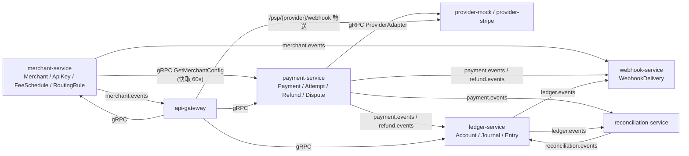
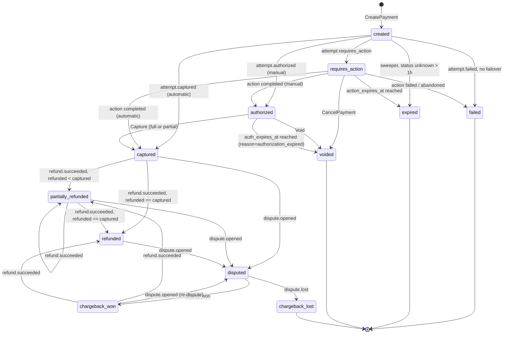
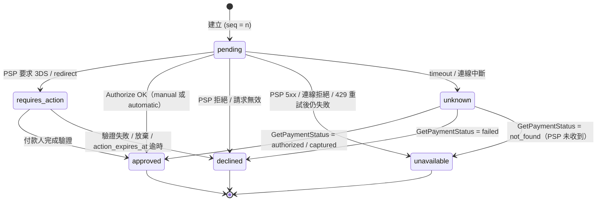
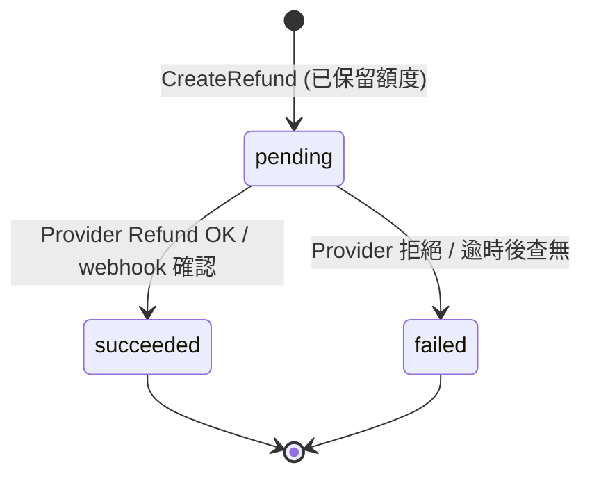
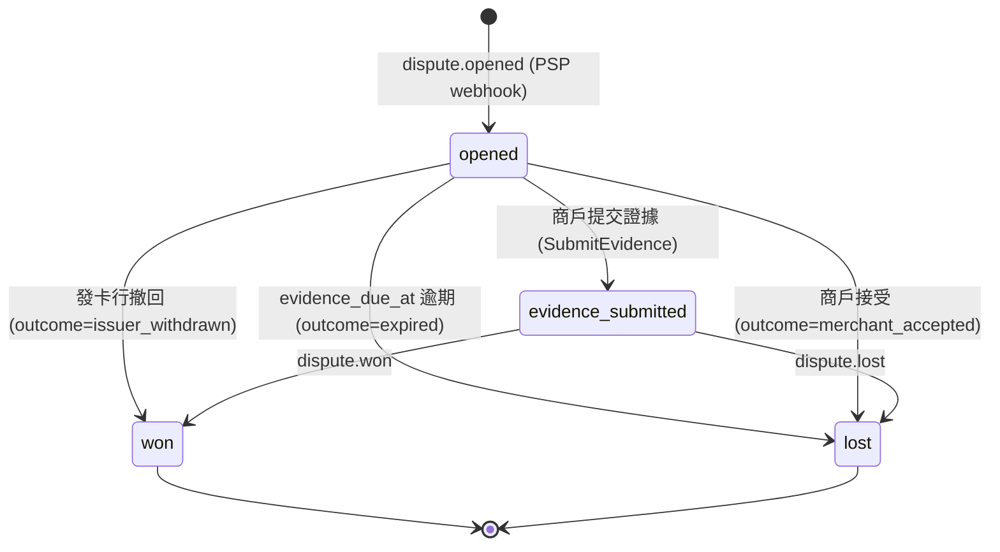
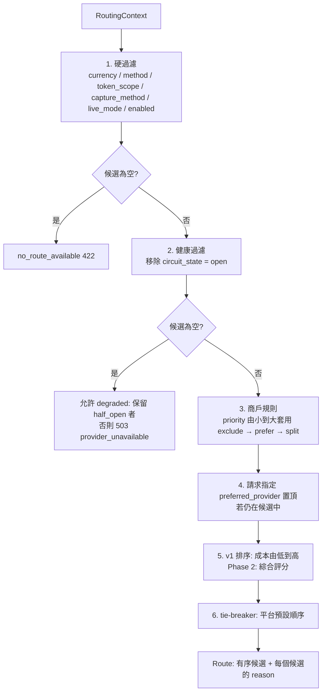

# PaymentGateway — 領域模型與帳本設計（Domain Model & Ledger）

> 本文件細化 `01-architecture.md` 第 5 節的領域模型。所有狀態機、不變條件、分錄範本、錯誤碼皆以本文件為準；
> 服務名稱、port、技術棧、錯誤格式沿用 01 文件，不得在此變更。
> 對應程式位置：`internal/payment/domain`、`internal/ledger/domain`、`internal/merchant/domain`、`pkg/money`。

---

## 0. 約定

### 0.1 金額
- 一律使用 `pkg/money.Money{Amount int64, Currency string}`；`Amount` 為該幣別最小單位（TWD 100 = `100`、USD 1.00 = `100`、JPY 100 = `100`）。
- 幣別小數位數由 `pkg/money` 內建表決定（ISO 4217 exponent），禁止在 domain 內自行換算。
- 所有比較/加減透過 `Money.Add / Sub / Cmp / IsZero / SplitBps`；不同幣別相加一律 panic-free 回傳 `ErrCurrencyMismatch`。
- 百分比一律以 basis point（bps，1 bps = 0.01%）整數表示；四捨五入規則固定為 **half-up（四捨五入到最小單位）**。

### 0.2 識別字
所有公開 ID 為 `前綴_` + ULID（26 字元 Crockford base32，時間可排序）：

| 前綴 | 物件 | 範例 |
|---|---|---|
| `mch_` | Merchant | `mch_01J5X1Y2Z3A4B5C6D7E8F9G0H1` |
| `pay_` | Payment | |
| `att_` | PaymentAttempt | |
| `re_` | Refund | |
| `dp_` | Dispute | |
| `acct_` | Ledger Account | |
| `jrn_` | Journal | |
| `ent_` | Entry | |
| `stl_` | SettlementBatch | |
| `evt_` | 領域事件 / outbox event | |
| `we_` | WebhookEndpoint | |
| `whd_` | WebhookDelivery | |
| `key_` | ApiKey（內部 id，非 key 本身） | |

### 0.3 時間
- 所有時間為 `TIMESTAMPTZ`，序列化為 RFC 3339 UTC。
- 狀態機的「過期」判斷統一由 `payment-service` 的 sweeper（每 30 秒掃描 `expires_at <= now()`）驅動，不依賴 PSP 通知。

---

## 1. Ubiquitous Language 詞彙表

| 術語 | 中文 | 定義 | 所屬 Context |
|---|---|---|---|
| **Merchant** | 商戶 | 接入閘道的租戶；擁有 API Key、Webhook 端點、路由偏好、費率表。所有資料皆以 `merchant_id` 隔離 | Merchant |
| **ApiKey** | API 金鑰 | 商戶呼叫 REST API 的憑證；分 `live` / `test` 兩種模式。詳見 06 文件 | Merchant |
| **WebhookEndpoint** | Webhook 端點 | 商戶接收事件通知的 URL 與簽章 secret | Merchant / Webhook |
| **FeeSchedule** | 費率表 | 平台向商戶收取手續費的規則（固定 + 百分比），以 merchant × provider × 付款方式 × 幣別為維度 | Merchant |
| **Payment** | 付款 | 商戶向付款人收取一筆金額的意圖與其完整生命週期（聚合根）。一個 Payment 對應一個 `Idempotency-Key` | Payment |
| **PaymentAttempt** | 付款嘗試 | Payment 對某一個 Provider 的一次授權嘗試。failover 會在同一個 Payment 下產生多個 Attempt | Payment |
| **Authorization** | 授權 | PSP 向發卡行確認額度並保留金額；尚未實際請款 | Payment |
| **Capture** | 請款 | 把已授權金額（全部或部分）轉為實際扣款；`capture_method = automatic` 時與授權一次完成 | Payment |
| **Void** | 取消授權 | 在 capture 前釋放授權額度 | Payment |
| **Refund** | 退款 | 將已 capture 的金額（全部或部分）退還付款人；一筆 Payment 可有多筆 Refund | Payment |
| **Dispute** | 爭議 | 持卡人透過發卡行對一筆付款提出異議的案件。**Chargeback（拒付）** 是 Dispute 進入正式扣款階段的型態；本系統以 Dispute 聚合根統一管理，`stage` 欄位區分 `inquiry / chargeback / pre_arbitration / arbitration` | Payment |
| **Provider / PSP** | 支付供應商 | 實際執行授權/請款的第三方（Stripe、Adyen、LINE Pay、ECPay、mock）。每個 Provider 由一個 adapter service 封裝 | Provider |
| **ProviderAccount** | 供應商帳戶 | 商戶（或平台）在某 Provider 開立的帳戶設定（憑證存 Vault、支援幣別/付款方式、成本費率） | Merchant / Provider |
| **PaymentMethod** | 付款方式 | 付款人的付款工具（卡片 token、錢包、轉帳…）。本系統只持有 PSP 發出的 token，**不持有 PAN** | Payment |
| **Route** | 路由 | 針對一筆 Payment 計算出的「有序 Provider 候選清單」與每個候選的選擇理由 | Payment |
| **RoutingRule** | 路由規則 | 商戶或平台設定的條件 → 動作（優先/排除/分流）規則 | Merchant / Payment |
| **Failover** | 容錯切換 | 某 Attempt 因「可切換」類別錯誤失敗時，對 Route 中下一個候選 Provider 建立新 Attempt | Payment |
| **ProviderErrorCategory** | 供應商錯誤類別 | adapter 把 PSP 原生錯誤正規化後的類別（§11），決定可否重試/切換 | Provider / Payment |
| **DeclineCode** | 拒絕代碼 | 正規化後的發卡行/PSP 拒絕原因（`insufficient_funds`、`do_not_honor`…） | Provider / Payment |
| **Account** | 帳戶（科目） | 帳本中的餘額載體，由 `kind × owner × currency` 唯一決定；type ∈ asset / liability / revenue / expense | Ledger |
| **Journal** | 日記帳 | 一次業務事件產生的一組分錄，借貸必相等；對應唯一 `event_id` | Ledger |
| **Entry** | 分錄 | Journal 中對單一 Account 的一筆借或貸 | Ledger |
| **Posting** | 過帳 | 將 Journal 寫入帳本並更新餘額的動作（同一 DB 交易） | Ledger |
| **Reversal** | 沖銷 | 以方向相反、金額相同的新 Journal 抵銷舊 Journal；帳本永不 UPDATE/DELETE | Ledger |
| **Balance** | 餘額 | Account 的 Σ借 − Σ貸（或反之，依 normal balance） | Ledger |
| **Settlement** | 結算 | PSP 將一段期間的淨額撥付到平台銀行帳戶的事件；由結算檔（settlement file）描述 | Reconciliation / Ledger |
| **Payout** | 撥款 | 平台將 `merchant_payable` 餘額撥付給商戶（Phase 3） | Ledger |
| **Reconciliation** | 對帳 | 將 PSP 結算檔逐筆與 Payment / Refund / Dispute 與帳本比對，找出差異 | Reconciliation |
| **Outbox Event** | 出箱事件 | 與業務資料同交易寫入、由 relay 送往 Kafka 的事件 | 全部 |
| **Idempotency-Key** | 冪等鍵 | 商戶提供的 UUID，24 小時內同商戶唯一；同 key 同 payload 回同結果 | api-gateway / Payment |

---

## 2. Bounded Context 與聚合設計

> 規則：聚合根是交易一致性邊界；跨聚合只透過 ID 參照與事件；跨 Context 只透過 gRPC 或 Kafka。

### 2.1 Merchant Context（`merchant-service`，DB `pg_merchant`）

| 類型 | 名稱 | 主要欄位 | 不變條件 |
|---|---|---|---|
| 聚合根 | `Merchant` | `id, name, status(active/suspended/closed), country, default_currency, settings, created_at, version` | `suspended/closed` 商戶不得建立新 Payment（Refund 仍允許以利善後）；狀態轉移 `active ⇄ suspended → closed`，`closed` 終態 |
| 實體 | `ApiKey` | `id, merchant_id, mode(live/test), lookup_id, key_hash(Argon2id), signing_secret_enc, status(active/rotating/revoked), expires_at, last_used_at` | 同 merchant 同 mode 最多 2 把 `active/rotating`；`revoked` 不可復原 |
| 實體 | `WebhookEndpoint` | `id, merchant_id, url(https only), secret_enc, secret_prev_enc, secret_rotated_at, enabled_events[], status(enabled/disabled), api_version` | URL 必須 `https://` 且非私有網段；`enabled_events` 為空 = 全部 |
| 實體 | `FeeSchedule` | `id, merchant_id, provider?, payment_method_type?, currency, fixed_amount, percentage_bps, min_fee?, max_fee?, refund_fee_policy(retain/return), refund_fixed_fee, chargeback_fee, effective_from, effective_to?, version` | 同維度在同一時間區間只能有一筆生效；`percentage_bps ∈ [0, 10000]`；`min_fee ≤ max_fee` |
| 實體 | `RoutingRule` | `id, merchant_id, priority(int), condition(JSON), action(prefer/exclude/split), providers[], weights[], enabled` | `priority` 在同商戶唯一；`split` 權重和 = 100 |
| 實體 | `ProviderAccount` | `id, merchant_id?(null=平台共用), provider, vault_path, supported_currencies[], supported_methods[], capabilities(partial_capture, multi_capture, void_partial, refund_window_days, auth_validity_days), cost_schedule, enabled` | 憑證只存 Vault 路徑，不存 DB |
| 值物件 | `MerchantSettings` | `capture_method_default, statement_descriptor, max_attempts(1..3), allow_failover, test_mode_enabled` | |

### 2.2 Payment Context（`payment-service`，DB `pg_payment`）

| 類型 | 名稱 | 主要欄位 | 不變條件 |
|---|---|---|---|
| 聚合根 | `Payment` | `id, merchant_id, idempotency_key, amount(Money), authorized_amount, captured_amount, refunded_amount, refund_reserved_amount, disputed_amount, status, capture_method(automatic/manual), payment_method(VO), customer(VO), description, metadata(map≤50 keys), statement_descriptor, current_attempt_id, winning_attempt_id, pending_operation(null/capture/void), capture_idempotency_key, auth_expires_at, action_expires_at, failure(VO), live_mode, created_at, updated_at, version` | 見 §3；`(merchant_id, idempotency_key)` 唯一；`0 ≤ captured_amount ≤ authorized_amount ≤ amount`；`refunded_amount + refund_reserved_amount ≤ captured_amount`；同一時間最多一個非終態 Attempt；`winning_attempt_id` 一旦設定不可改 |
| 實體（Payment 內） | `PaymentAttempt` | `id, payment_id, seq(1..n), provider, provider_account_id, provider_payment_id, status, route_reason, error_category, decline_code, provider_error_code, provider_message(遮罩後), latency_ms, requested_at, completed_at, three_ds(VO)` | `seq` 遞增且在 payment 內唯一；`status ∈ {pending, requires_action, approved, declined, unavailable, unknown}`；只有 `status = approved` 的 Attempt 可成為 `winning_attempt` |
| 聚合根 | `Refund` | `id, payment_id, merchant_id, idempotency_key, amount(Money), status(pending/succeeded/failed), reason(requested_by_customer/duplicate/fraudulent/other), provider, provider_refund_id, failure(VO), fee_returned_amount, requested_at, completed_at, version` | `(merchant_id, idempotency_key)` 唯一；`amount > 0`；幣別 = Payment 幣別；建立時必須持有 Payment row lock 並通過 §5 約束 |
| 聚合根 | `Dispute` | `id, payment_id, merchant_id, provider, provider_dispute_id, stage(inquiry/chargeback/pre_arbitration/arbitration), status(opened/evidence_submitted/won/lost), amount(Money), reason_code(正規化), network_reason_code, evidence_due_at, evidence(VO), fee_amount, opened_at, closed_at, outcome_reason(issuer_accepted/issuer_rejected/expired/merchant_accepted), version` | `(provider, provider_dispute_id)` 唯一；`amount ≤ payment.captured_amount`；同一 Payment 同時最多一個 `opened/evidence_submitted` Dispute |
| 值物件 | `PaymentMethod` | `type(card/wallet/bank_transfer/redirect), token, token_scope(provider/gateway), provider_of_token?, card{brand, last4, bin, exp_month, exp_year, funding, country}, wallet{kind(apple_pay/google_pay/line_pay)}` | `token` 禁止為 13–19 位純數字（PAN 偵測，06 文件）；`token_scope = provider` 時 `provider_of_token` 必填 |
| 值物件 | `Customer` | `id?, email, name, phone, ip, billing_address` | PII，落庫需欄位加密（06 文件） |
| 值物件 | `Failure` | `category(ProviderErrorCategory), decline_code, retryable(bool), message(商戶可見), provider_code(內部)` | |
| 值物件 | `ThreeDS` | `version, flow(challenge/frictionless), redirect_url, return_url, eci, liability_shift(bool)` | |
| 值物件 | `Route` | `candidates[]{provider, provider_account_id, reason, score?}, built_at, rule_ids[]` | 至少 1 個候選，否則建立 Payment 失敗 `no_route_available` |
| 值物件 | `RoutingContext` | `merchant_id, amount, currency, payment_method, country, capture_method, preferred_provider?` | |
| 事件表 | `payment_events` | `id(evt_), aggregate_type, aggregate_id, seq, type, payload(Protobuf bytes), occurred_at` | append-only；`(aggregate_id, seq)` 唯一 |
| 去重表 | `provider_events` | `provider, provider_event_id, received_at, payment_id?` | `(provider, provider_event_id)` 唯一 |

### 2.3 Ledger Context（`ledger-service`，DB `pg_ledger`）

| 類型 | 名稱 | 主要欄位 | 不變條件 |
|---|---|---|---|
| 聚合根 | `Account` | `id(uuid), merchant_id(uuid, NULL = 系統帳戶), code(如 merchant_payable、psp_receivable:stripe), name, type(asset/liability/revenue/expense), normal_balance(debit/credit), currency, status(active/frozen/closed), metadata, version` | `(merchant_id, code, currency)` 唯一（`NULLS NOT DISTINCT`，系統帳戶亦受約束）；`type` 與 `normal_balance` 必須相符（asset/expense → debit，liability/revenue → credit）；`frozen` 帳戶只能被貸記（不能流出）；`closed` 帳戶餘額必須為 0 |
| 聚合根 | `Journal` | `id(uuid), public_id(jrn_), event_id(uuid, unique), merchant_id, reference_type(payment/refund/dispute/fee/settlement/adjustment/reversal), reference_id, description, reversal_of_journal_id?, posted_at, metadata` | 至少 2 筆 Entry；Σ借 = Σ貸；所有 Entry 幣別一致且等於 Journal 幣別；post 後不可修改；`reversal_of` 所指 Journal 不可再被第二次沖銷 |
| 實體（Journal 內） | `Entry` | `id(uuid), journal_id, account_id, merchant_id(反正規化自 account), direction(debit/credit), amount(>0), currency, created_at` | `amount > 0`；`currency = account.currency`；account 必須 `active` |
| 讀模型 | `Balance` | `account_id, currency, balance(帶號 bigint，以 normal_balance 方向為正), entry_count, as_of_entry_id, version, updated_at` | 由 `entries` 的 AFTER INSERT trigger 在同交易維護；帳戶建立時自動建立一列；`version` 每次 +1 |
| 讀模型 | `BalanceSnapshot` | `account_id, snapshot_date, balance, entry_count, as_of_entry_id` | 每日 00:00 UTC 產生；只能新增 |
| 值物件 | `FeeCalculation` | `schedule_id, schedule_version, base_amount, fixed, percentage_bps, percentage_part, total` | `total = fixed + percentage_part`，clamp 於 `[min_fee, max_fee]` |
| 聚合根 | `SettlementBatch` | `id, provider, currency, period_start, period_end, gross, psp_fees, chargebacks, refunds, net_paid, bank_reference, status(imported/posted/disputed)` | `net_paid = gross − refunds − chargebacks − psp_fees ± adjustments` |

### 2.4 Webhook Context（`webhook-service`，DB `pg_webhook`）

| 類型 | 名稱 | 主要欄位 | 不變條件 |
|---|---|---|---|
| 聚合根 | `WebhookDelivery` | `id, merchant_id, endpoint_id, event_id, event_type, payload, status(pending/delivering/succeeded/failed/dead_letter), attempt_count, next_attempt_at, last_response_status, last_error` | `(endpoint_id, event_id)` 唯一（同事件對同端點只投遞一個 delivery）；`attempt_count ≤ max_attempts` |
| 實體 | `DeliveryAttempt` | `id, delivery_id, seq, sent_at, response_status, duration_ms, error` | append-only |
| 讀模型 | `EndpointMirror` | 來自 `merchant.events` 的 endpoint 投影（url、secret 版本、enabled_events） | 只由事件更新 |

### 2.5 Reconciliation Context（`reconciliation-service`，DB `pg_recon`）

| 類型 | 名稱 | 主要欄位 | 不變條件 |
|---|---|---|---|
| 聚合根 | `SettlementFile` | `id, provider, file_name, file_hash(sha256), period, status(received/parsed/matched/posted), line_count` | `(provider, file_hash)` 唯一（同檔不重複匯入） |
| 實體 | `SettlementLine` | `id, file_id, line_no, type(charge/refund/chargeback/fee/adjustment/payout), provider_ref, amount, fee, currency, occurred_at, raw(JSONB)` | |
| 聚合根 | `Discrepancy` | `id, file_id, line_id?, payment_id?, kind(missing_internal/missing_external/amount_mismatch/fee_mismatch/status_mismatch), expected, actual, status(open/resolved/written_off), resolution` | `written_off` 必須附 Journal（沖銷或調整） |

### 2.6 Provider Context（`provider-*` adapter，無 DB）

| 類型 | 名稱 | 說明 |
|---|---|---|
| 介面 | `ProviderAdapter` | gRPC `pg.provider.v1.ProviderAdapter`：`Authorize / Capture / Void / Refund / GetPaymentStatus / ParseWebhook / HealthCheck` |
| 值物件 | `ProviderError` | `category(ProviderErrorCategory), decline_code, provider_code, provider_message, retry_after?` |
| 值物件 | `ProviderHealth` | `success_rate_1m, p95_latency_ms, circuit_state(closed/open/half_open), last_checked_at`；由 payment-service 以滑動視窗計算並存 Valkey |

### 2.7 Context Map



---

## 3. Payment 狀態機

### 3.1 狀態定義

| 狀態 | 終態 | 意義 | 金額欄位狀態 |
|---|---|---|---|
| `created` | 否 | Payment 已落庫，尚未取得任何 Provider 回應（通常存活數百毫秒） | 全部 0 |
| `requires_action` | 否 | Provider 要求付款人完成額外動作（3DS challenge、redirect、OTP）；`action_expires_at` 必填 | 0 |
| `authorized` | 否 | 已授權、未請款（僅 `capture_method = manual`）；`auth_expires_at` 必填 | `authorized_amount = amount` |
| `captured` | 否 | 已請款（全額或部分）；可退款、可被爭議 | `0 < captured_amount ≤ authorized_amount`，`refunded_amount = 0` |
| `partially_refunded` | 否 | 已有成功退款，但 `refunded_amount < captured_amount` | |
| `refunded` | 否（仍可被爭議） | `refunded_amount = captured_amount` | |
| `disputed` | 否 | 有一個 `opened/evidence_submitted` 的 Dispute | `disputed_amount > 0` |
| `chargeback_won` | 否 | 最近一次 Dispute 以商戶勝訴結案；仍可退款、可被再次爭議 | `disputed_amount = 0` |
| `chargeback_lost` | **是** | 最近一次 Dispute 敗訴，資金已被收回 | |
| `voided` | **是** | capture 前取消：商戶主動 cancel（含 `requires_action` 期間）、或 `authorized` 超過授權有效期未 capture（`void_reason = authorization_expired`） | `captured_amount = 0` |
| `failed` | **是** | 所有 Attempt 皆失敗或遇不可切換錯誤；`failure` 必填 | 0 |
| `expired` | **是** | `requires_action` 逾時（付款人未完成 3DS/redirect），或 `created` 卡住超過 TTL 且 Provider 查無紀錄。**`authorized` 逾時不走此狀態**，改為 `voided`（T13） | 0 |

> 部分請款（partial capture）：v1 只允許**單次** capture，金額 ≤ `authorized_amount`；未請款餘額由 PSP 自動釋放（或由 adapter 以 `Void(remaining)` 釋放，依 `capabilities.void_partial`）。多次 capture（`multi_capture`）為 Phase 2 能力，屆時新增 `partially_captured` 狀態需經 ADR。

### 3.2 合法轉移表

| # | From | To | 觸發 | 守衛條件 | 副作用 / 事件 |
|---|---|---|---|---|---|
| T1 | `created` | `requires_action` | Attempt 回 `requires_action` | Attempt 為 `current_attempt` | 設 `action_expires_at = now + 30m`（或 PSP 給定）；`payment.requires_action` |
| T2 | `created` | `authorized` | Attempt 授權成功 | `capture_method = manual` | 設 `winning_attempt_id`、`authorized_amount = amount`、`auth_expires_at = now + capabilities.auth_validity_days`；`payment.authorized` |
| T3 | `created` | `captured` | Attempt 授權+請款成功 | `capture_method = automatic` | 設 `winning_attempt_id`、`authorized_amount = captured_amount = amount`；`payment.authorized` + `payment.captured`（兩個事件，同 tx） |
| T4 | `created` | `failed` | Attempt 轉 `declined` 或 `unavailable`，且（不可 failover ∨ 無下一個候選 ∨ `seq ≥ max_attempts`） | 無非終態 Attempt | 寫 `failure`；`payment.failed` |
| T5 | `created` | `expired` | sweeper：`created_at < now − 1h` 且對所有 Attempt `GetPaymentStatus` 回 `not_found/failed` | 所有 Attempt 終態或 unknown 已解析 | `payment.expired`；若查到 `authorized` 則改走 T2/T3（修復路徑） |
| T6 | `requires_action` | `authorized` | PSP webhook / `GetPaymentStatus` 回授權成功 | `capture_method = manual`；`now < action_expires_at`（逾時後到達的成功結果 → 直接 Void 並保持 `expired`，見 T9 註） | 同 T2 |
| T7 | `requires_action` | `captured` | 同上 | `capture_method = automatic` | 同 T3 |
| T8 | `requires_action` | `failed` | PSP 回 3DS 失敗 / 付款人放棄 | | current attempt → `declined`；`failure.category = authentication_failed`；`payment.failed` |
| T9 | `requires_action` | `expired` | sweeper：`action_expires_at ≤ now` | 先 `GetPaymentStatus` 確認非 approved | current attempt → `declined`（`decline_code = authentication_expired`）；`payment.expired`；若 PSP 其後仍送來成功 → adapter 自動 `Void`，記 `provider_events` |
| T10 | `requires_action` | `voided` | 商戶 `POST /payments/{id}/cancel` | `pending_operation = null` | 呼叫 `Void`（若 PSP 需要）；`payment.voided` |
| T11 | `authorized` | `captured` | 商戶 `POST /payments/{id}/capture`（可帶 `amount`） | `0 < amount ≤ authorized_amount`；`now < auth_expires_at`；`pending_operation = null`；`capture_idempotency_key` 未用或相同 | 兩階段（§8.3）；`payment.captured`（含 `fee_amount`） |
| T12 | `authorized` | `voided` | 商戶 `POST /payments/{id}/cancel` | `pending_operation = null` | `Void` 全額；`payment.voided` |
| T13 | `authorized` | `voided` | sweeper：`auth_expires_at ≤ now` | `pending_operation = null` | 嘗試 `Void`（失敗不阻擋，下一輪重試）；`void_reason = authorization_expired`；`payment.voided`（payload 含 `reason`） |
| T14 | `captured` | `partially_refunded` | `refund.succeeded` | `refunded_amount < captured_amount` | `refund.succeeded` |
| T15 | `captured` | `refunded` | `refund.succeeded` | `refunded_amount = captured_amount` | |
| T16 | `partially_refunded` | `partially_refunded` | `refund.succeeded` | 同 T14 | 自轉移仍寫 `payment_events` |
| T17 | `partially_refunded` | `refunded` | `refund.succeeded` | 同 T15 | |
| T18 | `captured` / `partially_refunded` / `refunded` / `chargeback_won` | `disputed` | `ParseWebhook` 產生 `dispute.opened` | 無進行中 Dispute；`dispute.amount ≤ captured_amount` | 建立 Dispute；`disputed_amount += amount`；`dispute.opened` |
| T19 | `disputed` | `chargeback_won` | `dispute.won` | Dispute 為 `opened/evidence_submitted` | `disputed_amount −= amount`；`dispute.won` |
| T20 | `disputed` | `chargeback_lost` | `dispute.lost` | 同上 | `dispute.lost` |
| T21 | `chargeback_won` | `partially_refunded` / `refunded` | `refund.succeeded` | 依 T14/T15 金額規則 | |
| T22 | 任何非終態 | 同狀態 | `refund.pending` / `refund.failed` / `dispute.evidence_submitted` | | 不改 Payment 狀態，只寫 `payment_events` 與更新 `refund_reserved_amount` |

不在表中的轉移一律拒絕，回 `payment_invalid_state`（§10）。

### 3.3 狀態圖



### 3.4 `failed` 的可重試性

`failure.retryable` 對商戶的語意是「**同一付款人用同一付款方式稍後再試是否有意義**」，不代表閘道會自動重試（閘道的自動重試/failover 在到達 `failed` 前已經結束）。

| `decline_code`（正規化） | `retryable` | 說明 |
|---|---|---|
| `insufficient_funds` | true | 餘額不足；可能稍後成功，但**不可 failover**（換 Provider 不會改變發卡行決定） |
| `try_again_later`, `processing_error`, `issuer_unavailable` | true | 暫時性；閘道已嘗試 failover（若允許） |
| `authentication_failed` | true | 3DS 失敗；可重新發起 |
| `velocity_exceeded` | true | 發卡行頻率限制 |
| `do_not_honor`, `generic_decline`, `restricted_card`, `call_issuer` | false | 應換卡 |
| `stolen_card`, `lost_card`, `pickup_card`, `fraudulent` | false | 對外顯示 `generic_decline`（不洩漏風控判斷），內部保留真實代碼 |
| `expired_card`, `incorrect_cvc`, `incorrect_number`, `invalid_expiry`, `card_not_supported`, `currency_not_supported` | false | 輸入/卡片問題，需換卡或修正 |

---

## 4. PaymentAttempt

### 4.1 Attempt 狀態

Attempt 狀態只描述「PSP 對這次 Authorize 的回應」；capture / void / refund 等後續動作由 Payment 狀態表達，Attempt 不重複這些詞彙。

| 狀態 | 終態 | 意義 | 對應 ProviderErrorCategory |
|---|---|---|---|
| `pending` | 否 | 已送出 `Authorize`，等待回應 | — |
| `requires_action` | 否 | PSP 要求 3DS / redirect / OTP | `authentication_required` |
| `approved` | 是 | PSP 核准（manual：已授權；automatic：已授權並請款）。成為 `winning_attempt` | — |
| `declined` | 是 | PSP 或發卡行拒絕，或請求被 PSP 判定無效；**不可 failover**（`declined_soft` 白名單碼例外，§9.5） | `declined_hard`、`declined_soft`、`fraud_suspected`、`authentication_failed`、`invalid_request`、`unsupported_operation`、`duplicate_request`（取回結果後覆寫） |
| `unavailable` | 是 | PSP 不可用；**可 failover** | `provider_unavailable`、`provider_rate_limited`（重試後仍失敗）、`provider_config_error`、`provider_timeout`（經 `GetPaymentStatus` 確認 `not_found`） |
| `unknown` | 否 | 逾時 / 連線中斷，結果不明；必須先收斂 | `provider_timeout`、`unknown` |



### 4.2 Payment 與 Attempt 的關係

| 規則 | 說明 |
|---|---|
| 一對多 | `Payment 1 ── n PaymentAttempt`，`seq` 從 1 遞增，`max_attempts` 預設 3（商戶可設 1..3） |
| 單一進行中 | 任一時刻最多一個 Attempt 處於 `pending / requires_action / unknown`（DB partial unique index：`UNIQUE(payment_id) WHERE status IN ('pending','requires_action','unknown')`） |
| 狀態投影 | Payment 狀態由 **current attempt** 的結果推導（§3.2 T1–T9）：`approved` → `authorized`（manual）或 `captured`（automatic）；`requires_action` → `requires_action`；`declined` / `unavailable` → 依 failover 規則建立下一個 Attempt，否則 Payment `failed`；`unknown` → Payment 維持 `created`。Payment `failed` 只有在「沒有下一個候選或錯誤不可切換」時才發生 |
| 勝出 Attempt | 第一個到達 `approved` 的 Attempt 成為 `winning_attempt_id`；之後的 Capture / Void / Refund / Dispute 都使用它的 `provider` 與 `provider_payment_id` |
| unknown 處理 | Attempt `unknown`（timeout）時**禁止直接 failover**；必須先 `GetPaymentStatus`（最多 3 次、間隔 1s/2s/4s）。仍 unknown → Payment 維持 `created`，交給 sweeper（T5）；避免同一付款人被重複授權。**1 小時後仍 `unknown` 的 Attempt 標記為需對帳（`needs_reconciliation = true`），由 reconciliation-service 以 PSP 結算檔 / 查詢 API 兜底收斂** |
| failover 條件 | 前一 Attempt 為 `unavailable`（或 `declined` 且 `error_category = declined_soft` 且 `decline_code` 在白名單）且 `payment_method.token_scope` 允許下一個候選（§9.5）且 `seq < max_attempts` 且總耗時預算（預設 25s）未用盡 |
| PSP 冪等鍵 | 每個 Attempt 對 PSP 的 `Authorize` 使用 `att_id` 作為 PSP 冪等鍵；`Capture` 用 `{pay_id}:capture:1`；`Void` 用 `{pay_id}:void`；`Refund` 用 `ref_id` |
| 時間預算 | 每次 PSP 呼叫 timeout 10s（adapter 內部對 PSP 8s）；整體 authorize saga 上限 25s，超過即停止 failover |

---

## 5. Refund 狀態機與約束

### 5.1 狀態



| 狀態 | 意義 | 對 Payment 的影響 |
|---|---|---|
| `pending` | 已通過約束檢查、已向 Provider 發出或即將發出 | `payment.refund_reserved_amount += amount` |
| `succeeded` | Provider 確認退款 | `refund_reserved_amount −= amount`、`refunded_amount += amount`、Payment 轉 `partially_refunded/refunded` |
| `failed` | Provider 拒絕或 24h 內無法確認 | `refund_reserved_amount −= amount`（釋放） |

### 5.2 約束

| 規則 | 內容 | 違反時錯誤碼 |
|---|---|---|
| 可退款狀態 | Payment ∈ {`captured`, `partially_refunded`, `chargeback_won`} | `payment_not_refundable` |
| 爭議中 | Payment = `disputed` → 拒絕（退款與拒付同時進行會造成雙重退回） | `payment_disputed` |
| 已敗訴 | Payment = `chargeback_lost` → 拒絕（資金已被收回） | `payment_not_refundable` |
| 金額上限 | `amount ≤ available_to_refund = captured_amount − refunded_amount − refund_reserved_amount` | `refund_amount_exceeds_available` |
| 最小金額 | `amount ≥ 1`（最小貨幣單位） | `amount_too_small` |
| 多次退款 | 允許無上限次數，每次皆獨立 Refund；全部累計受金額上限約束 | |
| 退款期限 | `now − captured_at ≤ provider_account.capabilities.refund_window_days`（Stripe 卡片 180 天、LINE Pay 依合約） | `refund_window_expired` |
| 幣別 | 必須等於 Payment 幣別（v1 不做換匯） | `currency_mismatch` |
| 冪等 | `(merchant_id, idempotency_key)` 唯一；重複 key 同 payload 回同一筆 Refund | `idempotency_key_reuse` |
| 併發 | 建立 Refund 時 `SELECT ... FROM payments WHERE id = $1 FOR UPDATE`，在同一 tx 更新 `refund_reserved_amount`，避免兩筆併發退款總和超額 | |
| 手續費 | 依 `FeeSchedule.refund_fee_policy`：`retain`（預設，不退手續費）或 `return`（按比例退回平台手續費）；另可收 `refund_fixed_fee` | |
| 商戶狀態 | `suspended` 商戶仍可退款（保護消費者）；`closed` 不可 | `merchant_closed` |

### 5.3 兩階段流程（與 §8.3 一致）

1. **tx1**：鎖 Payment → 檢查約束 → `INSERT refunds(status='pending')` → `UPDATE payments SET refund_reserved_amount += $amt, version = version + 1 WHERE id = $id AND version = $v` → outbox `refund.pending` → COMMIT。
2. 呼叫 `ProviderAdapter.Refund(provider_payment_id, amount, idempotency_key = ref_id)`。
3. **tx2**：依結果更新 Refund 與 Payment（`version` 檢查）→ outbox `refund.succeeded` / `refund.failed` → COMMIT。
4. 若步驟 2 超時：Refund 留在 `pending`；`refund-reconciler` 每 5 分鐘對 `pending` 超過 2 分鐘的 Refund 呼叫 `GetPaymentStatus`（含 refund 列表）；24 小時仍無法確認 → `failed`（`failure.category = provider_timeout`）並告警。

---

## 6. Dispute / Chargeback 生命週期

### 6.1 狀態與階段



| 欄位 | 說明 |
|---|---|
| `stage` | `inquiry`（retrieval request / Stripe `warning_*`，尚未扣款）→ `chargeback`（正式拒付，PSP 已扣款）→ `pre_arbitration` → `arbitration`。`stage` 前進不改變 `status`，但會寫 `dispute.stage_changed` 事件 |
| `evidence_due_at` | 由 PSP 提供；到期前 72h / 24h 各發一次 `dispute.evidence_due_soon` Webhook |
| `amount` | 可小於 `captured_amount`（部分爭議） |
| `fee_amount` | 拒付手續費（來自 `FeeSchedule.chargeback_fee`）；`inquiry` 階段不收 |
| `outcome_reason` | `issuer_accepted`（勝）/ `issuer_rejected`（敗）/ `expired` / `merchant_accepted` / `issuer_withdrawn` |

### 6.2 與 Payment / Refund / Ledger 的互動

| 事件 | Payment | Refund | Ledger（§7.3） |
|---|---|---|---|
| `dispute.opened`（stage = inquiry） | 不改狀態，`disputed_amount += amount`；**仍可退款**（退款常是 inquiry 的最佳解） | 允許 | 不記帳 |
| `dispute.opened`（stage = chargeback） | → `disputed` | 禁止新退款；進行中的 `pending` Refund 照常完成 | J-CB-OPEN：凍結商戶資金 + 拒付費 |
| `dispute.evidence_submitted` | 不變 | 禁止 | 不記帳 |
| `dispute.won` | → `chargeback_won` | 恢復允許 | J-CB-WON：釋放凍結；依政策退回拒付費 |
| `dispute.lost` | → `chargeback_lost` | 禁止 | J-CB-LOST：凍結資金轉入 PSP 應收沖減 |
| inquiry 升級為 chargeback | → `disputed` | 禁止 | J-CB-OPEN（此時才記） |

> 同一 Payment 在 `chargeback_won` 後可能收到第二次 Dispute（pre-arbitration 或不同 reason code）：建立新的 Dispute 聚合（新的 `provider_dispute_id`），Payment 重回 `disputed`。

---

## 7. 雙式記帳帳本設計

### 7.1 Chart of Accounts（科目表）

帳戶實例 = `merchant_id × code × currency`（對應 `accounts` 表的唯一鍵）。商戶帳戶帶 `merchant_id`；系統帳戶 `merchant_id IS NULL`，並以 `code` 後綴區分 provider 或銀行帳戶（例：`psp_receivable:stripe`、`bank_cash:ctbc_001`）。

| `code` | type | normal balance | 帳戶層級 | 用途 |
|---|---|---|---|---|
| `psp_receivable:<provider>` | asset | debit | 系統 | PSP 已請款、尚未撥付給平台的應收款（毛額） |
| `bank_cash:<bank_account>` | asset | debit | 系統 | PSP 撥付進來的現金 |
| `settlement_suspense:<provider>` | asset | debit | 系統 | 對帳差異暫記科目；月結前必須清零 |
| `merchant_payable` | liability | credit | 商戶 | 平台應付商戶的淨額（商戶可用餘額） |
| `refund_clearing` | liability | credit | 商戶 | 已從商戶餘額扣除、尚待 PSP 確認的退款 |
| `chargeback_reserve` | liability | credit | 商戶 | 因爭議凍結的商戶資金 |
| `fee_revenue` | revenue | credit | 系統 | 平台向商戶收取的交易手續費（商戶維度由 `entries.merchant_id`/journal reference 提供） |
| `chargeback_fee_revenue` | revenue | credit | 系統 | 向商戶收取的拒付處理費 |
| `psp_fee_expense:<provider>` | expense | debit | 系統 | 平台付給 PSP 的成本（結算時入帳） |
| `chargeback_fee_expense:<provider>` | expense | debit | 系統 | PSP 向平台收取的拒付費 |

> 01 文件列出的五種 kind（`merchant_payable`、`psp_receivable`、`fee_revenue`、`refund_clearing`、`chargeback_reserve`）為核心；其餘為完成借貸平衡所需的配套科目。帳戶以 **lazy create** 方式在第一次過帳時建立（同 tx `INSERT ... ON CONFLICT (merchant_id, code, currency) DO NOTHING`）。

### 7.2 Schema 的事實來源與 DB 級不變條件

帳本 schema 的**單一事實來源**是 `migrations/ledger/`（`0001_schema.up.sql`、`0002_entries.up.sql`）與 `docs/04-data-model.md` §3；本文件不重複貼 SQL，只描述設計意圖。實作與本節不一致時，以 migrations 為準並回頭修正本文件。

| 意圖 | DB 層落實（見 migrations） |
|---|---|
| 每筆 Journal 借貸相等、至少兩筆分錄、幣別一致 | `entries` 上的 `CONSTRAINT TRIGGER ... DEFERRABLE INITIALLY DEFERRED`，於交易提交時檢查整個 journal |
| 分錄幣別 = 帳戶幣別、帳戶必須 `active` | entries INSERT trigger 驗證 |
| 帳本 append-only | `journals` / `entries` 的 `BEFORE UPDATE OR DELETE` 與 `BEFORE TRUNCATE` trigger 一律 `RAISE EXCEPTION`；ledger-service 的 DB 角色另外 `REVOKE UPDATE, DELETE, TRUNCATE`（06 文件 §6.3） |
| 沖銷而非修改 | `journals.reversal_of_journal_id` 指向原 journal；`reference_type = reversal` |
| 即時餘額由 DB 維護 | `balances.balance`（帶號 bigint，以 `normal_balance` 方向為正）由 entries 的 AFTER INSERT trigger 在同一交易累加；`as_of_entry_id`、`entry_count`、`version` 同步更新；帳戶建立時自動建立餘額列 |
| 事件冪等 | `journals.event_id UNIQUE`：同一事件重複消費時 INSERT 違反唯一鍵，消費者視為已處理 |
| 系統帳戶 vs 商戶帳戶 | `accounts.merchant_id` 可為 NULL（系統帳戶）；唯一鍵 `(merchant_id, code, currency)` 使用 `NULLS NOT DISTINCT` |
| 分錄量級 | `entries` 以 `created_at` 按月分割；> 25 個月歸檔到冷儲存，靠 `balance_snapshots` + 之後分錄即可重建任一帳戶餘額 |

餘額語意：
- `balances.balance` 對 debit-normal 帳戶（asset / expense）= Σ借 − Σ貸；對 credit-normal 帳戶（liability / revenue）= Σ貸 − Σ借。
- 正常情況下 `balance ≥ 0`；出現負值即觸發告警（`pg_ledger_negative_balance_total`），但**不阻擋過帳**（帳本反映事實，不做業務守衛；業務守衛在 payment-service）。

### 7.3 分錄範本

以下範例：商戶 `M`、Provider `stripe`、TWD。付款 1,000 元；平台費率 2.8% + 5 元 → 手續費 `5 + round(1000 × 280 / 10000) = 33`；PSP 成本 2.2% + 3 元 = 25 元；拒付費 450 元。

| 範本 ID | 觸發事件 | 借方（Dr） | 貸方（Cr） | 金額來源 | 備註 |
|---|---|---|---|---|---|
| — | `payment.created` / `payment.authorized` / `payment.requires_action` | — | — | — | **不記帳**（授權不是資金移動） |
| **J-CAP** | `payment.captured` | `psp_receivable[stripe,TWD]` 1,000 | `merchant_payable[M,TWD]` 967<br/>`fee_revenue[platform,TWD]` 33 | `captured_amount`、事件中的 `fee_amount` | 部分 capture 以 `captured_amount` 為準 |
| **J-REF-PEND** | `refund.pending` | `merchant_payable[M]` 300 | `refund_clearing[M]` 300 | `refund.amount` | 先扣商戶餘額、掛清算 |
| **J-REF-OK** | `refund.succeeded` | `refund_clearing[M]` 300 | `psp_receivable[stripe]` 300 | `refund.amount` | PSP 從應收中扣回 |
| **J-REF-FEE-RET** | `refund.succeeded`（`refund_fee_policy = return`） | `fee_revenue[platform]` 10 | `merchant_payable[M]` 10 | `fee_returned_amount = round(fee × refund/captured)` | 僅退百分比部分；固定費不退 |
| **J-REF-FEE** | `refund.succeeded`（`refund_fixed_fee > 0`） | `merchant_payable[M]` 5 | `fee_revenue[platform]` 5 | `refund_fixed_fee` | |
| **J-REF-FAIL** | `refund.failed` | `refund_clearing[M]` 300 | `merchant_payable[M]` 300 | `refund.amount` | 沖回 J-REF-PEND（以 `reversal_of` 指向） |
| **J-CB-OPEN** | `dispute.opened`（stage ≥ chargeback） | `merchant_payable[M]` 1,000<br/>`merchant_payable[M]` 450 | `chargeback_reserve[M]` 1,000<br/>`chargeback_fee_revenue[platform]` 450 | `dispute.amount`、`fee_amount` | 商戶餘額可能因此為負 → 告警，Phase 3 payout 需檢查 |
| **J-CB-LOST** | `dispute.lost` | `chargeback_reserve[M]` 1,000 | `psp_receivable[stripe]` 1,000 | `dispute.amount` | PSP 已（或將）從應收扣回 |
| **J-CB-WON** | `dispute.won` | `chargeback_reserve[M]` 1,000 | `merchant_payable[M]` 1,000 | `dispute.amount` | 釋放凍結 |
| **J-CB-WON-FEE** | `dispute.won`（政策 `refund_chargeback_fee_on_win = true`） | `chargeback_fee_revenue[platform]` 450 | `merchant_payable[M]` 450 | `fee_amount` | 預設 false |
| **J-PSP-CBFEE** | 結算檔中的 chargeback fee 行 | `chargeback_fee_expense[stripe]` 500 | `psp_receivable[stripe]` 500 | 結算檔 | PSP 向平台收的拒付費 |
| **J-STL** | `settlement.posted`（reconciliation-service 匯入結算檔並比對成功） | `bank_cash[platform,acct]` 975<br/>`psp_fee_expense[stripe]` 25 | `psp_receivable[stripe]` 1,000 | 結算檔 `net_paid`、`psp_fees`、`gross` | 一批結算一筆 Journal（彙總），`settlement_id` 關聯 |
| **J-STL-DIFF** | `discrepancy.found`（金額差異） | `settlement_suspense[stripe]` Δ | `psp_receivable[stripe]` Δ（或反向） | 差異額 | 必須在月結前以調整分錄清零 |
| **J-REV** | 人工沖銷（ops 工具，需雙人核可） | 原 Journal 每筆 Entry 方向對調 | | 原 Journal | `reversal_of` 指向原 Journal；描述必填 |
| **J-PAYOUT**（Phase 3） | `payout.sent` | `merchant_payable[M]` 967 | `bank_cash[platform]` 967 | payout 金額 | 撥款前 `merchant_payable` 餘額必須 ≥ 金額 |

**範例追蹤**（1,000 元付款 → 300 退款 → 結算）：

| 步驟 | psp_receivable | merchant_payable | refund_clearing | fee_revenue | bank_cash | psp_fee_expense |
|---|---|---|---|---|---|---|
| J-CAP | +1,000 (Dr) | +967 (Cr) | | +33 (Cr) | | |
| J-REF-PEND | | −300 | +300 | | | |
| J-REF-OK | −300 | | −300 | | | |
| J-STL（PSP 結算 700 毛額 − 25 成本 = 675） | −700 | | | | +675 | +25 |
| **餘額** | 0 | 667 | 0 | 33 | 675 | 25 |

檢查：資產 675 = 負債 667 + 權益（收入 33 − 費用 25 = 8）。

### 7.4 手續費計算模型

```
輸入：amount (Money)、merchant_id、provider、payment_method_type、currency、captured_at
1. 取 FeeSchedule：依特定度由高到低比對
   (merchant, provider, method, currency) > (merchant, provider, *, currency) >
   (merchant, *, method, currency)       > (merchant, *, *, currency)       >
   (platform default, currency)
   且 effective_from ≤ captured_at < effective_to
2. percentage_part = round_half_up(amount × percentage_bps / 10000)
3. fee = fixed_amount + percentage_part
4. fee = clamp(fee, min_fee, max_fee)       -- 若設定
5. fee = min(fee, amount)                    -- 手續費不可超過金額
6. 結果與 schedule_id / schedule_version 一併寫入 payment.captured 事件（凍結於事件，之後費率變更不影響歷史）
```

- **計算方**：`payment-service` 在 capture 時計算（需要 `provider`、`method`），透過 gRPC `merchant-service.GetFeeSchedule`（快取 60s，以 `version` 失效）。`ledger-service` 只依事件中的 `fee_amount` 記帳，並以 `schedule_version` 做抽樣複算（每日 job，差異 → 告警）。
- **Provider 成本**（`ProviderAccount.cost_schedule`）：同樣結構，用於 (a) 路由成本因子、(b) 結算前的預估毛利報表。實際成本以結算檔為準（J-STL）。
- **四捨五入**：單筆 half-up；不做跨筆累積修正（與 PSP 帳單對齊時的差異進 `settlement_suspense`）。
- **幣別最小單位**：JPY/TWD 無小數；`pkg/money.SplitBps` 負責依 exponent 進位。

### 7.5 餘額計算策略

| 層級 | 機制 | 用途 | 一致性 |
|---|---|---|---|
| 即時餘額表 | `balances`：entries AFTER INSERT trigger 在過帳同一 tx 內累加 `balance`（依 `normal_balance` 決定正負）、更新 `as_of_entry_id`、`entry_count`、`version` | API 查詢商戶餘額、payout 前檢查 | 強一致（同交易） |
| 每日快照 | `balance_snapshots`：每日 00:05 UTC job 對每個帳戶寫入當下 `balance`、`entry_count` 與 `as_of_entry_id`（`snapshot_date` = 前一日） | 加速重算、月結報表、稽核基準 | 最終一致 |
| 重算驗證 | `ledger-verifier` job（每小時）：對隨機 5% 帳戶 + 所有 24h 內有異動的商戶帳戶，`snapshot.balance + SUM(entries after as_of_entry_id)` 與 `balances.balance` 比對；全量比對每日一次 | 偵測 bug / 人為竄改 | 差異 → `pg_ledger_imbalance_total` +1、PagerDuty |
| 全帳本恆等式 | 每日：Σ asset balances = Σ liability + Σ revenue − Σ expense（每幣別） | 試算平衡 | 不平衡即 P1 事故 |

讀取策略：商戶 API `GET /balance` 讀 `balances`（不掃 entries）；明細 `GET /balance_transactions` 走 `entries JOIN journals`（以 `(account_id, created_at DESC)` 索引分頁）。

### 7.6 帳本不變條件（必須全部由測試覆蓋）

1. 每個 Journal：Σ debit = Σ credit（DB deferred trigger + `domain.Journal.Validate()`）。
2. 每個 Journal 至少 2 筆 Entry，所有 Entry 幣別 = Journal 幣別 = Account 幣別。
3. `entries.amount > 0`；方向由 `direction` 表達，不用負數。
4. `journals` / `entries` 只能 INSERT（trigger + DB 權限 + 程式碼中無 UPDATE/DELETE 語句，CI 用 `grep` 把關）。
5. 錯帳以 **沖銷 Journal**（`reversal_of_journal_id`，`reference_type = reversal`）修正，再補正確 Journal；應用層保證一個 Journal 只被沖銷一次（DB 以索引輔助查核）。
6. `journals.event_id` 唯一：同一事件重送不會重複記帳（消費端冪等）。
7. 過帳與 `balances` 更新在同一 DB 交易（trigger 保證）；outbox `ledger.journal_posted` 亦同交易。
8. 帳本不做業務判斷（不拒絕負餘額），業務規則在 payment-service；但對負餘額/不平衡必須告警。
9. 每個 Payment 的 Journal 集合可重建其資金流：`SELECT * FROM journals WHERE reference_type = 'payment' AND reference_id = $1 ORDER BY posted_at`（退款/爭議 journal 以 `metadata.payment_id` 關聯）。

---

## 8. 冪等與一致性

### 8.1 三層防線

| 層 | 機制 | 防止 |
|---|---|---|
| api-gateway | `Idempotency-Key` + Valkey `SETNX`（24h），儲存 `(request_hash, status, body)`；同 key 不同 hash → `409 idempotency_key_reuse`；處理中 → `409 idempotency_in_progress` | 商戶重送整個請求 |
| payment-service（DB） | 唯一索引（§8.2）+ `version` 樂觀鎖 + `pending_operation` 互斥 | gateway 快取失效、多個 gateway 實例競態 |
| Provider | 每次 PSP 呼叫帶確定性冪等鍵（§4.2） | 網路重試造成 PSP 端重複授權/退款 |

### 8.2 唯一鍵一覽（`pg_payment`）

| 表 | 唯一鍵 | 目的 |
|---|---|---|
| `payments` | `(merchant_id, idempotency_key)` | 重複建立付款 |
| `payments` | `(merchant_id, capture_idempotency_key)` WHERE NOT NULL | 重複 capture |
| `payment_attempts` | `(payment_id, seq)` | attempt 序號 |
| `payment_attempts` | `(payment_id)` WHERE status IN ('pending','requires_action','unknown') | 同時只有一個進行中 attempt |
| `payment_attempts` | `(provider, provider_payment_id)` WHERE NOT NULL | 同一 PSP 物件不會掛到兩個 attempt |
| `refunds` | `(merchant_id, idempotency_key)` | 重複退款 |
| `refunds` | `(provider, provider_refund_id)` WHERE NOT NULL | PSP webhook 重複 |
| `disputes` | `(provider, provider_dispute_id)` | PSP webhook 重複 |
| `payment_events` | `(aggregate_id, seq)` | 事件序 |
| `provider_events` | `(provider, provider_event_id)` | PSP inbound webhook 去重 |
| `processed_events`（所有消費者） | `(consumer, event_id)` | Kafka at-least-once 去重 |

### 8.3 寫入模式：鎖 → 預留 → 外部呼叫 → 套用結果

PSP 呼叫可能長達 10s，**不可**在持有 DB row lock 的交易中進行。統一採兩階段：

```go
// internal/payment/app/capture.go（示意）
func (uc *CaptureUseCase) Execute(ctx context.Context, cmd CaptureCommand) (*Payment, error) {
    // ---- tx1：驗證 + 預留 ----
    var p *domain.Payment
    err := uc.tx.Run(ctx, func(ctx context.Context, r Repos) error {
        var err error
        p, err = r.Payments.GetForUpdate(ctx, cmd.MerchantID, cmd.PaymentID) // SELECT ... FOR UPDATE
        if err != nil { return err }
        if p.CaptureIdempotencyKey != nil && *p.CaptureIdempotencyKey == cmd.IdempotencyKey {
            return ErrAlreadyProcessed // 回傳既有結果（由 caller 重新讀取）
        }
        if err := p.BeginCapture(cmd.Amount, cmd.IdempotencyKey, uc.clock.Now()); err != nil {
            return err // 守衛：狀態、金額、auth_expires_at、pending_operation
        }
        // UPDATE payments SET pending_operation='capture', capture_idempotency_key=$k,
        //        version=version+1 WHERE id=$id AND version=$v  → 影響 0 列則 ErrConcurrentModification
        return r.Payments.Save(ctx, p)
    })
    if err != nil { return nil, err }

    // ---- 外部呼叫（無 DB 鎖） ----
    res, perr := uc.providers.For(p.WinningAttempt().Provider).
        Capture(ctx, p.WinningAttempt().ProviderPaymentID, cmd.Amount, p.ID+":capture:1")

    // ---- tx2：套用結果 ----
    return p, uc.tx.Run(ctx, func(ctx context.Context, r Repos) error {
        p, _ = r.Payments.GetForUpdate(ctx, cmd.MerchantID, cmd.PaymentID)
        switch {
        case perr == nil:
            fee := uc.fees.Calculate(ctx, p, cmd.Amount)
            evts := p.CompleteCapture(res, fee, uc.clock.Now())        // -> captured, 清 pending_operation
            if err := r.Outbox.Append(ctx, evts...); err != nil { return err }
        case perr.Category() == provider.CategoryTimeout:
            // 不清 pending_operation；交由 operation-reconciler 用 GetPaymentStatus 收斂
            p.MarkOperationUnknown("capture")
        default:
            p.FailCapture(perr)                                        // 清 pending_operation，狀態維持 authorized
        }
        return r.Payments.Save(ctx, p)                                 // version 檢查
    })
}
```

- `pending_operation` 是 **互斥旗標**：`capture` 與 `void` 互斥，另一個同時進來回 `409 operation_in_progress`。
- `operation-reconciler`：每分鐘掃描 `pending_operation IS NOT NULL AND updated_at < now() − 2m`，以 `GetPaymentStatus` 收斂；收斂不了超過 1 小時 → 告警、人工處理。
- 樂觀鎖衝突（`ErrConcurrentModification`）：use case 層最多重試 3 次（10ms/50ms/200ms），仍失敗回 `409 concurrent_modification`。
- 所有事件透過 `pkg/outbox` 與業務資料**同交易**寫入；消費者以 `processed_events(consumer, event_id)` 去重後才處理。

### 8.4 事件順序

- 同一 Payment 的事件以 `payment_id` 為 Kafka partition key，保證分區內有序。
- 事件 payload 帶 `aggregate_version`（= Payment `version`）；消費者若收到舊於已處理版本的事件直接 ack 丟棄。
- ledger-service 對同一 Payment 的 Journal 允許亂序到達（每個事件獨立記帳、互不依賴先後），但 `refund.succeeded` 必須在 `refund.pending` 之後才記帳（否則暫存於 `deferred_events` 表，重試 5 次 / 10 分鐘）。

---

## 9. 路由（Routing）決策模型

### 9.1 輸入因子

| 因子 | 來源 | 用途 |
|---|---|---|
| `currency` | Payment | 硬過濾：Provider 必須支援 |
| `payment_method.type` / `card.brand` / `wallet.kind` | Payment | 硬過濾：Provider 必須支援；LINE Pay 只能走 `provider-linepay` |
| `payment_method.token_scope` / `provider_of_token` | Payment | 硬過濾：`provider` scope 的 token 只能用於發 token 的 Provider |
| `amount` | Payment | 金額區間規則（例如 > 50,000 TWD 走成本較低者；< 100 TWD 避免固定費高者） |
| `capture_method` | Payment | 硬過濾：`manual` 需 Provider 支援延遲請款 |
| `card.country` / `customer.ip` 國別 | Payment | 本地收單偏好（本地卡走本地 PSP 成功率較高） |
| `preferred_provider`（請求參數） | 商戶 | 商戶指定；仍受硬過濾與健康度限制 |
| `RoutingRule[]` | merchant-service | 商戶自訂 prefer / exclude / split |
| Provider 健康度 | payment-service（Valkey 滑動視窗） | 排除 circuit open、降低高錯誤率者優先序 |
| Provider 成本 | `ProviderAccount.cost_schedule` | 成本排序 |
| 平台預設順序 | 設定 `PG_ROUTING_DEFAULT_ORDER` | 最終 tie-breaker |
| `live_mode` | ApiKey | `test` 模式只能路由到 `provider-mock` 或各 PSP 的 test 帳戶 |

### 9.2 決策流程



### 9.3 規則優先順序（由高到低）

| 優先 | 規則 | 說明 |
|---|---|---|
| 1 | 硬過濾 | 不滿足能力者永遠不列入 |
| 2 | 健康過濾 | circuit `open` 者排除；`half_open` 只允許作為 **最後候選**（當探測流量） |
| 3 | 商戶 `exclude` | 商戶明確排除 |
| 4 | 請求 `preferred_provider` | 單筆指定 |
| 5 | 商戶 `prefer` | 依 `priority` |
| 6 | 商戶 `split` | 以 `hash(payment_id) mod 100` 決定落點（確定性，便於重現） |
| 7 | 成本 / 評分 | v1：預估手續費（cost_schedule 套用於 amount）低者優先；Phase 2：`score = 0.4·cost_norm + 0.4·(1 − success_rate_1m) + 0.2·latency_norm`，低者優先 |
| 8 | 平台預設順序 | 設定檔 |

### 9.4 健康度與 circuit breaker

| 參數 | 值 |
|---|---|
| 視窗 | 60s 滑動視窗（Valkey sorted set 或 Lua 計數），按 `provider × currency` 維度 |
| 開路條件 | 視窗內請求 ≥ 20 且 `provider_unavailable + provider_timeout` 比率 ≥ 30%，或連續 5 次 `provider_unavailable` |
| 開路時間 | 30s；之後 `half_open`，放行最多 3 筆探測，成功 2 筆即 `closed` |
| `HealthCheck` | 每 10s 呼叫 adapter `HealthCheck`；連續 3 次失敗亦開路 |
| 注意 | `declined_*` **不計入**錯誤率（那是發卡行行為，不是 Provider 故障） |

### 9.5 Failover 條件

| 條件 | 規則 |
|---|---|
| 錯誤類別 | 只有 §11 表中「可 failover = 是」的類別 |
| `declined_soft` 白名單 | 僅 `processing_error`、`issuer_unavailable`、`try_again_later`；**`insufficient_funds`、`do_not_honor`、`generic_decline` 一律不 failover** |
| token 可攜性 | `token_scope = provider` 的 token 只能在 `provider_of_token` 使用 → 實務上**卡片 token 無法跨 PSP failover**，除非商戶使用 `gateway` scope token（網路代碼化 / Phase 2 token vault）。Redirect 型（LINE Pay、ECPay）本身綁定 Provider，無 failover |
| 次數 | `seq < merchant.settings.max_attempts`（≤ 3） |
| 時間 | 總耗時 < 25s |
| 狀態 | 前一 Attempt 必須是 `unavailable`，或 `declined` 且符合上列 `declined_soft` 白名單（`unknown` 需先收斂，§4.2） |
| 3DS | 已進入 `requires_action` 的 Payment **不 failover**（付款人已被導向特定 PSP 的頁面） |
| 商戶設定 | `settings.allow_failover = true`（預設 true） |

---

## 10. 領域錯誤碼清單

格式沿用 01 文件 §8。`type` 決定 HTTP 大類；`code` 為機器可讀碼；`param` 指出問題欄位（若有）。領域層定義於 `internal/payment/domain/errors.go`，由 `pkg/httpx` 映射為 HTTP。

| `type` | `code` | HTTP | 說明 |
|---|---|---|---|
| `invalid_request_error` | `missing_required_param` | 400 | 缺必要欄位（`param` 指出） |
| | `invalid_param` | 400 | 欄位格式錯誤 |
| | `amount_too_small` | 400 | 低於幣別/Provider 最小額 |
| | `amount_too_large` | 400 | 超過商戶單筆上限 |
| | `invalid_currency` | 400 | 非 ISO 4217 |
| | `currency_not_supported` | 400 | 商戶/所有 Provider 不支援 |
| | `currency_mismatch` | 400 | Refund 幣別 ≠ Payment |
| | `payment_method_invalid` | 400 | token 格式錯誤 / 過期 |
| | `pan_not_allowed` | 400 | 請求中偵測到疑似卡號（06 文件） |
| | `metadata_too_large` | 400 | > 50 key 或 value > 500 字 |
| | `resource_not_found` | 404 | Payment / Refund / Dispute 不存在或不屬於此商戶 |
| | `payment_invalid_state` | 409 | 狀態機不允許此轉移（`message` 含目前狀態） |
| | `payment_not_capturable` | 409 | 非 `authorized` |
| | `payment_already_captured` | 409 | |
| | `capture_amount_exceeds_authorized` | 400 | |
| | `payment_expired` | 409 | 授權/動作已過期 |
| | `void_not_allowed` | 409 | 已 capture 不可 void，應退款 |
| | `payment_not_refundable` | 409 | 狀態不允許退款 |
| | `payment_disputed` | 409 | 爭議進行中 |
| | `refund_amount_exceeds_available` | 400 | |
| | `refund_window_expired` | 409 | |
| | `operation_in_progress` | 409 | 另一個 capture/void 正在處理 |
| | `dispute_evidence_closed` | 409 | 已過 `evidence_due_at` 或已結案 |
| | `dispute_evidence_too_large` | 400 | 證據檔 > 5 MB |
| | `no_route_available` | 422 | 硬過濾後無候選 Provider |
| | `test_mode_mismatch` | 400 | test key 操作 live 資源或反之 |
| `authentication_error` | `invalid_api_key` | 401 | key 不存在 / 格式錯誤 |
| | `api_key_revoked` | 401 | |
| | `api_key_expired` | 401 | |
| | `signature_invalid` | 401 | HMAC 不符 |
| | `signature_missing` | 401 | |
| | `timestamp_out_of_window` | 401 | 超過 ±300s |
| | `signature_replayed` | 401 | 同簽章重複使用 |
| | `merchant_suspended` | 403 | |
| | `merchant_closed` | 403 | |
| | `insufficient_permissions` | 403 | key scope 不足 |
| `idempotency_error` | `idempotency_key_missing` | 400 | 寫入 API 未帶 |
| | `idempotency_key_invalid` | 400 | 非 UUID |
| | `idempotency_key_reuse` | 409 | 同 key 不同 payload |
| | `idempotency_in_progress` | 409 | 前一個同 key 請求尚在處理 |
| `rate_limit_error` | `rate_limited` | 429 | 帶 `Retry-After` |
| `provider_error` | `card_declined` | 402 | 帶 `decline_code`、`retryable`；所有 `declined_*` 與 `fraud_suspected` 對外皆為此碼 |
| | `authentication_required` | 402 | Provider 要求 3DS 但付款方式無法進行 |
| | `provider_unavailable` | 503 | 所有候選 Provider 皆不可用（帶 `Retry-After`） |
| | `provider_timeout` | 504 | 狀態未知且無法在請求內收斂；商戶應以同 `Idempotency-Key` 重查 |
| | `provider_rejected` | 502 | Provider 回 `invalid_request`（閘道端設定/映射問題，已告警） |
| `api_error` | `internal_error` | 500 | |
| | `concurrent_modification` | 409 | 樂觀鎖重試耗盡 |
| | `service_unavailable` | 503 | 依賴（DB/Valkey/下游 gRPC）不可用 |

回應範例：

```json
{
  "error": {
    "type": "provider_error",
    "code": "card_declined",
    "decline_code": "insufficient_funds",
    "retryable": true,
    "message": "The card has insufficient funds.",
    "param": null,
    "request_id": "req_01J5X..."
  }
}
```

---

## 11. ProviderErrorCategory（標準化供應商錯誤分類）

adapter 的 `ProviderError` 必須落在下列類別之一；payment-service **只依類別與正規化 `decline_code` 決策**，不解讀 PSP 原生碼。

| category | 意義 | 同 Provider 自動重試 | 可 failover | 商戶/付款人提示 | 對外 REST |
|---|---|---|---|---|---|
| `declined_hard` | 發卡行明確拒絕，換 Provider 無意義（`do_not_honor`、`stolen_card`、`lost_card`、`pickup_card`、`expired_card`、`incorrect_cvc`、`incorrect_number`、`restricted_card`、`card_not_supported`、`generic_decline`、`call_issuer`、**`insufficient_funds`**） | 否 | **否** | `retryable` 依 §3.4 | `402 card_declined` |
| `declined_soft` | 暫時性拒絕（`processing_error`、`issuer_unavailable`、`try_again_later`、`velocity_exceeded`） | `try_again_later`/`issuer_unavailable`：同 Provider 2s 後重試 1 次 | 是（僅白名單碼，§9.5） | `retryable = true` | `402 card_declined` |
| `fraud_suspected` | PSP / 發卡行風控攔截（`fraudulent`、Radar block） | 否 | **否**（換 Provider 規避風控是違規行為） | 對外 `generic_decline`，`retryable = false` | `402 card_declined` |
| `authentication_required` | 需 3DS / OTP | 不適用 | 否（改走 `requires_action`） | 付款人完成驗證 | 非錯誤 → `requires_action`；無法進行時 `402 authentication_required` |
| `authentication_failed` | 3DS 失敗 / 放棄 | 否 | 否 | `retryable = true` | `402 card_declined`（`decline_code = authentication_failed`） |
| `invalid_request` | PSP 說請求不合法（參數、幣別、金額、未啟用功能） | 否 | 否（通常是我方 bug 或設定，切換只會掩蓋問題） | — | `502 provider_rejected` + 告警 |
| `provider_config_error` | PSP 憑證無效 / 帳戶停用（401/403） | 否 | **是** | — | `503 provider_unavailable`（若無候選）+ P1 告警 |
| `provider_unavailable` | PSP 5xx、連線拒絕、circuit open | 否（直接切換） | **是** | — | `503 provider_unavailable` |
| `provider_rate_limited` | PSP 429 | 依 `retry_after`（≤ 2s）重試 1 次 | 是 | — | `503 provider_unavailable` |
| `provider_timeout` | 逾時 / 連線中斷，結果未知 | 否（先 `GetPaymentStatus` 收斂） | 收斂為 `failed/not_found` 後 **是**；仍 unknown 則 **否** | — | `504 provider_timeout` |
| `duplicate_request` | PSP 端冪等衝突（同鍵不同參數）或物件已存在 | 否（改以 `GetPaymentStatus` 取回既有結果） | 否 | — | 視取回結果 |
| `unsupported_operation` | PSP 不支援（例如部分 void） | 否 | 否（應在路由硬過濾時排除；到此表示能力表錯誤） | — | `502 provider_rejected` + 告警 |
| `unknown` | 無法分類 | 否 | **否**（保守：視同 `provider_timeout`，先查狀態） | — | `504 provider_timeout` |

### 11.0 類別 → Attempt 狀態對應

| ProviderErrorCategory | Attempt 狀態 | 說明 |
|---|---|---|
| `authentication_required` | `requires_action` | 非錯誤 |
| `declined_hard`、`declined_soft`、`fraud_suspected`、`authentication_failed` | `declined` | 僅 `declined_soft` 白名單碼可 failover |
| `invalid_request`、`unsupported_operation` | `declined` | 附 `error_category` 供告警區分 |
| `duplicate_request` | 依 `GetPaymentStatus` 取回結果決定 `approved` / `declined` | |
| `provider_unavailable`、`provider_rate_limited`、`provider_config_error` | `unavailable` | 可 failover |
| `provider_timeout`、`unknown` | `unknown` → 收斂後 `approved` / `declined` / `unavailable` | 收斂規則見 §4.2 |

### 11.1 正規化 `decline_code` 清單

`insufficient_funds`、`do_not_honor`、`generic_decline`、`stolen_card`、`lost_card`、`pickup_card`、`fraudulent`、`expired_card`、`incorrect_cvc`、`incorrect_number`、`invalid_expiry`、`card_not_supported`、`currency_not_supported`、`restricted_card`、`call_issuer`、`processing_error`、`issuer_unavailable`、`try_again_later`、`velocity_exceeded`、`authentication_required`、`authentication_failed`、`authentication_expired`、`amount_limit_exceeded`、`invalid_account`、`test_mode_live_card`。

adapter 映射表（以 `provider-stripe` 為例，位於 `internal/provider-stripe/adapter/mapping.go`）：

| Stripe `decline_code` / error | category | decline_code |
|---|---|---|
| `insufficient_funds` | `declined_hard` | `insufficient_funds` |
| `do_not_honor`, `generic_decline`, `no_action_taken`, `not_permitted`, `service_not_allowed`, `transaction_not_allowed` | `declined_hard` | `do_not_honor` / `generic_decline` |
| `stolen_card`, `lost_card`, `pickup_card`, `fraudulent`, `merchant_blacklist`, `security_violation` | `fraud_suspected` | 對外 `generic_decline` |
| `expired_card`, `incorrect_cvc`, `incorrect_number`, `invalid_expiry_month/year`, `invalid_cvc`, `invalid_number` | `declined_hard` | 對應碼 |
| `card_velocity_exceeded`, `withdrawal_count_limit_exceeded` | `declined_soft` | `velocity_exceeded` |
| `processing_error`, `issuer_not_available`, `try_again_later`, `reenter_transaction` | `declined_soft` | 對應碼 |
| `authentication_required` | `authentication_required` | `authentication_required` |
| `card_error` with `payment_intent.status = requires_action` 後失敗 | `authentication_failed` | `authentication_failed` |
| HTTP 400 `invalid_request_error` | `invalid_request` | — |
| HTTP 401/403 | `provider_config_error` | — |
| HTTP 429 `rate_limit_error` | `provider_rate_limited` | — |
| HTTP 5xx / `api_connection_error` | `provider_unavailable` | — |
| context deadline / EOF | `provider_timeout` | — |
| `idempotency_error` | `duplicate_request` | — |

---

## 附錄 A：事件目錄（摘要）

| Topic | 事件 | 主要 payload | 消費者 |
|---|---|---|---|
| `payment.events` | `payment.created`、`payment.requires_action`、`payment.authorized`、`payment.captured`（含 `fee_amount`、`fee_schedule_version`、`provider`）、`payment.failed`、`payment.voided`、`payment.expired`、`dispute.opened`、`dispute.stage_changed`、`dispute.evidence_submitted`、`dispute.won`、`dispute.lost` | `payment_id, merchant_id, aggregate_version, amounts, status, occurred_at` | ledger、webhook、reconciliation |
| `refund.events` | `refund.pending`、`refund.succeeded`（含 `fee_returned_amount`）、`refund.failed` | `refund_id, payment_id, amount` | ledger、webhook、reconciliation |
| `ledger.events` | `ledger.journal_posted`、`ledger.balance_snapshotted`、`ledger.imbalance_detected` | `journal_id, account_ids, amounts` | webhook（`balance.updated`）、reconciliation |
| `merchant.events` | `merchant.updated`、`api_key.created/rotated/revoked`、`webhook_endpoint.created/updated/deleted`、`fee_schedule.updated`、`routing_rule.updated` | | api-gateway（快取失效）、webhook、payment |
| `reconciliation.events` | `settlement.imported`、`settlement.posted`、`discrepancy.found`、`discrepancy.resolved` | `settlement_id, provider, totals` | ledger |

## 附錄 B：對商戶的 Webhook 事件型別

共 14 種（與 OpenAPI `EventType` 及 `docs/03-api.md` §5.1 一致，全部推送給商戶）：`payment.created`、`payment.requires_action`、`payment.authorized`、`payment.captured`、`payment.voided`、`payment.failed`、`payment.expired`、`refund.created`、`refund.succeeded`、`refund.failed`、`dispute.opened`、`dispute.evidence_submitted`、`dispute.won`、`dispute.lost`。
