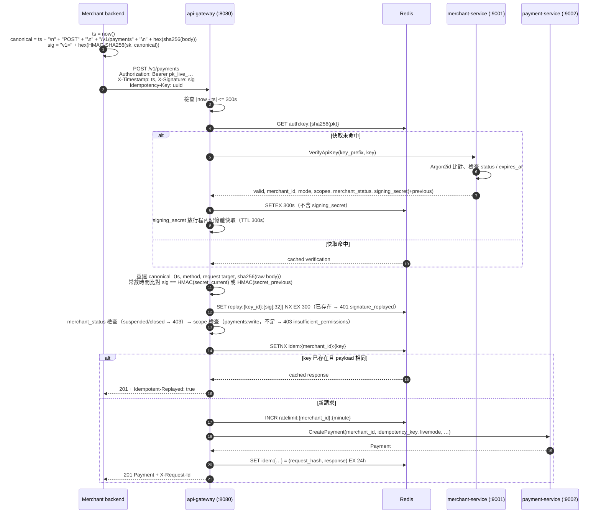

# PaymentGateway — API 設計說明

> 本文件說明商戶對外 REST API（`api/openapi/payment-gateway.yaml`）與服務間 gRPC 契約（`api/proto/pg/**`）的設計原則與使用方式。
> 所有決策以 `docs/01-architecture.md` 為準；簽章與金鑰以 `docs/06-security-compliance.md` 為權威；錯誤碼以 `docs/02-domain-and-ledger.md` §10 為權威；若本文件與前述文件衝突，以前述文件為準並提 ADR 修正。

---

## 1. 設計原則

### 1.1 資源導向
- URL 只出現**名詞**（`/payments`、`/refunds`、`/disputes`），動作以 HTTP method 表達。
- 狀態轉移型操作（請款、取消、確認、提交證據）屬於「對資源的子動作」，採 `POST /payments/{id}/capture` 形式；這是 REST 社群對狀態機操作的慣例（Stripe、GitHub 同款），比用 `PATCH status=captured` 更明確且可各自定義請求體與錯誤。
- 每個資源都有 `object` 欄位（`payment`、`refund`…）與帶前綴的 ID，方便在 webhook 與 log 中辨識。

| 資源 | ID 前綴 | 建立方式 |
|---|---|---|
| Payment | `pay_` | 商戶 `POST /payments` |
| PaymentAttempt | `att_` | 系統（內嵌於 Payment） |
| Refund | `re_` | 商戶 `POST /refunds` |
| Dispute | `dp_` | PSP 回呼（商戶不能建立） |
| WebhookEndpoint | `we_` | 商戶 |
| ApiKey | `key_` | 商戶 |
| Event | `evt_` | 系統 |
| Journal | `jrn_` | 系統（ledger-service） |
| Request | `req_` | 系統（每個 HTTP 請求） |

### 1.2 金額
- 一律 `Money { amount_minor: int64, currency: string }`，**沒有小數、沒有字串金額**。
- 同一 Payment 內所有 Money 幣別相同；v1 不做換匯。
- `captured_amount` 為實際請款金額（v1 單次請款，可小於 `amount`）；`refunded_amount` 為**累計**已成功退款金額，商戶不需自行加總。

### 1.3 冪等
- 所有 `POST` / `PATCH` / `DELETE` **必須**帶 `Idempotency-Key`（UUID 建議），商戶範圍內 24 小時唯一。
- 閘道行為（01 文件 §6.1）：
  1. Redis `SETNX idem:{merchant_id}:{key}` 取得鎖；取不到 → `409 idempotency_key_in_use`。
  2. 若已有儲存結果：比對 `request_hash`（method + path + body 的 SHA-256）；不同 → `409 idempotency_key_payload_mismatch`；相同 → 重放原回應並附 `Idempotent-Replayed: true`。
  3. 服務層（payment-service）以 `(merchant_id, idempotency_key)` 唯一索引做最後防線。
- **業務結果也被冪等**：第一次 `POST /payments` 被 PSP 拒絕（`201` + `status: failed`），重送同 key 仍回同一筆 `failed` 付款，不會再扣一次。要重試請換新的 key。
- `5xx` 與網路逾時：商戶應**用同一個 key 重送**，這是安全的。

### 1.4 「業務失敗」與「API 錯誤」的界線
這是最容易混淆的地方，規則只有一條：

> **建立資源的 POST 永遠回 `201`**（即使業務結果是失敗，資源已存在、`status` 與 `last_error` 說明結果）；
> **操作既有資源的 POST 若被 PSP 拒絕且資源狀態未改變，回 `402 provider_error`**。

| 情境 | 回應 |
|---|---|
| `POST /payments`，PSP 拒絕 | `201`，`status: failed`，`last_error.code: card_declined` |
| `POST /payments`，所有 failover 都不可用 | `201`，`status: failed`，`last_error.code: provider_unavailable` |
| `POST /payments/{id}/confirm`，3DS 失敗 | `200`，`status: failed`（狀態已轉移） |
| `POST /payments/{id}/capture`，PSP 拒絕請款 | `402 provider_error / card_declined`，付款仍為 `authorized` |
| `POST /refunds`，PSP 同步拒絕 | `201`，`status: failed` |
| `POST /payments/{id}/capture`，付款已是 `captured` | `409 invalid_request_error / invalid_state_transition` |

### 1.5 Payment 狀態與單次請款
Canonical 狀態全集（12 個，與 SQL CHECK、02 文件一致）：
`created`、`requires_action`、`authorized`、`captured`、`partially_refunded`、`refunded`、`voided`、`failed`、`expired`、`disputed`、`chargeback_won`、`chargeback_lost`。

- **v1 每筆付款只能請款一次**。`amount` 可小於授權金額（例如部分缺貨），請款後剩餘授權立即釋放，狀態為 `captured`、`captured_amount < amount`。沒有 `partially_captured` 狀態。
- 要分批收款請建立多筆付款（或 Phase 2 的多次 capture 功能）。

### 1.6 PaymentAttempt 狀態
每筆付款的 `attempts[]` 記錄每一次向 PSP 的嘗試（failover 會產生多筆）。狀態定義與 SQL 一致：

| status | 意義 | 後續 |
|---|---|---|
| `pending` | 已送出，等待 PSP 回應 | 極短暫 |
| `requires_action` | PSP 要求 3DS / 導向 | `confirm` 後收斂為 `approved` / `declined` |
| `approved` | PSP 核准（授權或請款成功） | 終態 |
| `declined` | PSP 明確拒絕（`error_category` 為 `declined_hard` / `declined_soft` / `fraud_suspected` / `invalid_request`） | 終態；`declined_soft` 依商戶偏好可 failover |
| `unavailable` | PSP 不可用（`provider_unavailable`），且確認 PSP 未處理本請求 | 終態；自動 failover 到下一個 PSP |
| `unknown` | 逾時 / 連線中斷，結果不明，PSP **可能已授權** | **不 failover**；attempt resolver 以 `GetPaymentStatus` 輪詢，**1 小時內**收斂為 `approved` / `declined` / `unavailable`；逾時仍無法收斂則付款轉 `failed` 並告警 |

商戶看到 `unknown` 時請勿重送新付款，等待 webhook 或輪詢 `GET /payments/{id}`。

### 1.7 版本策略
- 路徑版本 `/v1`。gRPC package 同步為 `pg.<service>.v1`。
- **向後相容變更（不升版）**：新增端點、新增「可選」請求欄位、新增回應欄位、新增 enum 值、新增事件類型、新增錯誤碼、放寬驗證。
- **Breaking change（升 `/v2`）**：移除或改名欄位 / 端點、改變欄位型別或語意、把可選改必填、移除 enum 值、改變既有錯誤碼的 HTTP status、改變簽章演算法（簽章另有 `v1=` 版本前綴可平行演進）。
- 商戶端**必須**容忍未知欄位、未知 enum 值與未知事件類型（收到不認識的事件回 2xx 即可）。

### 1.8 棄用流程
1. 在 OpenAPI 標記 `deprecated: true`，回應加 `Deprecation: true` 與 `Sunset: <RFC 1123 date>` header，`Link: <doc>; rel="sunset"`。
2. 公告後至少 **6 個月**才可停用；`/v1` 整體在 `/v2` 發佈後至少維護 **12 個月**。
3. Sunset 前 30 天起，對仍在使用的商戶以 email（`contact_email`）與後台通知提醒。
4. 停用當天起回 `410 Gone`（`invalid_request_error / endpoint_sunset`）。

---

## 2. 認證與簽章

### 2.1 憑證
建立 API 金鑰（`POST /api-keys`）一次性回傳兩個祕密：

| 名稱 | 格式 | 用途 | 儲存方式 |
|---|---|---|---|
| API key | `pk_live_…` / `pk_test_…` | `Authorization: Bearer` | 只存 Argon2id hash + 12 碼前綴 |
| Signing secret | `sk_live_…` / `sk_test_…` | 計算 `X-Signature` 的 HMAC 金鑰 | envelope encryption（06 §7.3；驗簽需明文，是「只存 hash」規則的唯一例外） |

### 2.2 請求簽章（權威定義：06 文件 §3.3）
```
Authorization: Bearer pk_live_<43>
X-Timestamp:   <Unix 秒，UTC>
X-Signature:   v1=<hex(HMAC-SHA256(signing_secret, canonical))>
```
**Canonical string** 為四行、以 `\n` 分隔、結尾無換行：
```
<X-Timestamp>             例：1755658245
<HTTP method 大寫>        例：POST
<request target>          path + "?" + 原始 query string（不重新編碼）；無 query 時只有 path，例：/v1/payments
<hex(sha256(raw_body))>   GET / DELETE 無 body 時為 sha256("") = e3b0c44298fc1c149afbf4c8996fb92427ae41e4649b934ca495991b7852b855
```
- HMAC 金鑰為 `sk_live_…` **含前綴的完整字串**；輸出小寫 hex 64 字元，前面加 `v1=`。
- request target **包含 `/v1` 前綴**（即 server URL 的 path 部分 + 端點路徑）。
- `raw_body` 為請求原始 bytes；不得先 parse 再序列化。
- 時間窗 ±300 秒（`401 timestamp_out_of_window`）；同一簽章 300 秒內重複出現回 `401 signature_replayed`（閘道以 Redis `SET replay:{key_id}:{sig[:32]} NX EX 300` 偵測）。
- 閘道比對使用常數時間比較（`crypto/subtle.ConstantTimeCompare`）。
- 納入 method 與 request target 的目的：防止把 `POST /v1/payments` 的合法簽章重放到 `POST /v1/refunds` 等其他端點。

### 2.3 流程圖


閘道驗證順序（06 §3.3）：Authorization 格式 → 金鑰查找 / Argon2id → `revoked` / `expired` → 商戶狀態 → 時間戳 → 簽章 → 重放 → scope。

### 2.4 授權範圍（scopes）
| scope | 允許的端點 |
|---|---|
| `payments:read` | `GET /payments*` |
| `payments:write` | `POST /payments*`（含 capture / void / confirm） |
| `refunds:read` / `refunds:write` | `/refunds*` |
| `disputes:read` / `disputes:write` | `/disputes*`、`/disputes/{id}/evidence` |
| `webhooks:manage` | `/webhook-endpoints*` |
| `api_keys:manage` | `/api-keys*` |
| `ledger:read` | `/ledger/*` |
| `events:read` | `/events*` |

scope 不足回 `403 authentication_error / insufficient_permissions`。金鑰 scopes 為空表示全部。

### 2.5 商戶狀態對操作的影響（02 §5 約束表）
金鑰本身有效時，`VerifyApiKey` 回 `valid=true` 並附 `merchant_status`，由閘道依操作種類決定放行或回 `403`：

| 商戶狀態 | 建立付款 | 請款 / 取消 / 確認 | 退款 | 爭議證據 | 設定類（webhook / api key） | 查詢 |
|---|---|---|---|---|---|---|
| `active` | 允許 | 允許 | 允許 | 允許 | 允許 | 允許 |
| `suspended` | `403 merchant_suspended` | 允許（善後既有付款） | **允許**（保護消費者） | 允許 | 允許 | 允許 |
| `closed` | `403 merchant_closed` | `403 merchant_closed` | `403 merchant_closed` | `403 merchant_closed` | `403 merchant_closed` | 允許 |

- 狀態轉移 `active ⇄ suspended → closed`，`closed` 為終態。
- 金鑰被撤銷 / 過期與商戶狀態無關，分別回 `401 api_key_revoked` / `401 api_key_expired`。

---

## 3. 分頁、過濾、排序、metadata

### 3.1 分頁（cursor-based）
```
GET /v1/payments?limit=20&cursor=eyJjIjoiMjAyNi0wOC0yMFQwMzowNDowNVoiLCJpIjoicGF5XzAxSjVYOVEzSzhUMk00TjZQOFIwUzJUNFY2In0
```
回應：
```json
{ "data": [ … ], "has_more": true, "next_cursor": "eyJj…" }
```
- `limit` 1–100，預設 20。
- `cursor` 為不透明 base64url（內含排序鍵 `(created_at, id)` 與篩選條件的 hash）；篩選條件改變時沿用舊 cursor 回 `400 parameter_invalid`。
- 不提供 offset / 總筆數（大表上成本太高且結果不穩定）。
- gRPC 對應：`pg.common.v1.PageRequest { page_size, page_token }` / `PageResponse { next_page_token, has_more }`。
- 注意：query string 是 canonical string 的一部分，簽章時 request target 必須帶上完整的 `?limit=…&cursor=…`。

### 3.2 過濾
| 參數 | 說明 | 範例 |
|---|---|---|
| `status` | 逗號分隔多值（OR） | `status=captured,partially_refunded` |
| `created_gte` / `created_lt` | RFC 3339，閉開區間 | `created_gte=2026-08-01T00:00:00Z` |
| `customer_id`、`currency`、`provider`、`payment_id` | 精確比對 | |
| `metadata[key]` | deepObject，最多 3 組（AND） | `metadata[order_id]=A10023` |
| `type`（events） | 支援尾端萬用字元 | `type=payment.*,refund.succeeded` |

### 3.3 排序
- 只支援 `sort=created_at.desc`（預設）或 `created_at.asc`。次要排序鍵固定為 `id`，保證穩定分頁。

### 3.4 metadata
- 自由鍵值對，key 最長 40（`[A-Za-z0-9_.-]`）、value 最長 500、最多 50 組。
- 閘道不解讀內容；會原樣存入、原樣出現在 webhook 與查詢回應，並轉送至 PSP metadata（方便在 PSP 後台對照）。
- **不要放敏感資料**（卡號、身分證號）；metadata 會出現在 log 以外的所有地方，但不會被遮罩。

---

## 4. 完整走查：建立付款 → 3DS → 請款 → 退款

以下用 bash 示範簽章與四個呼叫。假設：
```bash
export PG_BASE=http://localhost:8080/v1
export PG_KEY=pk_test_ab12Cd34Ef56Gh78Ij90Kl12Mn34Op56Qr78St90
export PG_SK=sk_test_Zm9vYmFyYmF6cXV4MTIzNDU2Nzg5MGFiY2RlZmdo

# 簽章 helper（06 §3.3 canonical）：用法 sign METHOD REQUEST_TARGET [RAW_BODY]；輸出 "<ts> v1=<sig>"
# REQUEST_TARGET 必須含 /v1 前綴與原始 query string，例：/v1/payments、/v1/ledger/journals?reference_id=pay_x
sign() {
  local method=$1 target=$2 body=${3:-}
  local ts; ts=$(date +%s)
  local body_hash; body_hash=$(printf '%s' "$body" | openssl dgst -sha256 -hex | sed 's/^.* //')
  local canonical; canonical=$(printf '%s\n%s\n%s\n%s' "$ts" "$method" "$target" "$body_hash")
  local sig; sig=$(printf '%s' "$canonical" | openssl dgst -sha256 -hmac "$PG_SK" -hex | sed 's/^.* //')
  echo "$ts v1=$sig"
}
```

### 步驟 1：建立付款（手動請款、要求 3DS）
```bash
BODY='{"amount":{"amount_minor":499000,"currency":"TWD"},"capture_method":"manual","payment_method":{"type":"card","card":{"token":"tok_mock_3ds","token_provider":"mock"}},"customer":{"id":"cus_1","email":"a@example.com","ip_address":"203.0.113.9","user_agent":"Mozilla/5.0"},"three_ds":"required","return_url":"https://shop.example.com/checkout/return","metadata":{"order_id":"A10023"}}'
read TS SIG < <(sign POST /v1/payments "$BODY")

curl -s -X POST "$PG_BASE/payments" \
  -H "Authorization: Bearer $PG_KEY" \
  -H "X-Timestamp: $TS" -H "X-Signature: $SIG" \
  -H "Idempotency-Key: $(uuidgen)" \
  -H "Content-Type: application/json" \
  --data-binary "$BODY"
```
（`--data-binary` 確保送出的 bytes 與簽章用的 `$BODY` 完全一致。）

回應 `201`：
```json
{
  "id": "pay_01J5X9R4M9V3N5P7Q9S1T3V5W7",
  "object": "payment",
  "status": "requires_action",
  "amount": { "amount_minor": 499000, "currency": "TWD" },
  "captured_amount": { "amount_minor": 0, "currency": "TWD" },
  "next_action": {
    "type": "redirect",
    "redirect": { "url": "http://localhost:9101/3ds/challenge?session=s_abc", "method": "GET" },
    "expires_at": "2026-08-20T03:19:05Z"
  },
  "attempts": [ { "sequence": 1, "provider": "mock", "status": "requires_action", "error_category": "authentication_required" } ],
  "provider": "mock",
  "provider_reference": "mock_pi_001",
  "livemode": false,
  "...": "..."
}
```
商戶把客戶導向 `next_action.redirect.url`。同時商戶端點會收到 `payment.created` 與 `payment.requires_action` 事件。

### 步驟 2：客戶完成 3DS，回到 return_url → 確認付款
PSP 把客戶帶回 `https://shop.example.com/checkout/return?payment_id=pay_…&session=s_abc&result=ok`。商戶把查詢參數原樣放進 `provider_params`：
```bash
PAY=pay_01J5X9R4M9V3N5P7Q9S1T3V5W7
BODY='{"provider_params":{"session":"s_abc","result":"ok"}}'
read TS SIG < <(sign POST "/v1/payments/$PAY/confirm" "$BODY")

curl -s -X POST "$PG_BASE/payments/$PAY/confirm" \
  -H "Authorization: Bearer $PG_KEY" \
  -H "X-Timestamp: $TS" -H "X-Signature: $SIG" \
  -H "Idempotency-Key: $(uuidgen)" \
  -H "Content-Type: application/json" \
  --data-binary "$BODY"
```
回應 `200`，`status: authorized`，`authorized_at` 有值，`attempts[0].status: approved`，`payment_method.card.three_ds_result: authenticated`。事件：`payment.authorized`。

> 若 3DS 失敗：同樣回 `200`，但 `status: failed`、`attempts[0].status: declined`、`last_error.code: authentication_failed`。事件：`payment.failed`。

### 步驟 3：請款（單次；金額可小於授權）
```bash
# 只收 300,000（例如部分缺貨）；剩餘 199,000 授權額度立即釋放
BODY='{"amount":{"amount_minor":300000,"currency":"TWD"}}'
read TS SIG < <(sign POST "/v1/payments/$PAY/capture" "$BODY")
curl -s -X POST "$PG_BASE/payments/$PAY/capture" \
  -H "Authorization: Bearer $PG_KEY" -H "X-Timestamp: $TS" -H "X-Signature: $SIG" \
  -H "Idempotency-Key: $(uuidgen)" -H "Content-Type: application/json" --data-binary "$BODY"
# → 200, status: captured, captured_amount: 300000（amount 仍為 499000）
# 事件：payment.captured（data.object.captured_amount = 300000）

# 全額請款則 body 為 {} 或省略 amount。再次呼叫 capture 會回 409 invalid_state_transition。
```
ledger-service 消費 `payment.captured`，記一筆 journal（借 `psp_receivable` 300,000 / 貸 `merchant_payable` + `fee_revenue`）。

### 步驟 4：部分退款
```bash
BODY="{\"payment_id\":\"$PAY\",\"amount\":{\"amount_minor\":50000,\"currency\":\"TWD\"},\"reason\":\"requested_by_customer\"}"
read TS SIG < <(sign POST /v1/refunds "$BODY")
curl -s -X POST "$PG_BASE/refunds" \
  -H "Authorization: Bearer $PG_KEY" -H "X-Timestamp: $TS" -H "X-Signature: $SIG" \
  -H "Idempotency-Key: $(uuidgen)" -H "Content-Type: application/json" --data-binary "$BODY"
```
回應 `201`，`status: pending`。幾秒後（mock）或數分鐘後（真實 PSP）收到 `refund.succeeded`，付款轉為 `partially_refunded`、`refunded_amount: 50000`。

### 步驟 5：查詢與餘額（GET：body 為空，query string 必須納入 request target）
```bash
read TS SIG < <(sign GET "/v1/payments/$PAY")
curl -s "$PG_BASE/payments/$PAY" \
  -H "Authorization: Bearer $PG_KEY" -H "X-Timestamp: $TS" -H "X-Signature: $SIG"

TARGET="/v1/ledger/journals?reference_type=payment&reference_id=$PAY"
read TS SIG < <(sign GET "$TARGET")
curl -s "http://localhost:8080$TARGET" \
  -H "Authorization: Bearer $PG_KEY" -H "X-Timestamp: $TS" -H "X-Signature: $SIG"
```

---

## 5. Webhook

### 5.1 事件類型總表
| 事件 | 資源 | 觸發時機 | 終態 | 記帳 |
|---|---|---|---|---|
| `payment.created` | payment | 付款建立（尚未授權） | 否 | 否 |
| `payment.requires_action` | payment | 需客戶完成 3DS / 導向 | 否 | 否 |
| `payment.authorized` | payment | 授權成功（僅 `manual`） | 否 | 否 |
| `payment.captured` | payment | 請款成功（每筆付款一則） | 否 | **是** |
| `payment.voided` | payment | 授權取消 | 是 | 否 |
| `payment.failed` | payment | 授權 / 3DS 失敗 | 是 | 否 |
| `payment.expired` | payment | 3DS 逾時或授權逾期 | 是 | 否 |
| `refund.created` | refund | 退款送交 PSP | 否 | 是（預扣） |
| `refund.succeeded` | refund | 退款完成 | 是 | 是 |
| `refund.failed` | refund | 退款失敗 | 是 | 是（沖回預扣） |
| `dispute.opened` | dispute | PSP 通知爭議 | 否 | 是（凍結） |
| `dispute.evidence_submitted` | dispute | 證據送交 PSP | 否 | 否 |
| `dispute.won` | dispute | 商戶勝訴 | 是 | 是（釋放） |
| `dispute.lost` | dispute | 商戶敗訴 | 是 | 是（扣款） |

對應 Kafka `payment.events` 的 `pg.payment.v1.PaymentEventType`；webhook 名稱 = enum 名稱去前綴、小寫、第一個 `_` 轉 `.`。

### 5.2 送達規格
- `POST <endpoint.url>`，`Content-Type: application/json`，body 為 `Event` 物件（與 `GET /events/{id}` 相同）。
- Headers：
  - `X-PG-Signature: t=<unix_ts>,v1=<hex>[,v1=<hex>]`
  - `X-PG-Event-Id: evt_…`
  - `User-Agent: PaymentGateway-Webhooks/1.0`
- 商戶須在 **10 秒內**回任何 `2xx`。其他狀態碼、逾時、連線失敗皆視為失敗。
- Delivery 狀態：`pending` → `in_flight` → `succeeded` | `failed`（等待重試）| `dead_letter`（重試用盡）| `canceled`（端點刪除 / 停用）。
- 重試：最多 8 次，間隔 1m、5m、30m、2h、6h、12h、24h、24h（約 3 天）；全部失敗進入 **dead_letter**，可在後台或 `WebhookService.RetryDelivery` 手動重送（不計入自動重試上限）。
- 端點連續 7 天所有送達皆失敗 → `auto_disabled`，商戶需 `PATCH status: enabled` 重新啟用。
- **順序不保證**（例如 `payment.captured` 可能早於 `payment.created` 到達）；請以 `data.object` 的狀態與 `created_at` 為準，並以事件 ID 去重。
- 同一事件送到多個端點時各自獨立重試。

### 5.3 payload 範例
```json
{
  "id": "evt_01J5XE4R6S8T0V2W4X6Y8Z0A2B",
  "object": "event",
  "type": "payment.captured",
  "api_version": "v1",
  "livemode": true,
  "created_at": "2026-08-20T03:04:05Z",
  "payment_id": "pay_01J5X9Q3K8T2M4N6P8R0S2T4V6",
  "request": { "id": "req_01J5XD3Q5R7S9T1V3W5X7Y9Z1A", "idempotency_key": "4b3f9d2e-…" },
  "data": {
    "object": {
      "id": "pay_01J5X9Q3K8T2M4N6P8R0S2T4V6",
      "object": "payment",
      "status": "captured",
      "amount": { "amount_minor": 150000, "currency": "TWD" },
      "captured_amount": { "amount_minor": 150000, "currency": "TWD" },
      "refunded_amount": { "amount_minor": 0, "currency": "TWD" },
      "metadata": { "order_id": "A10023" },
      "provider": "stripe",
      "provider_reference": "pi_3NXyzABC",
      "...": "..."
    }
  }
}
```

### 5.4 簽章驗證（偽碼）
Webhook 簽章（閘道 → 商戶）與請求簽章（商戶 → 閘道）是**兩套不同的 canonical**：webhook 沿用 Stripe 相容的 `t + "." + raw_body`（06 §5）。
```
function verify_webhook(raw_body: bytes, header: string, secrets: [string], tolerance = 300s) -> bool:
    parts   = parse "t=<ts>,v1=<sig>[,v1=<sig>]" from header
    ts      = parts.t
    sigs    = parts.v1[]                       # 可能有兩個（secret 輪替期間）
    if abs(now() - ts) > tolerance: return false

    signed_payload = ts + "." + raw_body       # 必須用原始 bytes，不可先 JSON parse 再序列化
    for secret in secrets:                     # 商戶若剛輪替也可能保有兩把
        expected = hex(HMAC_SHA256(secret, signed_payload))
        for sig in sigs:
            if constant_time_equal(expected, sig): return true
    return false

# handler
on POST /webhooks/pg:
    body = read_raw_body()
    if not verify_webhook(body, req.header["X-PG-Signature"], [WHSEC_CURRENT, WHSEC_PREVIOUS]):
        return 400
    event_id = req.header["X-PG-Event-Id"]
    if db.already_processed(event_id): return 200     # 去重
    event = json.parse(body)
    enqueue(event)                                     # 不要在 handler 內做耗時工作
    db.mark_processed(event_id)
    return 200
```

Go 參考實作（`pkg/sig` 會提供同款函式）：
```go
func VerifyWebhook(body []byte, header string, secrets []string, tolerance time.Duration) bool {
    ts, sigs, ok := parseHeader(header) // t=..., v1=...
    if !ok || time.Since(time.Unix(ts, 0)).Abs() > tolerance { return false }
    payload := append([]byte(strconv.FormatInt(ts, 10)+"."), body...)
    for _, s := range secrets {
        mac := hmac.New(sha256.New, []byte(s)); mac.Write(payload)
        want := hex.EncodeToString(mac.Sum(nil))
        for _, got := range sigs {
            if hmac.Equal([]byte(want), []byte(got)) { return true }
        }
    }
    return false
}
```

### 5.5 Secret 輪替
1. `PATCH /webhook-endpoints/{id}` 帶 `{"rotate_secret": true}` → 回應含新 `secret`。
2. 24 小時內 webhook 同時帶兩個 `v1=`（新舊各一）；商戶可先部署新 secret 再移除舊的。
3. 24 小時後舊 secret 失效。

---

## 6. gRPC 內部 API

### 6.1 一覽表
| 服務 / port | Service | RPC | 用途 | 主要呼叫者 |
|---|---|---|---|---|
| merchant-service :9001 | `pg.merchant.v1.MerchantService` | `CreateMerchant` | 建立商戶 | 後台 |
| | | `GetMerchant` | 查詢商戶 | 後台、gateway |
| | | `UpdateMerchant` | 部分更新（FieldMask） | 後台 |
| | | `ListMerchants` | 列表 | 後台 |
| | | `CreateApiKey` | 建立金鑰（明文 + signing secret 一次性回傳） | gateway |
| | | `RevokeApiKey` | 撤銷金鑰 | gateway |
| | | `ListApiKeys` | 列表 | gateway |
| | | `VerifyApiKey` | 驗證金鑰，回 merchant_id / mode / scopes / merchant_status / signing_secret（+previous） | gateway（每請求，快取 300s） |
| | | `CreateWebhookEndpoint` | 建立端點（secret 一次性回傳） | gateway |
| | | `UpdateWebhookEndpoint` | 更新 / 輪替 secret | gateway |
| | | `DeleteWebhookEndpoint` | 軟刪除 | gateway |
| | | `ListWebhookEndpoints` | 列表（`include_secrets` 僅 webhook-service） | gateway、webhook-service |
| | | `GetRoutingPreferences` | 取路由偏好 | payment-service |
| | | `UpdateRoutingPreferences` | 整份覆寫路由偏好 | 後台 |
| payment-service :9002 | `pg.payment.v1.PaymentService` | `CreatePayment` | 建立 + 授權（路由、failover） | gateway |
| | | `GetPayment` / `ListPayments` | 查詢 | gateway、reconciliation |
| | | `CapturePayment` | 請款（v1 單次，金額可小於授權） | gateway |
| | | `VoidPayment` | 取消授權 | gateway |
| | | `ConfirmPayment` | 3DS 後確認 | gateway |
| | | `CreateRefund` / `GetRefund` / `ListRefunds` | 退款 | gateway |
| | | `GetDispute` / `ListDisputes` | 爭議查詢 | gateway |
| | | `SubmitDisputeEvidence` | 提交證據 | gateway |
| provider-* :9101/9102 | `pg.provider.v1.ProviderAdapter` | `Authorize` | 授權（可立即請款；可回 requires_action） | payment-service |
| | | `Capture` / `Void` / `Refund` | 資金操作 | payment-service |
| | | `GetPaymentStatus` | `unknown` attempt 收斂、對帳 | payment-service（attempt resolver）、reconciliation |
| | | `ParseWebhook` | 驗簽並正規化 PSP webhook | payment-service |
| | | `HealthCheck` | 健康度與能力宣告 | payment-service 路由引擎 |
| ledger-service :9003 | `pg.ledger.v1.LedgerService` | `CreateAccount` / `GetAccount` / `ListAccounts` | 帳戶 | 後台、自動建立 |
| | | `GetBalance` | 餘額（帳戶或商戶拆解） | gateway |
| | | `PostJournal` | 內部過帳（借貸必相等） | reconciliation、後台 |
| | | `GetJournal` / `ListJournals` | 查詢 | gateway、reconciliation |
| webhook-service :9004 | `pg.webhook.v1.WebhookService` | `ListDeliveries` / `GetDelivery` | 送達紀錄（含 dead_letter） | gateway（Phase 1）、後台 |
| | | `RetryDelivery` | 手動重送（failed / dead_letter / succeeded） | 後台 |
| | | `ListEventTypes` | 事件類型清單 | gateway、文件生成 |
| reconciliation-service :9005 | `pg.reconciliation.v1.ReconciliationService` | `ImportSettlementFile` | 匯入結算檔（client streaming 或 URL） | 排程、後台 |
| | | `GetReconciliationRun` / `ListReconciliationRuns` | 對帳執行 | 後台 |
| | | `ListDiscrepancies` | 差異 | 後台 |
| | | `ResolveDiscrepancy` | 處理差異（可產生調整分錄） | 後台 |

### 6.2 REST → gRPC 對照
| REST | gRPC |
|---|---|
| `POST /payments` | `PaymentService.CreatePayment` |
| `GET /payments` / `/payments/{id}` | `ListPayments` / `GetPayment` |
| `POST /payments/{id}/capture` | `CapturePayment` |
| `POST /payments/{id}/void` | `VoidPayment` |
| `POST /payments/{id}/confirm` | `ConfirmPayment` |
| `POST /refunds`、`GET /refunds*` | `CreateRefund` / `ListRefunds` / `GetRefund` |
| `GET /disputes*`、`POST /disputes/{id}/evidence` | `ListDisputes` / `GetDispute` / `SubmitDisputeEvidence` |
| `/webhook-endpoints*` | `MerchantService.*WebhookEndpoint*` |
| `/api-keys*` | `MerchantService.CreateApiKey` / `ListApiKeys` / `RevokeApiKey` |
| `GET /ledger/balance` | `LedgerService.GetBalance(merchant)` |
| `GET /ledger/journals*` | `LedgerService.ListJournals` / `GetJournal` |
| `GET /events*` | gateway 直接查 event store（payment-service 的 `payment_events` 投影，Phase 0 以 `ListPayments` + outbox 表代替） |
| `POST /psp/{provider}/webhook` | gateway → payment-service 內部 `IngestProviderWebhook`（Phase 0 以 `ProviderAdapter.ParseWebhook` 直接呼叫） |

### 6.3 gRPC 錯誤對應
| gRPC code | REST status | 典型 `error.type` |
|---|---|---|
| `INVALID_ARGUMENT` | 400 / 422 | `invalid_request_error`（依 ErrorDetail.code 決定 400 或 422） |
| `NOT_FOUND` | 404 | `invalid_request_error / resource_missing` |
| `ALREADY_EXISTS` | 409 | `invalid_request_error` |
| `ABORTED` | 409 | `idempotency_error` |
| `FAILED_PRECONDITION` | 409 或 402 | `invalid_request_error / invalid_state_transition`，或 `provider_error`（ErrorDetail.type 決定） |
| `PERMISSION_DENIED` | 403 | `authentication_error`（`insufficient_permissions` / `merchant_suspended` / `merchant_closed`） |
| `UNAUTHENTICATED` | 401 | `authentication_error` |
| `RESOURCE_EXHAUSTED` | 429 / 422 | `rate_limit_error` 或 `invalid_request_error`（例 api_key_limit_reached） |
| `UNAVAILABLE` / `DEADLINE_EXCEEDED` | 503 | `api_error / service_unavailable` |
| `INTERNAL` / 其他 | 500 | `api_error / internal_error` |

服務端以 `status.WithDetails(&commonv1.ErrorDetail{...})` 夾帶細節；gateway 的 `pkg/httpx` 負責轉譯並加上 `request_id`。

### 6.4 Proto 演進規則
1. **欄位只增不刪**。要淘汰的欄位加 `[deprecated = true]` 註解並保留；真的要移除時把編號與名稱放進 `reserved`（範例：`PaymentStatus` 中已移除的 `PARTIALLY_CAPTURED = 5`）：
   ```proto
   reserved 5;
   reserved "PAYMENT_STATUS_PARTIALLY_CAPTURED";
   ```
2. **不可重用欄位編號**、不可改欄位型別、不可改 `oneof` 成員歸屬、不可改 package / go_package。
3. **enum**：只增不刪；第 0 值永遠是 `*_UNSPECIFIED`；消費者必須把未知值當 UNSPECIFIED 處理。
4. **RPC**：新增 RPC 為相容變更；移除或改簽章為 breaking。要淘汰的 RPC 加 `option deprecated = true;`。
5. **Request/Response 一律獨立 message**（不直接回傳領域物件），確保未來可加欄位。
6. **Breaking change 檢查**：CI 以 `buf breaking --against '.git#branch=main'`（`FILE` 規則）擋下所有破壞性變更；需要 breaking 時開新 package `pg.<service>.v2`，舊版至少並存兩個 release。
7. **Kafka 事件**（`events.proto`）視為永久合約：consumer 可能重放一年前的事件，因此 payload 只能加欄位，且新欄位必須有合理的零值語意。
8. 所有產物（`api/gen/go`）commit 進 repo，PR 必須同時包含 proto 與重新生成的 Go 程式碼（CI 以 `buf generate && git diff --exit-code` 驗證）。

---

## 7. 錯誤碼總表

格式（01 文件 §8）：
```json
{ "error": { "type": "...", "code": "...", "message": "...", "param": "...", "request_id": "req_..." } }
```
權威清單為 02 文件 §10；本節為商戶視角的摘要，認證類 code 與 02 §10 / 06 §3.3 完全一致。

### 7.1 `invalid_request_error`
| code | HTTP | 說明 |
|---|---|---|
| `parameter_missing` | 400 | 缺必填欄位（`param` 指出欄位） |
| `parameter_invalid` | 400 | 型別 / 格式錯誤、JSON 無法解析、cursor 無效 |
| `parameter_unknown` | 400 | 未知欄位（嚴格模式，預設只警告不拒絕；`X-PG-Strict: true` 時拒絕） |
| `resource_missing` | 404 | 資源不存在或不屬於此商戶 |
| `invalid_state_transition` | 409 | 目前狀態不允許此操作（capture 已 captured 的付款、void 已 captured 的付款等） |
| `amount_too_small` | 422 | 低於幣別最小金額 |
| `amount_too_large` | 422 | 超過單筆上限 |
| `currency_not_supported` | 422 | 幣別不支援 |
| `currency_mismatch` | 422 | capture / refund 幣別與付款不同 |
| `capture_amount_exceeds_authorized` | 422 | 請款金額超過授權金額 |
| `refund_amount_exceeds_captured` | 422 | 退款金額超過可退金額 |
| `payment_method_invalid` | 422 | token 無效 / 過期 / token_provider 未知 |
| `return_url_required` | 422 | 該付款方式需要 return_url |
| `evidence_window_closed` | 422 | 超過證據提交期限 |
| `webhook_url_invalid` | 422 | 非 https 或無法解析 |
| `webhook_endpoint_limit_reached` | 422 | 超過 16 個端點 |
| `api_key_limit_reached` | 422 | 超過 10 把有效金鑰 |
| `cannot_revoke_current_key` | 409 | 不可撤銷正在使用的金鑰 |
| `webhook_signature_invalid` | 400 | PSP inbound webhook 驗簽失敗（`/psp/*`） |
| `endpoint_sunset` | 410 | 端點已停用 |

### 7.2 `authentication_error`（與 02 §10、06 §3.3 一致）
| code | HTTP | 說明 |
|---|---|---|
| `invalid_api_key` | 401 | 缺 `Authorization`、格式不符、key 不存在 |
| `api_key_revoked` | 401 | 金鑰已撤銷 |
| `api_key_expired` | 401 | 金鑰已過期 |
| `signature_missing` | 401 | 缺 `X-Signature` / `X-Timestamp`，或 `X-Signature` 不是 `v1=` 格式 |
| `signature_invalid` | 401 | HMAC 與 canonical（timestamp、method、request target、body hash）不符 |
| `timestamp_out_of_window` | 401 | 與伺服器時間差超過 300 秒 |
| `signature_replayed` | 401 | 同一簽章在 300 秒內重複出現 |
| `merchant_suspended` | 403 | 商戶暫停：不允許建立付款；退款、既有付款善後、查詢仍允許 |
| `merchant_closed` | 403 | 商戶已關閉：所有寫入操作拒絕（含退款），僅允許查詢 |
| `insufficient_permissions` | 403 | 金鑰 scope 不足 |

### 7.3 `idempotency_error`
| code | HTTP | 說明 |
|---|---|---|
| `idempotency_key_missing` | 400 | 寫入操作缺 `Idempotency-Key` |
| `idempotency_key_invalid` | 400 | 長度 > 255 或含不可見字元 |
| `idempotency_key_in_use` | 409 | 同 key 請求仍在處理中 |
| `idempotency_key_payload_mismatch` | 409 | 同 key 但 payload 不同 |

### 7.4 `rate_limit_error`
| code | HTTP | 說明 |
|---|---|---|
| `rate_limit_exceeded` | 429 | 超過每分鐘配額（預設 600/商戶） |
| `concurrency_limit_exceeded` | 429 | 同時進行中的請求過多（預設 50） |

### 7.5 `provider_error`（僅用於對既有資源的操作被 PSP 拒絕；建立時的拒絕見 `last_error`）
| code | HTTP | ProviderErrorCategory | 說明 |
|---|---|---|---|
| `card_declined` | 402 | `DECLINED_SOFT` / `DECLINED_HARD` | 發卡行拒絕；`message` 含 PSP 原因 |
| `insufficient_funds` | 402 | `DECLINED_SOFT` | 餘額不足 |
| `expired_card` | 402 | `DECLINED_HARD` | 卡片過期 |
| `fraud_suspected` | 402 | `FRAUD_SUSPECTED` | PSP 風控攔截 |
| `authentication_failed` | 402 | `AUTHENTICATION_REQUIRED` | 3DS 驗證失敗（confirm 時） |
| `provider_unavailable` | 402 | `PROVIDER_UNAVAILABLE` | PSP 暫時不可用；可用同 key 重試 |
| `provider_rejected` | 402 | `INVALID_REQUEST` / `UNKNOWN` | PSP 拒絕且無法歸類 |

同一組 code 也會出現在 `Payment.last_error.code`、`Refund.failure_code`；`PaymentAttempt.error_code` 則為 PSP 原始碼，`PaymentAttempt.status` 為 `declined` / `unavailable`。

### 7.6 `api_error`
| code | HTTP | 說明 |
|---|---|---|
| `internal_error` | 500 | 未預期錯誤；可用同 key 重試 |
| `service_unavailable` | 503 | 內部服務不可用；依 `Retry-After` 重試 |
| `timeout` | 504 | 內部呼叫逾時；**付款可能已建立**，請用同 key 重送或以 `GET /payments?metadata[...]` 查詢 |

### 7.7 HTTP status 速查
| status | 何時 |
|---|---|
| 200 | 查詢成功、對既有資源操作成功 |
| 201 | 資源建立（含業務失敗的 `status: failed`） |
| 204 | 刪除成功 |
| 400 | 格式錯誤、缺必填、缺 Idempotency-Key |
| 401 | 認證失敗（金鑰、簽章、時間窗、重放） |
| 402 | PSP 拒絕對既有資源的操作 |
| 403 | scope 不足（`insufficient_permissions`）、商戶暫停 / 關閉 |
| 404 | 資源不存在 |
| 409 | 冪等衝突、狀態不允許 |
| 410 | 端點已停用 |
| 422 | 業務規則違反 |
| 429 | 限流 |
| 500 / 503 / 504 | 系統錯誤 |

---

## 8. 相關檔案
- OpenAPI：`api/openapi/payment-gateway.yaml`
- Proto：`api/proto/pg/{common,merchant,payment,provider,ledger,webhook,reconciliation}/v1/*.proto`
- 架構：`docs/01-architecture.md`
- 領域、帳本與錯誤碼權威清單：`docs/02-domain-and-ledger.md`
- 安全（簽章權威定義）：`docs/06-security-compliance.md`
