# PaymentGateway — 關鍵流程與循序圖（Flows & Sequences）

> 本文件把 `01-architecture.md` 的決策展開成可實作的流程。服務、port、topic、狀態名稱以 `01` 為準；聚合根欄位、狀態轉移表、錯誤分類以 `02-domain-and-ledger.md` 為準；資料表結構以 `04-data-model.md` 為準；簽章、webhook 重試、PSP inbound 驗簽以 `06-security-compliance.md` 為準。本文件只「展開」不「更改」。
> 與隊友文件之間仍待收斂的差異列在 §15。

## 0. 閱讀指南與共用約定

### 0.1 參與者縮寫

| 縮寫 | 服務 / 元件 | 備註 |
|---|---|---|
| `M` | 商戶後端 | 呼叫 REST API、接收 webhook |
| `GW` | api-gateway（HTTP :8080） | 驗簽、冪等、限流、REST→gRPC |
| `R` | Redis | 冪等鍵、API key 快取、重放 nonce、限流、provider 健康度滑動視窗 |
| `MS` | merchant-service（:9001） | API key、webhook 端點、路由偏好、費率表 |
| `PS` | payment-service（:9002） | Saga orchestrator |
| `DB` | `pg_payment` | payment-service 專屬資料庫 |
| `PA` / `PA1` / `PA2` | provider adapter（provider-mock :9101、provider-stripe :9102） | 實作 `pg.provider.v1.ProviderAdapter` |
| `PSP` | 外部支付供應商 | 只有 adapter 會碰到 |
| `OR` | outbox relay（`pkg/outbox`，跑在各擁有 DB 的服務行程內） | polling + `FOR UPDATE SKIP LOCKED` |
| `K` | Kafka | `payment.events` / `refund.events` / `ledger.events` / `merchant.events` / `reconciliation.events` |
| `LS` | ledger-service（:9003） | 雙式記帳 |
| `WS` | webhook-service（:9004） | 對商戶通知 |
| `RS` | reconciliation-service（:9005） | 對帳 |
| `JOB` | 排程工作 | 見 §14 |

### 0.2 payment-service 內的關鍵資料（摘要，欄位以 02 §2.2 / 04 §2 為準）

| 表 | 用途 | 關鍵欄位 |
|---|---|---|
| `payments` | 聚合根狀態表 | `id, public_id(pay_), merchant_id, idempotency_key, idempotency_request_hash, status, amount, currency, capture_method, amount_authorized, amount_captured, amount_refunded, amount_refund_pending, disputed_amount, current_attempt_id, winning_attempt_id, pending_operation(null/capture/void), capture_idempotency_key, auth_expires_at, expires_at, failure, live_mode, version` |
| `payment_attempts` | 每次對 provider 的 Authorize 嘗試（02 §4） | `id(att_), payment_id, attempt_no, provider, provider_account_id, provider_reference, status(pending/requires_action/approved/declined/unavailable/unknown), needs_reconciliation, error_category, decline_code, latency_ms` |
| `payment_events` | append-only 事件表，按月分割 | `id(evt_), aggregate_type, aggregate_id, seq(= 轉移後的 payments.version), type, payload(protobuf), occurred_at` |
| `refunds` | 退款聚合根 | `id(ref_), payment_id, merchant_id, idempotency_key, amount, status(pending/succeeded/failed), provider, provider_refund_id, fee_returned_amount, version` |
| `disputes` | 爭議聚合根（02 §6） | `id(dsp_), payment_id, provider, provider_dispute_id, stage, status(opened/evidence_submitted/won/lost), amount, fee_amount, evidence_due_at, version` |
| `provider_events` | PSP inbound 事件去重 | `(provider, provider_event_id)` 唯一 |
| `outbox` | Transactional Outbox（04 §7） | `id uuid（即全域 event_id）, aggregate_type, aggregate_id, event_type, payload bytea, headers jsonb, created_at, published_at, attempts, last_error` |
| `processed_events` | 消費端去重（每個消費服務自己的 DB 都有一份） | `PRIMARY KEY (event_id, consumer)`；保留 30 天 |

DB 層最後防線（04 §2.2）：

```
amount_authorized <= amount
amount_captured   <= amount_authorized
amount_refunded + amount_refund_pending <= amount_captured
UNIQUE (merchant_id, idempotency_key)
UNIQUE (payment_id) WHERE status IN ('pending','requires_action','unknown')   -- payment_attempts：同一時間只有一個進行中 attempt
```

> 欄位名一律以 `migrations/payment` 的 SQL 為準（Tech Lead 裁決，§15）。Payment 狀態含獨立終態 `expired`（僅用於 `created` / `requires_action` 逾時）。

### 0.3 狀態轉移一律走同一條「寫入路徑」

每一次狀態轉移都在**同一個 DB 交易**中完成三件事，缺一不可：

1. `UPDATE payments SET status=..., version=version+1 WHERE id=? AND version=?`（樂觀鎖；影響列數 0 → 重讀，若已在目標狀態或更後面則視為 no-op 成功，否則 `409`）
2. `INSERT payment_events(seq = 新 version, ...)`
3. `INSERT outbox(...)`（payload 為 `pg.payment.v1.PaymentEvent`，含 `aggregate_version`）

`internal/payment-service/app` 提供單一 helper `transition(ctx, tx, payment, cmd)`，所有 use case 都必須經過它，禁止繞過。

涉及 PSP 呼叫的操作一律採 02 §8.3 的**兩階段寫入**：`tx1`（短暫 row lock + 驗證 + 預留/互斥旗標 + version+1）→ PSP 呼叫（無 DB 鎖）→ `tx2`（套用結果，version 檢查）。

### 0.4 Provider 錯誤分類與 failover（摘要，完整表見 02 §11）

| `error_category` | 同 Provider 自動重試 | 可 failover | Payment 結果 |
|---|---|---|---|
| `declined_hard`（含 `insufficient_funds`、`do_not_honor`、`stolen_card`…） | 否 | **否** | `failed`（`402 card_declined`） |
| `declined_soft` | `try_again_later` / `issuer_unavailable`：2s 後重試 1 次 | 僅白名單碼（`processing_error`、`issuer_unavailable`、`try_again_later`） | 視下一個 attempt |
| `fraud_suspected` | 否 | **否** | `failed`，對外 `generic_decline` |
| `authentication_required` | — | 否 | `requires_action` |
| `authentication_failed` | 否 | 否 | `failed` |
| `invalid_request` / `unsupported_operation` | 否 | 否 | `failed`（`502 provider_rejected` + 告警） |
| `provider_config_error` | 否 | **是** | 視下一個 attempt，P1 告警 |
| `provider_unavailable` | 否 | **是** | 視下一個 attempt |
| `provider_rate_limited` | 依 `retry_after`（≤ 2s）重試 1 次 | 是 | 視下一個 attempt |
| `provider_timeout` / `unknown` | 否，先 `GetPaymentStatus` 收斂 | 收斂為 `not_found` 後**是**；仍 unknown 則**否** | attempt `unknown`，payment 維持 `created`；1 小時內未收斂 → `failed(provider_timeout)` |
| `duplicate_request` | 否，改以 `GetPaymentStatus` 取回既有結果 | 否 | 視取回結果 |

其他 failover 前提（02 §9.5）：`payment_method.token_scope` 允許下一個候選（provider-scoped token 不可跨 PSP）、`attempt_no < max_attempts`（≤ 3）、總耗時 < 25s、已進入 `requires_action` 者不 failover、商戶 `allow_failover = true`。

### 0.5 PSP 冪等鍵（Tech Lead 裁決格式）

| 操作 | PSP idempotency key |
|---|---|
| `Authorize` | `{pay_id}:auth:{attempt_no}`（每個 attempt 不同） |
| `Capture` | `{pay_id}:capture:1` |
| `Void` | `{pay_id}:void` |
| `Refund` | `{ref_id}:refund:1` |

---

## 1. 商戶建立付款（automatic capture、無 3DS）

### 1.1 循序圖

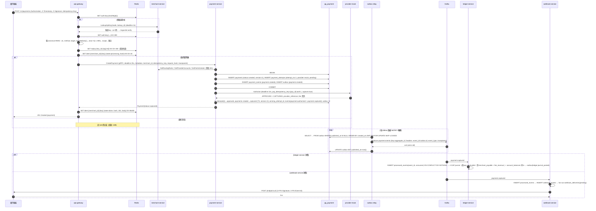

### 1.2 文字步驟

1. **驗證（GW，06 §3.3）**：解析 `Authorization: Bearer pk_live_…` → Redis `auth:key:{sha256(pk)}`（TTL 300s）未命中則 gRPC `LookupApiKey` 並做 Argonid 驗證 → 檢查 key / 商戶狀態 → `X-Timestamp` 在 ±300s 內 → 以 canonical string（timestamp、method、request target、sha256(body)）驗 `X-Signature`（輪替期間接受 current + previous） → 重放 nonce `replay:{key_id}:{sig[:32]}` → scope → 限流。任一步失敗回 `401/403/429`，**不會**碰冪等鍵。
2. **冪等鎖（GW，§10）**：`SET idem:{merchant_id}:{key} NX EX 30`；值含 `request_hash`。鎖 TTL 30s 略大於上游 gRPC deadline 25s，確保 gateway 崩潰後鎖會自動釋放。
3. **路由（PS）**：依 02 §9 產生有序候選（硬過濾 → 健康過濾 → 商戶規則 → preferred → 成本 → 預設順序）。無候選 → `422 no_route_available`，不建立 payment。
4. **建立聚合根（PS）**：第一個交易寫 `payments(created)` 與第一個 `payment_attempts(pending)` 並 commit。即使後續 PSP 呼叫卡住或行程重啟，payment 已存在、可被查詢與 sweeper 接手；`(merchant_id, idempotency_key)` 唯一索引在此生效。
5. **Authorize（PS→PA）**：automatic 模式下 `Authorize(capture=true)` 一次完成授權與請款（T3）；adapter 對 PSP 的 HTTP timeout 為 8s（gRPC deadline 10s）。
6. **套用結果**：經 `transition` helper 在同一 tx 寫 `payment.authorized` + `payment.captured` 兩個事件（02 T3），`seq` 分別為 version 2、3（或同 version 下以事件順序區分，以 04 為準）。
7. **回應**：gateway 把 gRPC 回應轉成 REST JSON，寫入 Redis（`state=done`，TTL 24h），回 `201`。
8. **Outbox relay**：與 payment-service 同行程的 relay worker 送到 Kafka；同一 `aggregate_id` 的事件因 partition key 相同而保序。
9. **下游**：ledger-service（J-CAP）、webhook-service、reconciliation-service（`payment_records` 投影）各自以 `processed_events` 去重後處理。

### 1.3 失敗情境與補償

| 失敗點 | 現象 | 處理 / 補償 | 商戶看到 |
|---|---|---|---|
| 步驟 1 驗簽失敗 | — | 直接拒絕，不寫任何東西 | `401 signature_invalid` 等（02 §10） |
| 步驟 3 無候選 provider | 硬過濾後為空 | 不建 payment；刪冪等鍵 | `422 no_route_available` |
| 步驟 4 DB 不可用 | `CreatePayment` 回 `UNAVAILABLE` | gateway **刪除** Redis 冪等鍵後回 `503`，允許商戶以同 key 重試 | `503 service_unavailable`，`Retry-After: 1` |
| 步驟 4 唯一索引衝突 | 同 key 已有 payment（Redis 鍵過期或 gateway 崩潰後的重試） | 比對 `idempotency_request_hash`：相同 → 回既有 payment；不同 → `FAILED_PRECONDITION` | `200` + `Idempotent-Replayed: true` / `409 idempotency_key_reuse` |
| 步驟 5 `declined_*` / `fraud_suspected` / `invalid_request` | provider 明確拒絕 | attempt→declined；無可 failover → payment→`failed`（T4，寫 `failure`）；outbox `payment.failed` | `402 card_declined`（資源已建立，body 含 payment 與 `decline_code`、`retryable`） |
| 步驟 5 `provider_unavailable` / `provider_config_error` / `provider_rate_limited` | PSP 故障 | attempt→unavailable；failover 到下一個候選（§3）；全部失敗 → `failed`，`503 provider_unavailable` | 同上 |
| 步驟 5 `provider_timeout` | 不知 PSP 有沒有扣款 | **不 failover**；attempt→`unknown`；`GetPaymentStatus` 最多 3 次（1s/2s/4s）；仍不確定則 payment 停 `created`，交給 `attempt-resolver`（最長 1h；之後 attempt→`needs_reconciliation`、payment→`failed(provider_timeout)`，由 reconciliation-service 兜底） | `504 provider_timeout`（body 含 payment，`status=created`）；商戶以同 key 重查或等 webhook |
| 步驟 5 `duplicate_request` | PSP 端冪等衝突 | `GetPaymentStatus` 取回既有結果後套用 | 視結果 |
| 步驟 6 tx2 失敗（DB 短暫錯誤） | PSP 已扣款但本地未記錄 | use case 以 `context.WithoutCancel` 重試 tx2（純 DB 操作）；行程崩潰則 `attempt-resolver` 以 `GetPaymentStatus` 修復 | 可能暫時看到 `created`，數分鐘內收斂 |
| 步驟 7 gateway 寫 Redis 失敗 | 回應已產生 | 仍回 201；下次同 key 請求落到服務層唯一索引（回放成功） | 正常 |
| 步驟 7 gateway 回應前崩潰 | 商戶收到連線錯誤 | 商戶重試同 key（需重新簽章）→ Redis 鎖 30s 內回 `409 idempotency_in_progress`；30s 後鎖過期 → 服務層回放 | 先 409 後 200 |
| 步驟 8 relay 崩潰於 produce 後、UPDATE 前 | 事件重複送出 | 消費端 `processed_events` 去重（§8） | 無感 |
| 步驟 9 ledger 記帳失敗 | 不平衡 / DB 錯 | 重試 3 次 → `payment.events.dlq`；`pg_ledger_imbalance_total` 告警 | 無感（餘額延後更新） |

---

## 2. 付款需要 3DS（requires_action）

### 2.1 循序圖

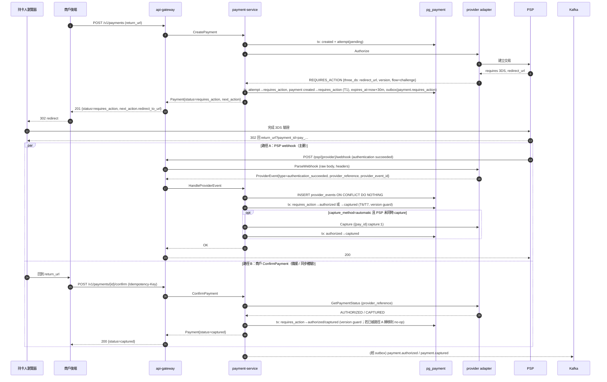

### 2.2 文字步驟

1. `Authorize` 回 `authentication_required` 時走 T1：payment 進入 `requires_action`，`expires_at = now + 30m`（或 PSP 給定）。v1 只支援 redirect 型 3DS（PSP hosted），`ThreeDS` 值物件記錄 `version / flow / redirect_url / return_url`。
2. `next_action`：`{type: "redirect_to_url", redirect_to_url: {url, return_url}}`。
3. **兩條路徑收斂到同一個轉移**（T6 / T7）：以 `version` 樂觀鎖保證只有一條成功；另一條 0 rows → 重讀 → 已在目標狀態則 no-op，回傳當前狀態。
4. **Capture 的唯一性**：`authorized → captured` 同樣受 version 保護，加上固定的 PSP 冪等鍵 `{pay_id}:capture:1`，兩條路徑都呼叫 `Capture` 時 PSP 端也只會請款一次。
5. `ConfirmPayment` 的 REST 同樣要求 `Idempotency-Key`。
6. **信任但驗證（06 §5）**：若 webhook 事件 `created` 距今 > 5 分鐘、或金額/幣別與我方不符，adapter 額外呼叫 `GetPaymentStatus` 以 PSP 當前狀態為準。
7. 已進入 `requires_action` 的 payment **不 failover**（付款人已被導到特定 PSP 頁面）。

### 2.3 失敗情境與補償

| 情境 | 處理 |
|---|---|
| 持卡人放棄驗證、30 分鐘未完成 | sweeper（T9，每分鐘）：先 `GetPaymentStatus` 確認非 authorized → `requires_action → expired`，outbox `payment.expired`；若之後 PSP 仍送來成功 → adapter 自動 `Void`，記 `provider_events` |
| 3DS 驗證失敗（`authentication_failed`） | T8：`requires_action → failed`，`failure.category = authentication_failed`（對外 `402 card_declined`，`retryable=true`） |
| 商戶主動取消 | `POST /v1/payments/{id}/cancel` → T10：`requires_action → voided` |
| 路徑 A 的 webhook 比路徑 B 晚到、payment 已 `captured` | `HandleProviderEvent` 判定轉移已發生 → 記 `provider_events` 後 no-op，回 200 |
| PSP webhook 找不到對應 payment（亂序） | 回 `500` 讓 PSP 重送；連續 10 次仍找不到 → 記入 `orphan_provider_events` 並回 200（06 §5） |
| `confirm` 時 `GetPaymentStatus` 仍 pending | 回 `200 {status=requires_action}`，商戶稍後再試或等 webhook |
| `confirm` 呼叫在 `failed` / `expired` 上 | `409 payment_invalid_state` |
| HandleProviderEvent 時 payment-service 不可用 | gateway 回 `500` 給 PSP，PSP 依自己的退避重送 |

---

## 3. Provider failover

### 3.1 循序圖：provider_unavailable → 第二個 attempt 成功

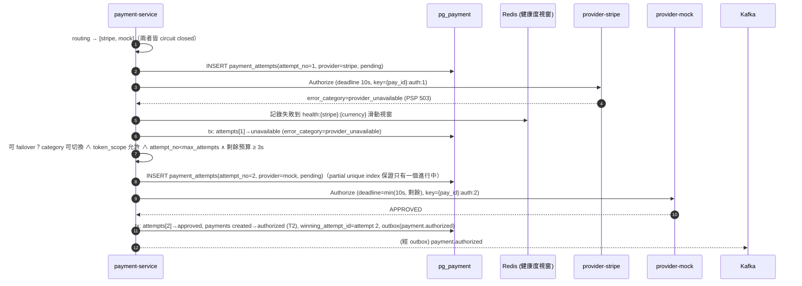

### 3.2 循序圖：declined_hard 不 failover

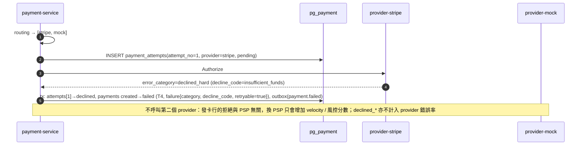

### 3.3 規則

1. **最大 attempt 數**：`merchant.settings.max_attempts`，預設 3、上限 3（02 §4.2）。
2. **可 failover 的類別**：見 §0.4；`declined_soft` 只有白名單碼可切換。
3. **provider_timeout 處理（結果不明）**：
   - attempt→`unknown`；以剩餘 deadline 呼叫 `GetPaymentStatus`，最多 3 次（1s/2s/4s）。
   - `not_found` → attempt→`unavailable`，可 failover；`declined` → attempt→`declined`，payment→`failed`。
   - `authorized` / `captured` → 正常套用（T2/T3）。
   - 仍不確定 → payment 維持 `created`（商戶得到 `504 provider_timeout`），交給 `attempt-resolver`：指數退避輪詢 `GetPaymentStatus`，**最長 1 小時**；查到 authorized / captured 走修復路徑（T2 / T3）；1 小時後仍 unknown → attempt 標記 `needs_reconciliation`、payment → `failed(provider_timeout)`、outbox `payment.failed`，由 reconciliation-service 在結算檔中兜底（PSP 若其實有扣款會以 `missing_internal` 浮現，人工 void / 退款）。**絕不**在不確定時 failover。
4. **Circuit breaker**（02 §9.4；以 Redis 滑動視窗跨實例共享，維度 `provider × currency`）：
   - 60s 視窗、≥ 20 個請求且 `provider_unavailable + provider_timeout` 比率 ≥ 30%，或連續 5 次 `provider_unavailable` → open。
   - open 30s 後 half_open，放行 3 筆探測，成功 2 筆 → closed。
   - `HealthCheck` 每 10s，連續 3 次失敗亦 open。
   - open 的 provider 被路由排除；half_open 只能作為最後候選；全部不可用 → `503 provider_unavailable`（或允許 degraded 保留 half_open 者）。
5. **deadline 預算**：整體 authorize saga 25s；下一個 attempt 至少需要 3s 剩餘，否則停止 failover 並以目前結果落地。
6. **每個 attempt 用不同的 PSP 冪等鍵**（`{pay_id}:auth:{attempt_no}`）。
7. **同一 provider 的自動重試**（`declined_soft` 白名單、`provider_rate_limited`）不建立新 attempt；重試沿用同一個冪等鍵，在 attempt 上記 `retry_count`。

### 3.4 失敗情境與補償

| 情境 | 處理 |
|---|---|
| 同一 payment 出現兩個 `approved` attempt（程式錯誤） | partial unique index 應阻止；若仍發生，`attempt-resolver` 偵測 → 對非 winning 的 attempt 發 `Void`，`pg_double_auth_total` 告警 |
| 所有候選都失敗 | `failed`，`503 provider_unavailable`（資源已建立，body 含 payment） |
| 第二個 provider 回 `authentication_required` | 進入 §2 |
| token 為 provider-scoped、第一個 provider 不可用 | 無法 failover → 直接 `failed`（`provider_unavailable`）；商戶可改用 gateway-scoped token（Phase 2） |

---

## 4. Manual capture：authorize → 部分 capture → cancel / 過期自動 void

### 4.1 循序圖

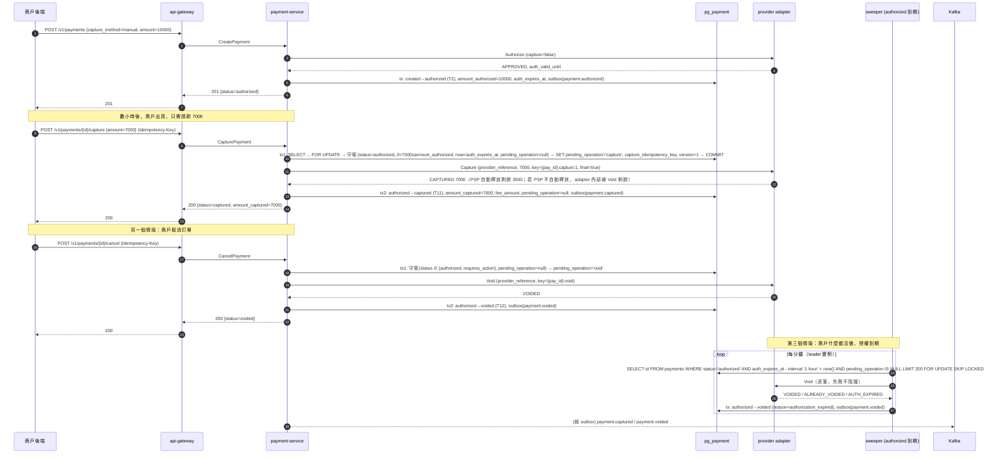

### 4.2 規則

1. **v1 只允許一次 capture**（single-capture）：部分 capture 後剩餘額度即釋放。多次 capture 留到 Phase 3。
2. `capture.amount` 必須 `0 < amount ≤ amount_authorized`；超過 → `400 capture_amount_exceeds_authorized`；`now ≥ auth_expires_at` → `409 payment_expired`。
3. **`pending_operation` 互斥旗標**（02 §8.3）：`capture` 與 `void` 互斥；另一個同時進來回 `409 operation_in_progress`。旗標在 tx2 清除；PSP 逾時則保留，交給 `operation-reconciler`。
4. **重複 capture 請求**：tx1 發現 `capture_idempotency_key` 相同 → 回既有結果（不再呼叫 PSP）；不同 key 但已 `captured` → `409 payment_already_captured`。
5. 剩餘額度的釋放：adapter 透過 `Capabilities` 宣告 `auto_releases_remainder`；若為 false，adapter 在 `Capture` 成功後補 `Void(remaining)`，payment-service 不需知道。
6. **過期提早 1 小時執行 void**（04 §2.2）：`auth_expires_at − 1h` 為實際執行時間；PSP 回 `ALREADY_VOIDED` / `AUTH_EXPIRED` 視為成功 → `authorized → voided`（`reason=authorization_expired`，outbox `payment.voided`）。Void 回可重試錯誤 → 留在 `authorized` 下一輪重試；連續 10 次失敗 → `needs_attention` 進對帳。`authorized` **不會**轉 `expired`（`expired` 只用於 `created` / `requires_action` 逾時）。
8. **Capture 失敗（非 unknown）不補償**：PSP 回 `provider_unavailable` / `invalid_request` 等明確錯誤時，tx2 清 `pending_operation`，payment **維持 `authorized`**，回錯誤讓商戶重試；**不自動 void、不轉 failed**。
7. 過期前 24 小時發 `payment.authorization_expiring`（**提案**：02 附錄 A/B 尚未列入此事件，需 02 owner 確認）。

### 4.3 失敗情境與補償

| 情境 | 處理 |
|---|---|
| Capture 回 `provider_unavailable` | 不 failover（授權已綁定 PSP）；tx2 清 `pending_operation`，payment 仍 `authorized`；`503 provider_unavailable`，商戶可同 key 重試 |
| Capture 逾時 | `pending_operation` 保留；`operation-reconciler`（每分鐘，`updated_at < now − 2m`）以 `GetPaymentStatus` 收斂；商戶得到 `504 provider_timeout`（body 含 payment，`status=authorized`） |
| Void 時 PSP 回「已 capture」 | 表示有外部操作（例如 PSP dashboard）→ `GetPaymentStatus` 後轉 `captured`，`pg_external_state_change_total` 告警；商戶收到 `409 void_not_allowed` |
| 商戶在 `captured` 上呼叫 cancel | `409 void_not_allowed`，提示改用 refund |
| sweeper 的 Void 連續失敗 | 每輪重試；連續 10 次 → `needs_attention`，進對帳差異清單 |

---

## 5. 退款（含部分退款與並發退款的樂觀鎖）

### 5.1 循序圖

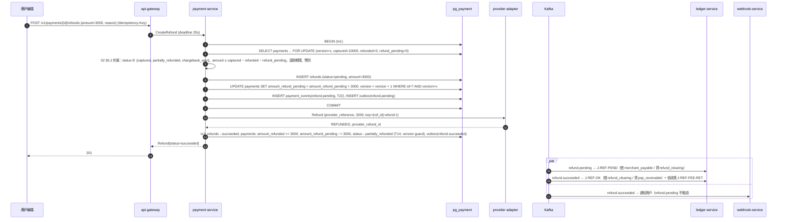

### 5.2 並發兩筆退款搶同一餘額

情境：`amount_captured=10000`，尚未退款。商戶同時送出退款 A（7000）與退款 B（5000），合計超過可退餘額。

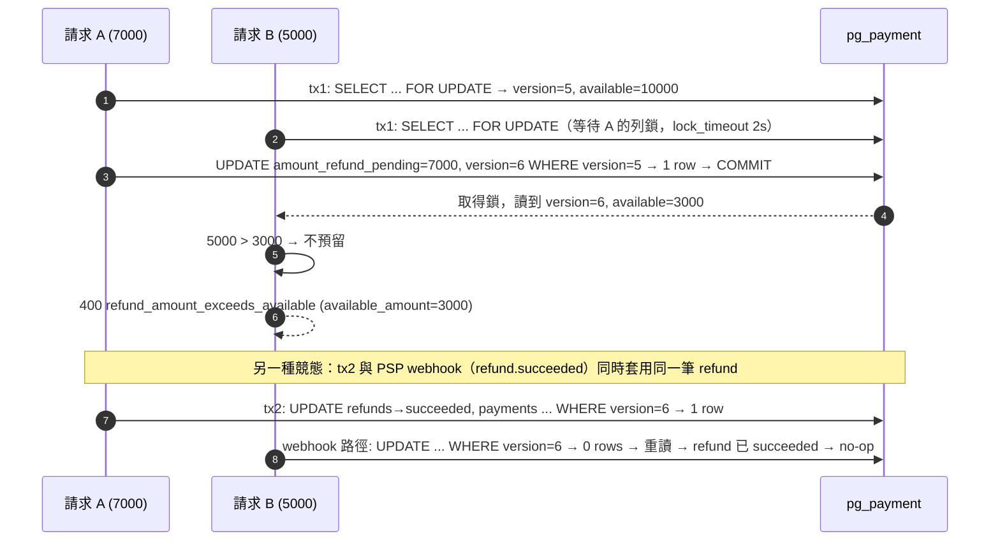

要點：

1. **tx1 以短暫 row lock（`FOR UPDATE`）序列化「預留額度」**（02 §5.2、§8.3）；鎖只持續毫秒級，PSP 呼叫在鎖外進行。`version` 仍在 tx1 遞增，讓任何繞過鎖的路徑也會被偵測。
2. **`version` 樂觀鎖保護 tx2 與其他並發路徑**（PSP webhook 推進 refund、`refund-reconciler`）：0 rows → 重讀 → 已在目標狀態則 no-op；否則重試最多 3 次（10ms/50ms/200ms）→ `409 concurrent_modification`。
3. `amount_refund_pending` 是預留機制：退款送出 PSP 前就先佔住額度，避免 PSP 成功但本地超退。
4. DB `CHECK (amount_refunded + amount_refund_pending <= amount_captured)` 與 `refunds_guard_total` trigger（04 §2.2）是最後防線。
5. 退款的冪等：`refunds(merchant_id, idempotency_key)` 唯一；同 key 同 payload 回既有 refund。

### 5.3 失敗情境與補償

| 情境 | 處理 |
|---|---|
| PSP 回退款失敗（例如已過退款期限） | tx2：`refunds→failed`，釋放 `amount_refund_pending`，outbox `refund.failed`；ledger J-REF-FAIL 以 `reversal_of` 沖回 J-REF-PEND |
| PSP 逾時 | refund 停 `pending`（額度持續預留）；`refund-reconciler`（每 5 分鐘，`pending` 超過 2 分鐘）以 `GetPaymentStatus`（含 refund 列表）確認；24h 仍不明 → `failed(provider_timeout)` + 告警 + 釋放額度，並列入對帳 |
| PSP 非同步退款（LINE Pay、銀行轉帳 T+N） | adapter 回 `REFUND_PENDING`；refund 停 `pending`，由 PSP webhook（§6）推進 |
| tx2 失敗 | 以 `context.WithoutCancel` 重試（純 DB 操作）；行程崩潰則 `refund-reconciler` 透過 PSP 狀態補寫 |
| 對 `disputed` payment 退款 | `409 payment_disputed`；`inquiry` 階段的 dispute 不改 payment 狀態，仍可退款（02 §6.2） |
| 對 `chargeback_lost` 退款 | `409 payment_not_refundable` |
| 全額退款 | `amount_refunded == amount_captured` → `refunded`（T15/T17）；否則 `partially_refunded`（T14/T16） |
| 超過退款期限 | `409 refund_window_expired` |
| `suspended` 商戶退款 | 允許（保護消費者）；`closed` 商戶 → `403 merchant_closed` |

---

## 6. PSP inbound webhook（例：chargeback opened）

### 6.1 循序圖

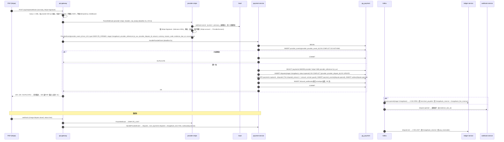

### 6.2 規則

1. **gateway 不理解任何 PSP 格式**：只做大小限制、限流、轉交 raw body + headers。驗簽、解析、租戶對應全部在 adapter（ADR-0006）。
2. **ParseWebhook 無副作用**：純函式。簽章錯 → `INVALID_SIGNATURE`，gateway 回 `400`（讓 PSP 不要再重送）並記 `pg_psp_webhook_total{provider, result=bad_signature}`；租戶對應不到 → 記錄並丟棄（200）。
3. **去重在 payment-service**：`provider_events(provider, provider_event_id)` 與狀態轉移同一交易；dispute 本身另以 `disputes(provider, provider_dispute_id)` 唯一。
4. **事件 → 領域命令**：`HandleProviderEvent` 把 `ProviderEvent.type` 映射成命令（`OpenDispute`、`SubmitDisputeOutcome`、`MarkAuthenticated`、`MarkCaptured`、`MarkRefundSucceeded/Failed`、`MarkExpired`…）再套用 02 §3.2 的轉移表。不合法轉移（例如對 `failed` 的 payment 開 dispute）→ 記 `provider_events` 後回 `OK` 並發 warning，**不**回錯誤給 PSP。
5. **`inquiry` 階段不改 payment 狀態**（02 §6.2）：只 `disputed_amount += amount`、建立 Dispute(stage=inquiry)、不記帳；升級為 `chargeback` 時才 T18 + J-CB-OPEN。
6. **找不到 payment**：回 `500` 讓 PSP 重送；連續 10 次 → `orphan_provider_events` + 200；orphan 會在對帳中以 `missing_internal` 出現。
7. 支援的 inbound 事件（v1）：`AUTHENTICATION_SUCCEEDED/FAILED`、`CAPTURE_SUCCEEDED/FAILED`（非同步 capture 的 PSP）、`REFUND_SUCCEEDED/FAILED`、`DISPUTE_OPENED/STAGE_CHANGED/WON/LOST`、`PAYMENT_EXPIRED`。其他 → `IGNORED`，gateway 直接回 200。

### 6.3 失敗情境與補償

| 情境 | 處理 |
|---|---|
| adapter 或 payment-service 不可用 | gateway 回 `500`，PSP 重送 |
| 處理超過 5s | 回 `500` 而非部分提交（交易 rollback） |
| 同一事件 PSP 重送 | `provider_events` 去重，回 200 `DUPLICATE` |
| 部分拒付（`amount < amount_captured`） | `disputed_amount` 只累計該金額；J-CB-OPEN 以 `dispute.amount` 記帳 |
| dispute 開在已全額退款的 payment | T18 允許 `refunded → disputed`；ledger 依 02 §7.3 處理 |
| `chargeback_won` 後第二次 dispute | 建立新的 Dispute 聚合（新 `provider_dispute_id`），payment 重回 `disputed` |
| secret 輪替 | adapter 同時接受 current + previous；輪替完成後移除 previous |

---

## 7. 對商戶 webhook 投遞與重試

### 7.1 循序圖

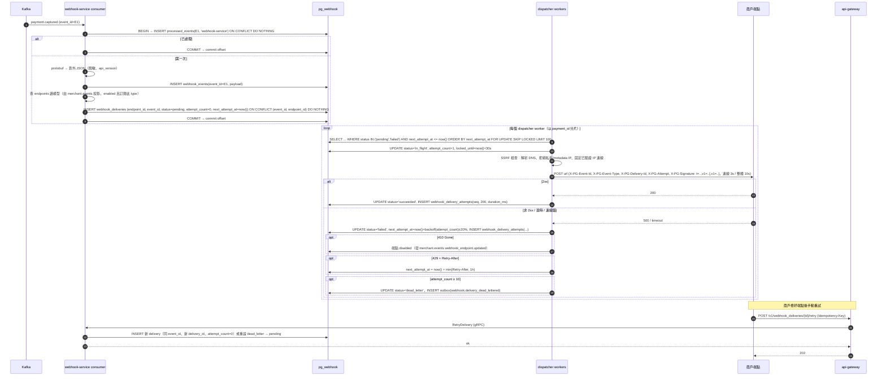

### 7.2 規則（權威定義見 06 §4）

1. **投遞保證**：at-least-once。商戶必須以 `X-PG-Event-Id` 去重；同一事件多個端點 → 多筆 delivery、相同 event_id。投遞狀態集：`pending / in_flight / succeeded / failed / dead_letter / canceled`。
2. **退避表**（06 §4.4；每次 ±20% jitter）：

   | attempt | 1 | 2 | 3 | 4 | 5 | 6 | 7 | 8 | 9 | 10 |
   |---|---|---|---|---|---|---|---|---|---|---|
   | 距上次 | 立即 | 1m | 5m | 30m | 2h | 6h | 12h | 24h | 24h | 24h |

   累計約 3 天 20 小時；第 10 次仍失敗 → `dead_letter`，發 ops 告警與商戶通知信。
3. **簽章**：`X-PG-Signature: t=<unix_ts>,v1=<hmac_sha256(whsec, t + "." + raw_body)>`；輪替 grace 期間（最長 72h）帶兩個 `v1=`；商戶應拒絕 `|now − t| > 300s`。
4. **順序**：不保證（重試會打亂）。payload 內 `data.object.version` 供商戶以版本較大者為準；同一 `payment_id` 的事件以 worker 分片盡量序列化。
5. **`in_flight` 逾時回收**：`locked_until < now()` 仍 `in_flight` → `reclaim-stuck-deliveries` job（每分鐘）改回 `failed`（可重送）。可能重複投遞（合約允許）。
6. **端點健康**：`410 Gone` → 立即 `disabled`；連續 72 小時所有投遞皆失敗 → 自動 `disabled` + 通知。端點被 `disabled` / 刪除時，其 `pending` / `failed` deliveries → `canceled`；重新啟用後可重送最近 7 天事件（`POST /v1/webhook_endpoints/{id}/replay`）。
7. **per-endpoint 併發**：最多 10 個 in-flight。
8. **手動重試**：保留原 `event_id`、新 `delivery_id`。
9. **回應處理**：只看 HTTP status；2xx 成功；3xx 不跟隨（失敗）；4xx/5xx/逾時都重試（`410` 例外）。
10. **payload**：對外 JSON（`id, type, api_version, created, livemode, data.object`）；> 64KB 時改 thin payload（只含 `id, type, data.object.id`），商戶回查 API。
11. 不推送給商戶的事件：`payment.created`、`refund.pending`（02 附錄 B）。

### 7.3 失敗情境與補償

| 情境 | 處理 |
|---|---|
| 商戶端點長時間 5xx | 依退避表至 `dead_letter`；`webhook-dead-letter-alert` job 彙總告警；72h 全失敗自動停用 |
| webhook-service 崩潰於 POST 後、UPDATE 前 | 該筆被 reclaim，重送一次（商戶去重） |
| Kafka 重送 `payment.captured` | `processed_events` 去重；`webhook_events.event_id` PK 與 `UNIQUE(event_id, endpoint_id)` 第二道 |
| 商戶 webhook secret 輪替 | `merchant.events webhook_endpoint.updated` → endpoints 讀模型更新（`source_version` 丟棄亂序）；投遞時簽兩把 |
| 商戶端點 URL 改動 | delivery 存 `endpoint_id`，投遞時讀最新 URL |
| DNS 解析到內網 IP / rebinding | 06 §4.5：建立與每次投遞前檢查；固定 IP 連線；egress NetworkPolicy |

---

## 8. Outbox relay 與消費端去重

### 8.1 循序圖

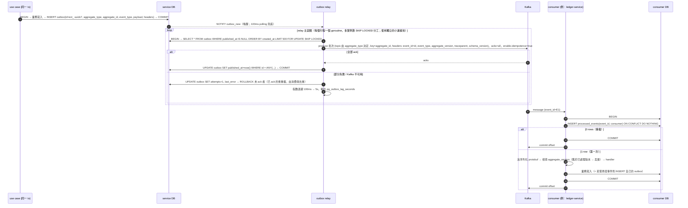

### 8.2 規則

1. **relay 是 at-least-once**：produce 成功但 `UPDATE published_at` 前崩潰 → 重送。`outbox.id`（UUIDv7）就是全域 `event_id`，下游 `processed_events.event_id`、`journals.event_id`、`webhook_events.event_id` 都引用它。
2. **順序**：partition key = `aggregate_id`，同一聚合根的事件在同一 partition 有序；relay 以 `ORDER BY created_at` 送出；producer `enable.idempotence=true`（`max.in.flight` ≤ 5 仍保序）。
3. **多實例**：relay 在每個服務實例都跑，`SKIP LOCKED` 分工，不需 leader election。跨實例同 key 的微幅錯序由消費端以 `aggregate_version` 防護（02 §8.4：舊於已處理版本的事件直接 ack 丟棄）。
4. **消費端交易邊界**：`processed_events` 與業務寫入同一 tx；offset 在 tx commit 之後手動提交。
5. **handler 失敗**：in-process 重試 3 次（100ms、500ms、2s）；仍失敗 → `<topic>.dlq`（帶 `error`、`original_topic/partition/offset` header）並 commit offset，**不阻塞 partition**。`cmd/<service> replay-dlq` 人工重放。
6. **Poison message**（反序列化失敗 / schema 不相容）：直接 DLQ。
7. **相依事件**：ledger 的 `refund.succeeded` 必須在 `refund.pending` 之後記帳，否則暫存 `deferred_events`（重試 5 次 / 10 分鐘；02 §8.4）。
8. **保留期**：`outbox` 已發佈列 7 天；`processed_events` **30 天**（≥ Kafka retention 7 天，確保重播一定能被去重；04 §8.3）。
9. **schema 演進**：protobuf 只加欄位不改號；`schema_version` header；CI `buf breaking`。
10. **監控**：`pg_outbox_lag_seconds = now() − min(created_at) WHERE published_at IS NULL`（SLO < 5s）、`pg_outbox_pending_rows`、consumer lag、`pg_consumer_dlq_total{topic}`。

---

## 9. 對帳：匯入結算檔 → 比對 → 差異 → 人工處理

### 9.1 循序圖

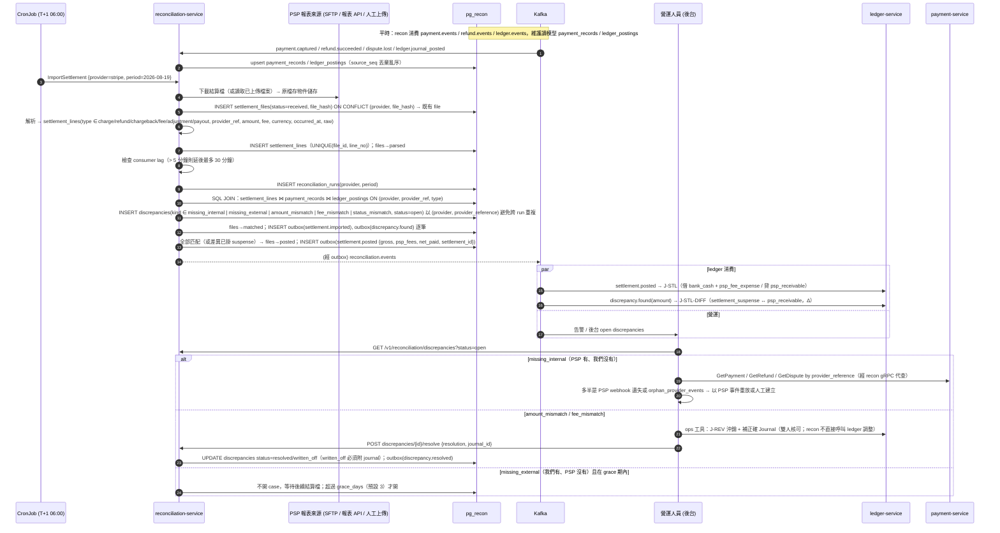

### 9.2 規則

1. **資料來源分離**：recon **不**跨庫讀 `pg_payment` / `pg_ledger`（ADR-0002）；比對全部在本地讀模型上以 SQL JOIN 完成（04 §5.2）。結算檔取得不經 provider adapter（介面無此方法），由 recon 內的 `importer` 子套件負責（每個 PSP 一個 parser）。
2. **比對鍵**：`(provider, provider_reference, type)`；同一交易有 charge 與 fee 兩列。
3. **比對結果**（kind 以 02 §2.5 為準）：`amount_mismatch` / `fee_mismatch` / `status_mismatch` 立即開單；`missing_internal`（PSP 有我們沒有）立即開單；`missing_external`（我們有 PSP 沒有）等待 `grace_days` 後才開單。
4. **重複匯入**：`(provider, file_hash)` 唯一；同檔重跑只重新 match，不重複建單（`(provider, provider_reference)` 索引）。
5. **自動 re-match**：新事件進讀模型時若有對應的 unmatched line，立即比對並自動關單（`resolution=auto_matched`）。
6. **呼叫矩陣（06 §6.2）**：recon 只能呼叫 payment-service 的 `GetPayment/GetRefund/GetDispute`、ledger-service 的 `PostSettlement/GetJournalsByPayment`、merchant-service 的 `GetProviderAccounts`。**調整分錄不由 recon 觸發**，而是 ledger 消費 `discrepancy.found` 記 J-STL-DIFF（suspense），人工以 ledger ops 工具 J-REV 沖銷（雙人核可）。`settlement_suspense` 必須在月結前清零。
7. **人工動作都留稽核**：`discrepancy_actions(discrepancy_id, actor, type, payload, created_at)`；`written_off` 必須附 Journal。
8. **報表**：`settlement.imported` 事件含統計；`pg_recon_unmatched_total{provider, kind}`；SLO：T+3 後 unmatched 比率 < 0.1%。

### 9.3 失敗情境與補償

| 情境 | 處理 |
|---|---|
| 結算檔下載失敗 | files `failed`，CronJob `backoffLimit=3`；仍失敗 → 告警 |
| 檔案格式改變（parser 例外） | files `failed(parse_error)`，原檔保留於物件儲存；改 parser 後重新匯入 |
| 匯入到一半崩潰 | `settlement_files.status` 停在 `received/parsed`；重跑依 `file_hash` 找到既有 file，`UNIQUE(file_id, line_no)` 避免重複插入，從 matching 階段重做（比對冪等） |
| 讀模型落後 | 比對前檢查 consumer lag，> 5 分鐘延後（最多 30 分鐘），避免假陽性 `missing_internal` |
| PSP 以結算幣別換匯（USD 結算 TWD 交易） | v1 非目標；以 PSP 提供的原幣金額比對，無則開 `amount_mismatch` 並標記 `currency_conversion` |
| `settlement.posted` 重送 | ledger `journals.event_id` 唯一 → no-op |

---

## 10. 冪等請求的各種情況

### 10.1 循序圖

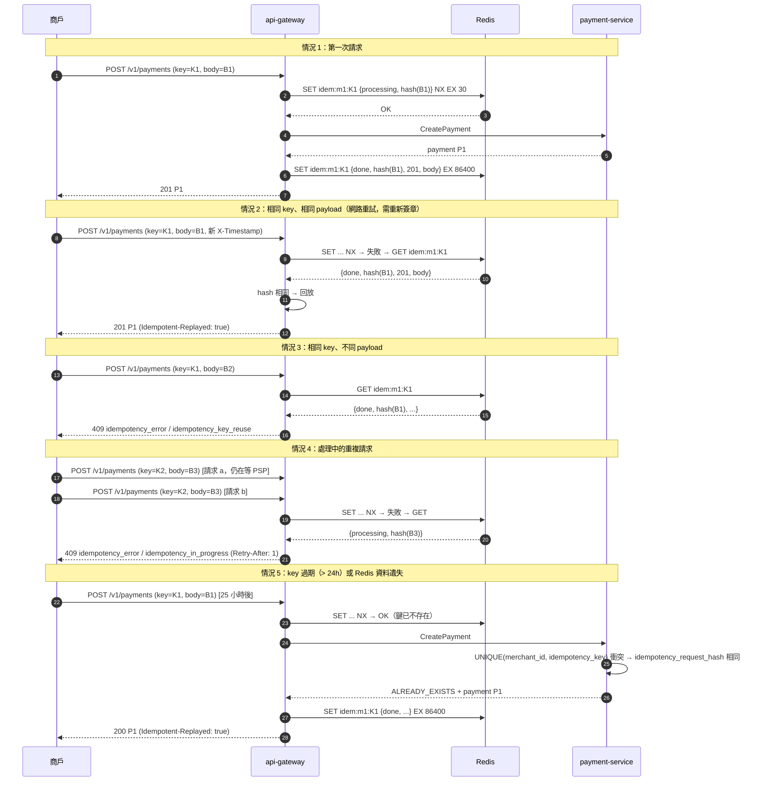

### 10.2 情況總表（錯誤碼依 02 §10）

| # | 情況 | Redis 狀態 | 行為 | 回應 |
|---|---|---|---|---|
| 1 | 首次請求 | 無 → `processing` → `done` | 正常處理 | 原始回應（201/200/4xx） |
| 2 | 同 key 同 payload，已完成 | `done`，hash 相同 | 回放快取回應（原 status code 與 body） | 原回應 + `Idempotent-Replayed: true` |
| 3 | 同 key 不同 payload | `done` 或 `processing`，hash 不同 | 拒絕 | `409 idempotency_error / idempotency_key_reuse` |
| 4 | 同 key 同 payload，處理中 | `processing`，hash 相同 | **不等待**，立即拒絕（避免佔用 gateway 連線；v1 不做 long-poll） | `409 idempotency_error / idempotency_in_progress` + `Retry-After: 1` |
| 5a | key 在 Redis 過期、同 payload | 無 | 服務層唯一索引攔截，hash 相同 → 回既有資源 | `200` + `Idempotent-Replayed: true` |
| 5b | key 在 Redis 過期、不同 payload | 無 | 服務層 hash 不同 → `FAILED_PRECONDITION` | `409 idempotency_key_reuse` |
| 6 | 缺少 `Idempotency-Key` | — | 寫入端點一律必填 | `400 idempotency_error / idempotency_key_missing` |
| 7 | key 非 UUID | — | 拒絕 | `400 idempotency_error / idempotency_key_invalid` |
| 8 | 處理中 gateway 崩潰 | `processing` 殘留 ≤ 30s | 鎖 TTL 到期自動釋放；之後進情況 5 | 先 409（≤ 30s），後 200 回放 |
| 9 | 上游回 5xx / gRPC `UNAVAILABLE` / 逾時 | `processing` | gateway **刪除**鍵，不快取 5xx，讓商戶能重試 | `502/503/504` |
| 10 | 上游回 4xx（驗證錯誤、`402 card_declined` 等） | `done` | 快取 4xx 回應（同 key 重送得到同樣的結果） | 原 4xx + `Idempotent-Replayed: true` |
| 11 | 同 key 用在不同端點 | `done`，hash 含 path → 不同 | 視為情況 3 | `409` |
| 12 | 不同商戶用相同 key | 鍵含 `merchant_id` | 互不影響 | 正常 |
| 13 | 重送沿用舊簽章 | — | 06 §3.3 重放防護先於冪等檢查 | `401 signature_replayed` |

### 10.3 實作細節

- **request_hash** = `sha256(method + "\n" + path + "\n" + canonical_json(body))`；canonical JSON 排序 key、去除空白，避免商戶 SDK 重新序列化造成誤判。
- **Redis 值**：`{state, request_hash, status_code, headers(subset), body, created_at}`；body 上限 64KB。
- **Redis 不可用**：gateway fail-closed，回 `503 service_unavailable`；不允許在沒有冪等保護下轉發寫入請求。
- **服務層**：`CreatePayment` / `CreateRefund` 依唯一索引；衝突時讀回既有列、比對 `idempotency_request_hash`（由 gateway 以 gRPC metadata `x-pg-request-hash` 傳入）。對既有資源的操作（capture / cancel / confirm）由狀態機 + `capture_idempotency_key` / `pending_operation` 自然冪等。
- **服務層保留期**：永久（隨資料列），所以即使 Redis 全失，同 key 也不會重複建立付款。
- PSP inbound webhook 端點 `/psp/{provider}/webhook` **排除**在此 middleware 之外。

---

## 11. 逾時與重試預算表

### 11.1 每個 hop 的預算

| Hop | Timeout | 重試 | 重試條件 | 備註 |
|---|---|---|---|---|
| 商戶 → api-gateway（HTTP server） | `ReadHeaderTimeout 5s`、`ReadTimeout 10s`、`WriteTimeout 30s`、handler 整體 **28s** | 由商戶決定 | — | 商戶 SDK client timeout ≥ 35s，同 `Idempotency-Key` + 新簽章重試 |
| api-gateway → Redis | 100ms | 1 次 | 連線錯 / 逾時 | 失敗 → 503 fail-closed |
| api-gateway → merchant-service（`LookupApiKey`） | 2s | 2 次（100ms、300ms） | `UNAVAILABLE` | 結果快取 300s |
| api-gateway → payment-service（寫入） | **25s**（gRPC deadline） | **0** | — | 容納 authorize saga 25s 預算 |
| api-gateway → payment-service（讀取） | 3s | 2 次 | `UNAVAILABLE`、`DEADLINE_EXCEEDED` | 讀取冪等 |
| api-gateway → provider adapter（`ParseWebhook`） | 3s | 0 | — | PSP 會重送 |
| api-gateway → payment-service（`HandleProviderEvent`） | 5s | 0 | — | 同上；整體 < 5s 回 PSP |
| payment-service → merchant-service（設定查詢） | 2s | 2 次 | `UNAVAILABLE` | 快取 60s；快取失效且查詢失敗 → `503` |
| payment-service → adapter `Authorize` | **10s**（adapter 對 PSP 8s） | 同 provider：`declined_soft` 白名單 / `provider_rate_limited` 各 1 次（≤ 2s 後） | 02 §11 | 逾時視為結果不明（§3.3） |
| payment-service → adapter `Capture` / `Void` / `Refund` | 10s（adapter 8s） | 0（同步路徑） | — | 帶固定 PSP 冪等鍵；reconciler 可安全重送 |
| payment-service → adapter `GetPaymentStatus` | 3s | 最多 3 次（1s/2s/4s） | 任何錯誤 | 純讀取 |
| authorize saga 整體 | **25s** | — | — | 超過即停止 failover |
| adapter → PSP HTTP | 8s（從 ctx 推導，保留 2s） | 0 | — | adapter 不自行重試，避免疊加 |
| payment-service → PostgreSQL | `statement_timeout 5s`、`lock_timeout 2s`、`idle_in_transaction_session_timeout 10s` | 樂觀鎖衝突 3 次（10/50/200ms） | version 衝突 | 連線池 acquire 2s；relay 與 job 用獨立小池 |
| outbox relay → Kafka produce | `delivery.timeout.ms 10s`、`request.timeout.ms 5s` | 無限（退避 100ms → 5s） | 任何錯誤 | `enable.idempotence=true, acks=all` |
| consumer handler | 30s | 3 次（100ms、500ms、2s）後 DLQ | 非 poison 錯誤 | `max.poll.interval.ms 300s` |
| webhook-service → 商戶端點 | 連線 3s、整體 10s | 10 次（§7.2） | 非 2xx / 逾時 / 連線錯 | 超過 → dead_letter |
| reconciliation CronJob | `activeDeadlineSeconds 1800` | `backoffLimit 3` | 非 0 exit | — |
| 排程工作的 adapter 呼叫 | 10s | 由下一輪排程重試 | — | — |

### 11.2 Deadline 傳遞

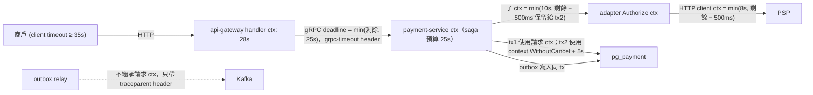

規則：

1. **全鏈以 `context.Context` 傳遞 deadline**；gRPC 自動把 deadline 放進 `grpc-timeout` metadata。
2. **下游留餘裕**：每層對再下游的呼叫用 `min(固定上限, 剩餘 − 保留量)`。
3. **關鍵寫入不可被取消**：PSP 已回覆後的 tx2 使用 `context.WithoutCancel(ctx)` 加自己的 5s timeout，避免商戶斷線導致「PSP 已扣款但本地沒記錄」。
4. **`pkg/grpcx` interceptor**：server 端剩餘 deadline < 200ms 直接回 `DEADLINE_EXCEEDED`。
5. **Kafka 不傳 deadline**，只傳 `traceparent` / `tracestate`。
6. **重試只在冪等 hop 上做**；跨 hop 重試靠商戶以同 `Idempotency-Key` 重送。

---

## 12. 一致性分析

### 12.1 強一致的邊界（單一 DB 交易內）

| 不變條件 | 保證機制 |
|---|---|
| payment 狀態、`payment_events`、`outbox` 三者一致 | 同一 tx（§0.3） |
| 同一 payment 不被兩個並發請求同時轉移 | `version` 樂觀鎖 + `pending_operation` 互斥 |
| `amount_refunded + amount_refund_pending ≤ amount_captured ≤ amount_authorized ≤ amount` | DB CHECK + tx1 row lock + version |
| 同一時間最多一個進行中 attempt | partial unique index |
| 同 `(merchant_id, idempotency_key)` 只有一筆 payment / refund | 唯一索引 |
| 同一 PSP 事件只套用一次 | `provider_events` 唯一索引與轉移同 tx |
| 每筆 journal 借貸相等、`account_balances` 與 entries 一致 | ledger deferred trigger + 同 tx 更新（02 §7.5） |
| 帳本 append-only | DB 權限 + trigger |
| 消費端「處理過」與「業務結果」一致 | `processed_events` 與業務寫入同 tx |

### 12.2 最終一致的部分與可觀察延遲視窗

| 資料 | 落後來源 | 典型延遲 | SLO（P99） | 商戶如何觀察 |
|---|---|---|---|---|
| 商戶餘額（`account_balances`） vs 付款狀態 | outbox poll（100ms）+ Kafka + ledger 消費 | 200–500ms | < 5s | `GET /v1/balance` 回傳 `as_of`（ledger 最後處理的事件時間）；餘額表本身與 journals 強一致，落後只在「事件尚未消費」 |
| 對商戶 webhook | 同上 + dispatcher + 商戶端點 | 0.5–2s | < 30s（首次投遞） | webhook 可能晚於 API 回應；商戶須能處理「先 API 後 webhook」 |
| `GET /v1/payments/{id}` / 列表 | 無（直接讀 payment-service DB） | 0 | — | **read-your-writes** |
| 對帳讀模型 | 消費事件 | 秒級 | < 5 分鐘 | 不對商戶暴露 |
| PSP 端狀態 vs 我們（逾時情況） | `attempt-resolver` / `operation-reconciler` 輪詢 | 30s–數分鐘 | authorize 逾時 1h 內收斂（否則 `failed(provider_timeout)`，對帳兜底）；capture / void 逾時由 operation-reconciler 收斂 | payment `created` 且 `last_attempt.status=unknown`，或 `pending_operation` 非空 |
| 非同步退款 | PSP webhook | 數小時–數天 | 依 PSP | refund `pending` |
| 過期授權 → `voided(authorization_expired)` | 每分鐘 sweeper | ≤ 1 分鐘（相對 `auth_expires_at − 1h`） | — | 提前 24h `payment.authorization_expiring`（提案） |
| webhook 端點設定變更 | `merchant.events` → endpoints 讀模型 | < 1s | < 10s | 改 URL 後極短時間內舊 URL 仍可能收到投遞 |
| API key 撤銷 | `api_key.revoked` 事件清快取 + `auth:revoked:{key_id}` | < 1s | 最長 300s（事件遺失時靠 TTL） | — |
| 費率 / 路由規則變更 | payment-service 快取 60s + `merchant.events` 失效 | < 1s | < 60s | — |

### 12.3 對商戶的文件承諾

1. API 回應是**當下**的權威狀態；webhook 是**通知**，可能重複、亂序、延遲。
2. 餘額查詢附 `as_of`；精確對帳請用 `GET /v1/balance_transactions`。
3. 同一 payment 的事件在 Kafka 內有序，投遞到商戶後不保證；以 `data.object.version` 判斷新舊。

---

## 13. 服務啟動 / 關機順序與 graceful shutdown

### 13.1 依賴與啟動順序

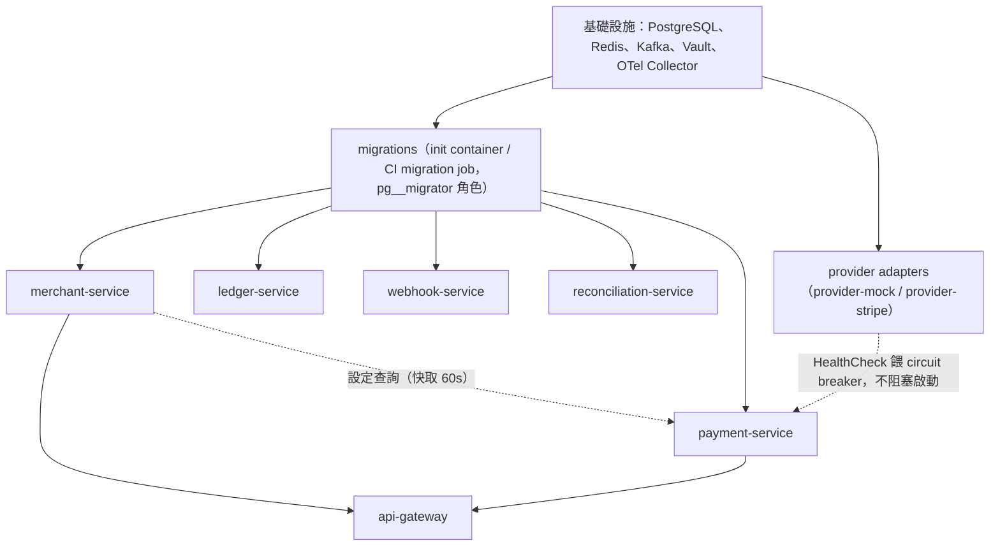

規則：

1. Kubernetes 下不強制啟動順序，靠 **readiness probe** 與 client 端重試收斂。`/readyz` 只在「自己的 DB 可連、migration 版本符合、Kafka producer 建立成功、Vault 憑證取得」時回 200。
2. **api-gateway 的 readiness** 額外要求 Redis 可用與 merchant-service、payment-service 的 gRPC health 為 `SERVING`。
3. payment-service **不**把 adapter 的健康列入 readiness（單一 PSP 故障不應讓 payment-service 下線），改用 circuit breaker 排除。
4. 本機 docker-compose 用 `depends_on: condition: service_healthy` 近似上述順序。
5. Migration 由 `pg_<svc>_migrator` 角色在 init container / CI job 執行（06 §6.3）；應用程式啟動時檢查 schema 版本不符則拒絕啟動。

### 13.2 Graceful shutdown（`pkg/grpcx.Run` / `pkg/httpx.Run` 共用骨架）

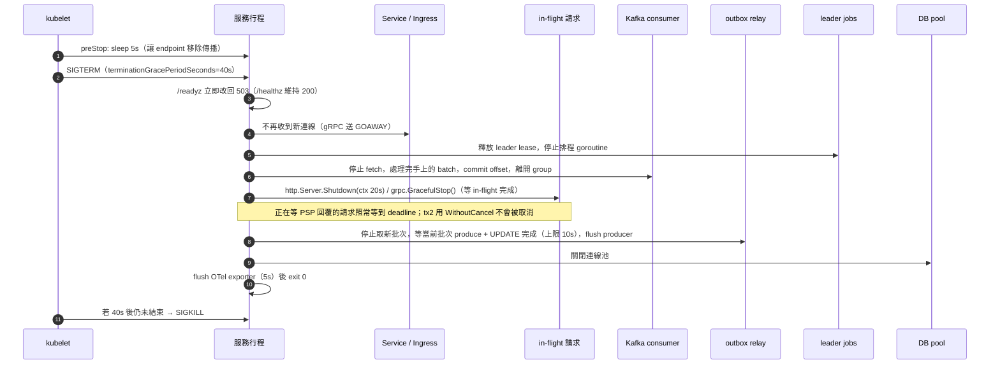

關機順序（由外到內）：

| 步驟 | 動作 | 上限 | 說明 |
|---|---|---|---|
| 1 | readiness → 503、preStop sleep | 5s | LB / kube-proxy 把 pod 從 endpoints 移除 |
| 2 | 停止排程 / leader 工作 | 1s | 放棄 lease 讓其他實例接手 |
| 3 | 停止 consumer 拉取、處理完 in-flight batch、commit offset | 10s | 未完成的訊息不 commit，由其他實例重送（去重保護） |
| 4 | 排空 in-flight HTTP / gRPC 請求 | 20s | 新請求已被拒 |
| 5 | outbox relay 完成當前批次並 flush producer | 10s | 未 flush 的留在 outbox，其他實例會送 |
| 6 | 關 DB pool、flush OTel | 5s | — |

步驟 3–5 可並行，總預算 ≤ 35s，留 5s 餘裕給 `terminationGracePeriodSeconds=40s`。

**滾動更新**：`maxUnavailable=0, maxSurge=1`；PDB `minAvailable=1`（payment-service、api-gateway 為 `minAvailable=2`）。

**回滾**：Helm `rollback` 只回滾程式；DB migration 必須向後相容（expand/contract，04 §11.1），舊版程式能跑在新 schema 上；`down.sql` 只在開發環境使用。

### 13.3 集群層面的關機（例如維護）

反向依賴：先 api-gateway（停止入口）→ payment-service（排空 saga）→ webhook / ledger / recon consumers → provider adapters → merchant-service → 基礎設施。Kafka 與 PostgreSQL 最後停。

---

## 14. 排程工作清單

### 14.1 執行模式

| 模式 | 適用 | 實作 |
|---|---|---|
| **in-process leader job** | 高頻（≤ 5 分鐘）、需要低延遲、與服務邏輯緊密 | 服務行程內的 goroutine，以 **Kubernetes Lease**（`client-go/tools/leaderelection`；本機 fallback 為 PostgreSQL advisory lock `pg_try_advisory_lock(hash(job_name))`）選出 leader；每輪以 `FOR UPDATE SKIP LOCKED` 分批，即使短暫雙 leader 也安全；使用獨立的小連線池 |
| **Kubernetes CronJob** | 低頻批次、可獨立重跑、耗時長、需要 owner/migrator 角色（分割建立） | 同一個服務 image，以子命令執行（例如 `payment-service job outbox-cleanup`）；`concurrencyPolicy: Forbid`；本機以 Makefile target 觸發 |

原則：**所有 job 都必須冪等且可重入**。

### 14.2 清單

| Job | 服務 | 模式 | 頻率 | 工作內容 | 冪等保證 | 告警 |
|---|---|---|---|---|---|---|
| `sweeper` | payment-service | leader | 每 1 分鐘 | (a) `created` 且 `expires_at ≤ now` 且無進行中 / unknown attempt → `expired`；(b) `requires_action` 且 `expires_at ≤ now` → 先 `GetPaymentStatus` → `expired`；(c) `authorized` 且 `auth_expires_at − 1h < now` 且 `pending_operation IS NULL` → `Void` → `voided(reason=authorization_expired)` | version 樂觀鎖；PSP `ALREADY_VOIDED` 視為成功 | 連續失敗 10 次的 payment 數 > 0 |
| `attempt-resolver` | payment-service | leader | 每 30 秒 | `payment_attempts.status=unknown` → `GetPaymentStatus`（指數退避，**最長 1 小時**）→ 收斂 attempt 與 payment；逾 1h → attempt `needs_reconciliation=true`、payment `failed(provider_timeout)`、outbox `payment.failed`，reconciliation-service 以結算檔兜底 | `next_check_at` 欄位、version | unknown 超過 30 分鐘的筆數 > 0；`needs_reconciliation` 新增 > 0 |
| `operation-reconciler`（02 §8.3） | payment-service | leader | 每 1 分鐘 | `pending_operation IS NOT NULL AND updated_at < now − 2m` → `GetPaymentStatus` 收斂 capture / void | 條件更新 + version | 超過 1h 未收斂 |
| `refund-reconciler`（02 §5.3） | payment-service | leader | 每 5 分鐘 | `refunds.status=pending` 超過 2 分鐘 → `GetPaymentStatus`（含 refund 列表）→ 收斂；24h → `failed(provider_timeout)` + 釋放額度 | version | pending 超過 24h |
| `authorization-expiring-notifier`（提案） | payment-service | leader | 每 10 分鐘 | `auth_expires_at` 在 24h 內且未通知 → outbox `payment.authorization_expiring` | `expiring_notified_at` | — |
| `dispute-evidence-due-notifier`（02 §6.1） | payment-service | leader | 每 10 分鐘 | `evidence_due_at` 在 72h / 24h 內 → outbox `dispute.evidence_due_soon` | `due_soon_notified_72h/24h_at` | — |
| `provider-health-probe`（02 §9.4） | payment-service | 每實例 | 每 10 秒 | 呼叫每個 adapter `HealthCheck`，更新 Redis 健康度視窗；連續 3 次失敗 → open | 唯讀 | provider 連續 unhealthy > 1 分鐘 |
| `outbox-lag-monitor` | 每個擁有 DB 的服務 | leader | 每 10 秒 | `now() − min(created_at) WHERE published_at IS NULL` → `pg_outbox_lag_seconds` | 唯讀 | lag > 30s 持續 2 分鐘 |
| `outbox-cleanup` | 每個擁有 DB 的服務 | CronJob | 每日 03:00 | `DELETE ... WHERE published_at < now() − 7d`，每批 5000 | 純刪除 | outbox 列數 > 1000 萬 |
| `processed-events-cleanup` | 每個消費服務 | CronJob | 每日 03:30 | 刪除 **30 天**前的 `processed_events` | 純刪除 | — |
| `ensure-monthly-partition`（04 §8.1） | payment-service、ledger-service | CronJob（owner 角色） | 每日 01:00 | 預建下個月 `payment_events` / `entries` 分割；確保 `*_default` 為空 | `IF NOT EXISTS` | `*_default` 列數 > 0 |
| `ledger-balance-snapshot`（02 §7.5） | ledger-service | CronJob | 每日 00:05 UTC | 對每個帳戶寫入 `balance_snapshots(totals, last_entry_id)` | `(account_id, as_of)` 唯一 | — |
| `ledger-verifier`（02 §7.5） | ledger-service | CronJob | 每小時（抽樣 5% + 24h 異動帳戶）；每日全量 | `SUM(entries) since snapshot` 與 `account_balances` 比對；全帳本恆等式 | 唯讀 | 差異 → `pg_ledger_imbalance_total` +1、PagerDuty（P1） |
| `reconciliation-import` | reconciliation-service | CronJob | 每日 06:00（依 PSP 時區可多個） | 下載 / 讀取結算檔、比對、開單、發 `settlement.posted`（§9） | `(provider, file_hash)` 去重 | import failed；unmatched 比率 > 0.1% |
| `reconciliation-grace-expiry` | reconciliation-service | CronJob | 每日 07:00 | `missing_external` 超過 grace_days 的 payment_records 開單 | `(provider, provider_reference)` 索引 | — |
| `reclaim-stuck-deliveries` | webhook-service | leader | 每 1 分鐘 | `in_flight` 且 `locked_until < now()` → `failed`（可重送） | 條件更新 | — |
| `webhook-dead-letter-alert` | webhook-service | leader | 每 5 分鐘 | 統計近 1h 新增 `dead_letter`，依商戶彙總 → outbox `webhook.dead_letter_digest`（告警 + 商戶通知信） | `alerted_at` 標記 | 新增 > 0（warning）、> 100（critical） |
| `webhook-endpoint-health` | webhook-service | leader | 每 10 分鐘 | 連續 72h 全失敗的端點 → `disabled` + 通知；其 `pending` / `failed` deliveries → `canceled` | 條件更新 | — |
| `webhook-retention-cleanup` | webhook-service | CronJob | 每日 02:00 | `webhook_delivery_attempts` > 30 天、`webhook_events` / `webhook_deliveries` > 90 天，批次 DELETE | 純刪除 | — |
| `idempotency-key-metrics` | api-gateway | leader | 每 1 分鐘 | `SCAN` 統計 `processing` 殘留鍵數 | 唯讀 | processing 鍵 > 1000 |
| `dlq-monitor` | 每個消費服務 | leader | 每 1 分鐘 | 讀取 `<topic>.dlq` 的 lag / 筆數 → metric | 唯讀 | DLQ 新增 > 0 |
| `api-key-rotation-expiry` | merchant-service | leader | 每 5 分鐘 | `rotating` 且 `expires_at < now` → `revoked`，發 `api_key.revoked` | 條件更新 | — |

### 14.3 Job 的共通骨架（`pkg/jobs`）

- `jobs.Run(ctx, name, interval, fn)`：leader 判斷 → 帶 `trace_id` 的 span → 執行 → `pg_job_runs_total{job, result}`、`pg_job_duration_seconds{job}`、`pg_job_last_success_timestamp{job}`。
- 每輪有 `max_batch` 上限，避免單輪跑太久擋住 leader 切換。
- 所有 job 可用 `cmd/<service> job <name> --once` 手動觸發。

---

## 15. 已收斂決議紀錄（Tech Lead 裁決，2026-08-20）

| # | 主題 | 決議 | 依據 |
|---|---|---|---|
| 1 | 金額欄位名 | `amount_authorized / amount_captured / amount_refunded / amount_refund_pending` | SQL（`migrations/payment`） |
| 2 | 逾時欄位名 | `expires_at`（`created` / `requires_action` 的完成期限）、`auth_expires_at`（授權有效期） | SQL |
| 3 | 其他欄位名 | `idempotency_request_hash`、`provider_reference`、`payment_attempts.attempt_no`、`processed_events (event_id, consumer)` | SQL |
| 4 | Attempt 狀態 | `pending / requires_action / approved / declined / unavailable / unknown`（另有 `needs_reconciliation` 旗標） | SQL + 02（已改） |
| 5 | `expired` 狀態 | 獨立終態，僅用於 `created` / `requires_action` 逾時（含 3DS 逾時）；SQL CHECK 補上 | Tech Lead |
| 6 | 授權過期 | `authorized` 超過 `auth_expires_at` 未 capture → `voided(reason=authorization_expired)`，不是 `expired` | Tech Lead |
| 7 | Capture 失敗 | 非 unknown 的失敗 → payment 維持 `authorized`、回錯誤讓商戶重試；不自動 void、不轉 failed | Tech Lead |
| 8 | unknown 收斂 | `attempt-resolver` 最長 1 小時；之後 attempt `needs_reconciliation`、payment `failed(provider_timeout)`，reconciliation-service 兜底 | Tech Lead |
| 9 | Webhook 重試 | 10 次（06 §4.4 時程表）→ `dead_letter`；狀態集 `pending / in_flight / succeeded / failed / dead_letter / canceled` | 06 |
| 10 | PSP 冪等鍵 | `{pay_id}:auth:{attempt_no}`、`{pay_id}:capture:1`、`{ref_id}:refund:1`（Void 維持 `{pay_id}:void`） | 02 |
| 11 | HMAC canonical string | timestamp、method、request target、sha256(body)；重送需重新簽章 | 06 §3.3 |
| 12 | discrepancy kind | `missing_internal / missing_external / amount_mismatch / fee_mismatch / status_mismatch` | 02 §2.5（04 待同步） |
| 13 | 帳本科目 | 01 §5.4 為核心摘要，完整科目表以 02 §7.1 為準 | 02 |
| 14 | `payment.authorization_expiring` 事件 | 本文件提案，待 02 owner 納入附錄 A/B | 提案 |
| 15 | 初始 ADR 編號 | 以 `docs/adr/` 實際檔案為準，08 §2.2 清單待更新 | 本次交付 |
