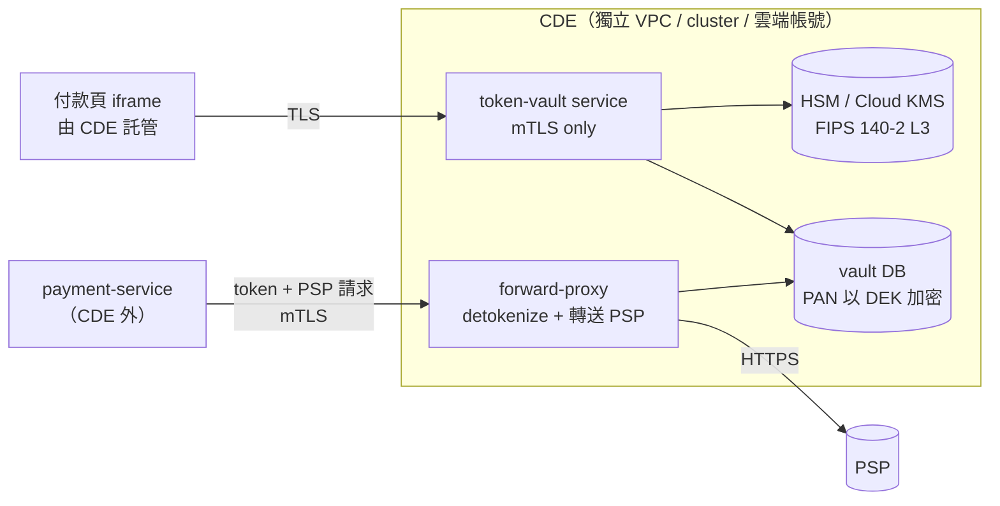
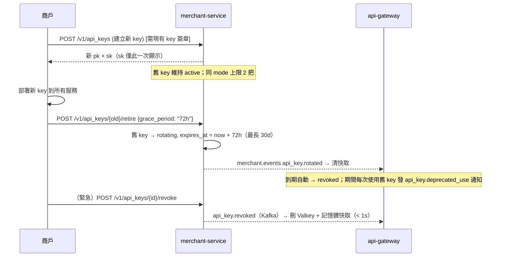
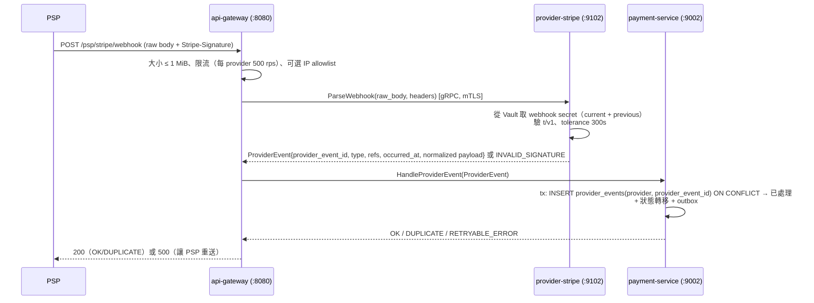
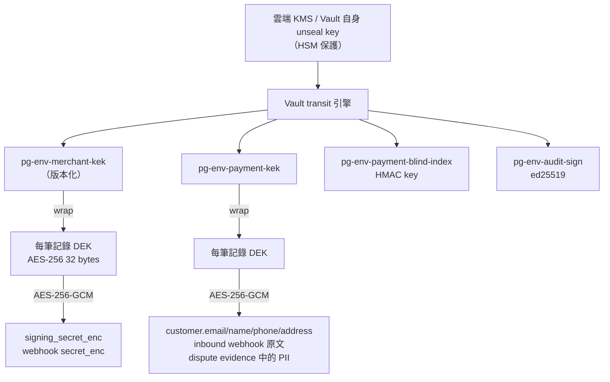
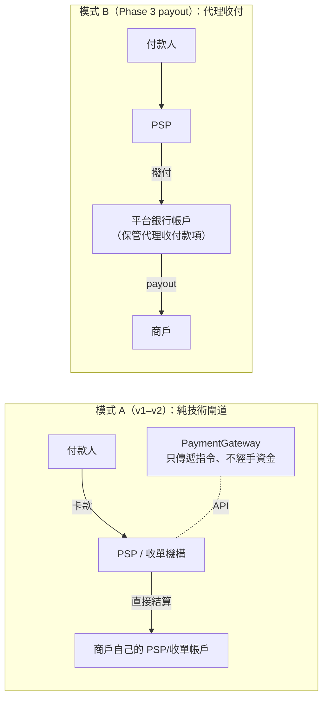

# PaymentGateway — 安全與合規（Security & Compliance）

> 本文件細化 `01-architecture.md` §2（安全 NFR）與 §6.4（安全機制）。所有驗證、簽章、加密、稽核、合規控制以本文件為準；
> 服務名稱、port、技術棧沿用 01 文件。程式位置：`pkg/sig`（HMAC）、`pkg/httpx`（middleware）、`pkg/grpcx`（mTLS / authz interceptor）、`internal/api-gateway`、`internal/merchant`。
> **本文件不是法律意見**；§10 的法規段落在落地前必須由法務與合規覆核。

---

## 0. 安全設計原則

| 原則 | 在本系統的具體落實 |
|---|---|
| 不碰 PAN | 所有卡號輸入走 PSP hosted fields / tokenization；閘道只接收 PSP token；入口主動偵測並拒絕疑似 PAN（§1.3） |
| 縱深防禦 | 邊界（WAF/限流）→ api-gateway（驗證/簽章/冪等）→ 服務（mTLS/authz）→ DB（最小權限/append-only）→ 稽核（hash chain / WORM） |
| 最小權限 | 每服務獨立 DB 角色、Vault policy、Kafka ACL、NetworkPolicy；只有 `provider-*` 可對外 egress |
| 祕密不落地 | 所有憑證由 Vault 動態簽發或注入記憶體；容器映像、Git、環境變數檔不含祕密 |
| 可稽核 | 所有安全相關動作與狀態轉移留不可竄改紀錄 |
| 失敗關閉（fail closed） | 簽章驗證、mTLS、authz 任何錯誤一律拒絕；Vault 不可用時不降級為明文 |

---

## 1. PCI-DSS 範圍界定

### 1.1 為什麼是 SAQ A / SAQ A-EP 等級的範圍

| 角色 | 情境 | 適用 |
|---|---|---|
| **商戶**（我們的客戶） | 商戶頁面以 PSP 提供的 iframe / redirect（例如 Stripe Elements iframe、LINE Pay redirect）收集卡號，卡號直接送 PSP；商戶與本閘道只交換 token | 商戶可維持 **SAQ A**（卡片資料完全外包） |
| **商戶** | 商戶頁面自行建立表單欄位、以 JS 直接 POST 到 PSP（direct post），或載入本閘道提供的 checkout JS 控制頁面行為 | 商戶落入 **SAQ A-EP**（頁面會影響交易安全） |
| **本系統**（服務供應商） | 不儲存、不處理、不傳輸 PAN/SAD；但提供可能影響持卡人資料安全的服務（API、未來的 checkout JS） | 不在 CDE 內，但屬於「可能影響 CHD 安全的第三方服務供應商」；需能對 PSP / 收單行 / 商戶出具 **AOC 或書面說明**（v1 以本文件 + 年度第三方評估為基礎；若日後提供 checkout JS 或 token vault，升級為 SAQ D for Service Providers / ROC） |

設計結論：**本系統所有元件皆不得出現 PAN、CVV/CVC、磁條/晶片資料、PIN**，以維持商戶 SAQ A/A-EP 資格並把本系統排除在 CDE 之外。

### 1.2 絕不可出現 PAN / SAD 的資料流

| 資料流 | 控制 |
|---|---|
| 商戶 → `api-gateway` REST 請求 | §1.3 PAN 偵測 middleware 拒絕；OpenAPI schema 無任何卡號欄位；`payment_method.token` 必須符合 PSP token 格式 |
| `api-gateway` → 各服務 gRPC | proto 無卡號欄位；`PaymentMethod` 只有 `token, brand, last4, bin, exp_month, exp_year` |
| Kafka 事件 payload | proto 同上；`pkg/eventbus` producer 啟用 payload PAN 掃描（抽樣 1%，命中即告警） |
| PostgreSQL 各 DB | schema 無卡號欄位；`card_last4 CHAR(4)`、`card_bin CHAR(8)`（僅 6 或 8 碼）；CI 檢查 migration 不得新增含 `pan/card_number/cvv/cvc` 的欄位名 |
| Valkey（冪等快取、限流、健康度） | 冪等快取存的是回應 body（無卡號）與請求 hash（非原文） |
| 日誌 / trace / metrics | §2.3 遮罩；span attribute 白名單；metrics label 不得含任何使用者輸入 |
| PSP inbound webhook 原文 | PSP webhook 不含完整 PAN（Stripe/Adyen 只含 last4）；仍以 envelope encryption 儲存、90 天 TTL |
| 對商戶 Webhook payload | 由 API 回應同一序列化器產生，欄位同 REST |
| 錯誤訊息 | `pkg/httpx` 只輸出映射後的 `code/message`，原始 PSP 訊息不外洩 |
| 備份、dump、支援工具匯出 | 來源已無卡號；匯出功能需 `operator` 角色 + 稽核 |

### 1.3 PAN / SAD 偵測器（`pkg/httpx/pandetect`）

```
對 JSON body 遞迴走訪所有 string 值（含 metadata、description、customer.*）：
1. 取出候選：/(?:\d[ -]?){13,19}/ ，去除空白與連字號
2. 長度 13–19 且通過 Luhn 檢查 → 判定為 PAN → 400 invalid_request_error / pan_not_allowed（param 指出路徑）
3. 任何 JSON key 名稱匹配 /^(cvv|cvc|cvn|cvv2|cvc2|security_code|card_number|pan|track[12]|pin)$/i → 400 pan_not_allowed
4. 例外：已知 token 欄位（payment_method.token 以 tok_ / pm_ / src_ / linepay_ 等 adapter 註冊的前綴開頭）不掃描
5. 命中時只記錄：merchant_id、路徑、長度、bin 前 6 碼 hash；不記錄原值
```

誤判（例如恰好通過 Luhn 的訂單號）以「商戶改用非數字訂單號或加前綴」處理；**不提供關閉偵測的開關**。

### 1.4 若未來自建 Tokenization Vault（Phase 2+，需 ADR）



隔離要求：
1. CDE 獨立網路、獨立 Kubernetes cluster（或至少獨立 node pool + NetworkPolicy deny-all）、獨立雲端帳號與 IAM。
2. **PAN 絕不離開 CDE**：detokenize 只能由 CDE 內的 forward-proxy 執行並直接送往 PSP；主系統只拿到 token 與 PSP 回應。
3. CDE 內所有主機：檔案完整性監控（FIM）、每日日誌審閱、季度 ASV 掃描、年度滲透測試、變更控制。
4. 加密：PAN 以 AES-256-GCM + HSM 保管的 KEK；金鑰分割知識與雙重控制；年度金鑰輪替。
5. 屆時本系統改以 **SAQ D-SP / ROC** 評估；主系統其餘部分維持 out-of-scope（需以網路分段測試證明）。

---

## 2. 資料分類與處理規則

### 2.1 分類等級

| 等級 | 定義 | 範例 |
|---|---|---|
| **L4 敏感認證資料（SAD）/ PAN** | PCI 定義的卡片資料 | PAN、CVV、磁條、PIN —— **本系統禁止出現** |
| **L3 機密（Secret）** | 洩漏可直接造成資金損失或冒用 | API signing secret、Webhook secret、PSP API key、PSP webhook secret、DB 憑證、KEK/DEK、mTLS 私鑰、Vault token |
| **L2 個資（PII）** | 可識別自然人 | 付款人 email、姓名、電話、帳單地址、IP、device fingerprint、銀行帳號（Phase 3） |
| **L1 內部（Internal）** | 業務資料，洩漏影響商業機密或隱私 | 金額、交易狀態、商戶名稱、費率、路由規則、帳本、card brand/last4/bin/expiry、PSP 物件 id |
| **L0 公開** | 可公開 | API 文件、公鑰、狀態頁 |

### 2.2 各等級規則

| 等級 | 儲存 | 傳輸 | 日誌 / trace | 存取 | 保存 |
|---|---|---|---|---|---|
| L4 | 禁止 | 禁止 | 禁止 | — | — |
| L3 | 只能在 Vault（PSP key、webhook secret）或 DB 中以 envelope encryption 儲存（商戶 signing secret、商戶 webhook secret）；API key 本體只存 Argon2id hash | TLS 1.3 / mTLS；永不放 URL、query string | **禁止**；型別實作 `slog.LogValuer` 回傳 `[REDACTED]` | 僅擁有該 Vault policy 的服務；人員不可讀取 | 輪替/撤銷後保留 hash 供稽核 |
| L2 | DB 欄位 envelope encryption（§7.3）；需搜尋的欄位另存 blind index | TLS | 遮罩（§2.3）；IP 允許記錄於安全日誌（保存 90 天） | 服務帳號；人員存取需稽核 | 依 §10.3 保存與匿名化 |
| L1 | 一般欄位；DB 磁碟加密 | TLS / mTLS | 可記錄 id、狀態、金額；不得記錄 `metadata` 與 `description` 全文 | 依租戶隔離（`merchant_id` 必要條件） | 帳本永久；其餘依 §10.3 |
| L0 | — | — | — | — | — |

### 2.3 遮罩規則（日誌、trace、錯誤訊息、支援工具一體適用）

| 欄位 | 規則 | 範例 |
|---|---|---|
| 卡號（若任何地方意外出現） | 永不記錄；PAN 偵測器命中只記錄 hash | — |
| `card.last4` / `card.bin` / `exp_month` / `exp_year` / `brand` | 可記錄（PCI 允許 bin + last4 並存，前提是 PAN 不存在） | `bin=424242 last4=4242` |
| `payment_method.token` | 前 8 字 + `…` | `tok_1Abc…` |
| `Authorization` header | 只記錄 key 前綴（`pk_live_` + lookup_id 8 碼） | `pk_live_ab12cd34…` |
| `X-Signature`、`X-PG-Signature`、`Stripe-Signature` | 不記錄 | — |
| `customer.email` | 第 1 字 + `***@` + domain | `j***@example.com` |
| `customer.name` | 第 1 字 + `***` | `王***` |
| `customer.phone` | 後 3 碼 | `***-***-789` |
| `customer.ip` | 完整記錄於安全稽核日誌（90 天）；應用日誌去尾段 | `203.0.113.0` |
| `billing_address` | 只記錄 `country` | |
| `metadata`、`description`、`statement_descriptor` | 不記錄內容，只記錄 key 數量與長度 | |
| 所有 secret 型別（`sig.Secret`、`vault.Credential`） | `[REDACTED]` | |
| PSP 原始回應 | 只記錄 `provider_code`、HTTP status、request id；body 不記錄（debug 層級亦同） | |
| Webhook payload（商戶端） | 記錄 event id / type / size；不記錄 body | |
| SQL 參數 | pgx tracer 關閉參數記錄（`LogLevel` 不含 args） | |
| gRPC payload | `pkg/grpcx` logging interceptor 只記錄 method、status、duration、`payment_id/merchant_id` | |

實作：`pkg/httpx` 的 request logger 採**白名單**（只輸出已知安全欄位），而非黑名單；CI 對 log 輸出跑 PAN / email 掃描的整合測試。

---

## 3. 商戶端 API 認證規格

### 3.1 憑證組成

| 項目 | 格式 | 說明 |
|---|---|---|
| API key（公開識別） | `pk_live_` / `pk_test_` + 43 字元 base62 | 32 bytes CSPRNG（`crypto/rand`）→ base62 編碼（固定 43 字元，不足左補 `0`）。Regex：`^pk_(live\|test)_[0-9A-Za-z]{43}$` |
| Signing secret | `sk_live_` / `sk_test_` + 43 字元 base62 | 同上產生；**只在建立時顯示一次**；用於 HMAC，不放在任何 header |
| `lookup_id` | key 隨機部分的前 8 字元 | 明文索引欄位，用於查找 key 記錄與對外顯示前綴 `pk_live_ab12cd34…` |
| `key_id` | `key_` + ULID | 內部 id，進稽核日誌 |
| scopes | `payments:read`、`payments:write`、`refunds:write`、`disputes:write`、`balance:read`、`webhooks:manage` | 預設全給；可建立受限 key |
| mode | `live` / `test` | 與 key 前綴一致；test key 只能操作 `live_mode = false` 資源且只路由到 mock / PSP test 帳戶 |

### 3.2 儲存

| 欄位 | 儲存方式 |
|---|---|
| `key_hash` | **Argon2id**（`golang.org/x/crypto/argon2`）：`m = 64 MiB (65536 KiB)`、`t = 3`、`p = 4`、salt 16 bytes、tag 32 bytes；以 PHC 字串儲存 `$argon2id$v=19$m=65536,t=3,p=4$<salt_b64>$<hash_b64>`；hash 輸入為完整 key 字串（含前綴） |
| `signing_secret_enc` | envelope encryption（§7.3，KEK `pg-{env}-merchant-kek`）。**必須可解密**：HMAC 驗證需要明文 secret；這是 01「API Key 只存 hash」規則的唯一例外，且只適用於 signing secret，不適用於 `pk_` 本身 |
| `lookup_id` | 明文，索引 `(mode, lookup_id)` |
| 顯示 | 後台只顯示 `pk_live_` + `lookup_id` + `…`；secret 永不再顯示 |

驗證成本控制：Argon2id 驗證約 50–100 ms，不可每請求執行。`api-gateway` 在**首次驗證成功後**於 Valkey 寫入 `auth:key:{sha256(pk)}` → `{key_id, merchant_id, mode, scopes, status, secret_version}`（TTL 300s），之後以 SHA-256 查表；signing secret 明文只放在 `api-gateway` **行程內記憶體快取**（TTL 300s，`merchant.events` 的 `api_key.rotated/revoked` 立即清除），**不得寫入 Valkey**。

### 3.3 請求簽章

商戶每個請求必須帶：

```
Authorization: Bearer pk_live_<43>
X-Timestamp: 1723456789                      # Unix 秒，UTC
X-Signature: v1=<hex(HMAC-SHA256)>
Idempotency-Key: <uuid>                       # 寫入 API 必帶（01 §6.1）
Content-Type: application/json
```

**Canonical string**（欄位以 `\n` 分隔，結尾無換行）：

```
<X-Timestamp>            例：1723456789
<HTTP method 大寫>       例：POST
<request target>         例：/v1/payments?expand=attempts   （定義：path + "?" + raw query；query 為商戶送出的原始字串，不重新排序/編碼；無 query 時只有 path，不加 "?"）
<sha256_hex(body)>       例：空 body 為 e3b0c44298fc1c149afbf4c8996fb92427ae41e4649b934ca495991b7852b855
```

```
signature = hex( HMAC-SHA256( key = sk_live_<43> 的完整字串（含前綴）, msg = canonical ) )
X-Signature: v1=<signature>
```

> 01 文件摘要為「HMAC-SHA256 over timestamp + body」；本節為權威定義。加入 method 與 request target 是為了防止把同一簽章重放到其他端點（例如把 `POST /v1/payments` 的簽章用在 `POST /v1/refunds`）。

`api-gateway` 驗證流程（`pkg/httpx/auth.go`）：

```
1.  解析 Authorization；格式不符 → 401 invalid_api_key
2.  mode = 前綴決定；lookup_id = key[8:16]
3.  Valkey 查 auth:key:{sha256(pk)}；miss → gRPC merchant-service.LookupApiKey(mode, lookup_id)
      → 對回傳的所有候選（最多 2 把）做 Argon2id verify；都失敗 → 401 invalid_api_key
      → 成功：寫 Valkey（TTL 300s），並取 signing secret 放行程內快取
4.  status = revoked → 401 api_key_revoked；expires_at < now → 401 api_key_expired
5.  merchant.status = suspended → 403 merchant_suspended；closed → 403 merchant_closed
6.  X-Timestamp 缺/非整數 → 401 signature_missing；|now − ts| > 300s → 401 timestamp_out_of_window
7.  讀 body（上限 1 MiB），計算 canonical，期望簽章 = HMAC(secret_current)；
    key 狀態為 rotating 且有 secret_previous 時亦接受 HMAC(secret_previous)
    比對用 crypto/subtle.ConstantTimeCompare；不符 → 401 signature_invalid
8.  重放防護：Valkey SET replay:{key_id}:{sig[:32]} 1 NX EX 300；已存在 → 401 signature_replayed
9.  scope 檢查 → 403 insufficient_permissions
10. 將 merchant_id / key_id / mode 放入 context 與 trace attributes；下游 gRPC metadata 帶 merchant_id（由 gateway 簽發的內部 header，不可由外部傳入）
```

規則說明：
- **重送必須重新簽章**：商戶 SDK 在網路重試時沿用同一 `Idempotency-Key`，但必須用新的 `X-Timestamp` 重新計算簽章；沿用舊簽章會被 §8 判為重放。
- 驗證失敗**不區分**「key 不存在」與「簽章錯誤」的回應時間差（都跑一次 dummy Argon2id 或固定延遲），避免列舉。
- 每把 key 每分鐘簽章失敗 ≥ 20 次 → 暫時封鎖該 key 5 分鐘（`429 rate_limited`）並發安全告警。
- 伺服器回應帶 `Date` header，SDK 可用來校正時鐘偏移。

### 3.4 Key 輪替流程



- 輪替不需停機；兩把 key 各自有獨立 secret，**不做 secret 共用**。
- 撤銷立即生效：除了事件驅動的快取清除，`api-gateway` 對 `revoked` 的 key 亦在 Valkey 寫入 `auth:revoked:{key_id}`（TTL 24h）作為第二道判斷。
- 平台可強制輪替（外洩事件）：設定 `force_rotate_by`，逾期未輪替的 key 自動 `revoked` 並通知商戶。
- 所有建立 / retire / revoke 皆進稽核日誌（§8）。

---

## 4. 對商戶的 Webhook 簽章與投遞

### 4.1 Secret

- 格式：`whsec_` + 43 字元 base62（32 bytes CSPRNG）。
- 每個 `WebhookEndpoint` 一把；儲存為 envelope encryption（`pg-{env}-merchant-kek`）；建立/輪替時顯示一次。
- 輪替：`POST /v1/webhook_endpoints/{id}/rotate_secret {grace_period: "24h"}` → 新 secret 成為 current，舊 secret 成為 previous；grace 期間（最長 72h）**每次投遞同時帶兩個 `v1`**；到期後 previous 清除。

### 4.2 Header 與 payload

```
POST {endpoint.url}
Content-Type: application/json
User-Agent: PaymentGateway-Webhooks/1.0
X-PG-Event-Id: evt_01J5X...
X-PG-Event-Type: payment.captured
X-PG-Delivery-Id: whd_01J5X...
X-PG-Attempt: 3
X-PG-Signature: t=1723456789,v1=5257a869e7ecebeda32affa62cdca3fa51cad7e77a0e56ff536d0ce8e108d8bd,v1=<previous secret 簽章（輪替期間）>
```

```json
{
  "id": "evt_01J5X...",
  "type": "payment.captured",
  "api_version": "2026-08-01",
  "created": "2026-08-20T08:00:00Z",
  "livemode": true,
  "data": { "object": { "id": "pay_...", "object": "payment", "status": "captured", "version": 7, "...": "..." } }
}
```

簽章計算：

```
t              = 投遞當下 Unix 秒（每次重試重新產生）
signed_payload = t + "." + raw_body（位元組原文，不重新序列化）
v1             = hex( HMAC-SHA256( whsec_..., signed_payload ) )
```

### 4.3 商戶端驗證偽碼

```python
def verify(headers, raw_body: bytes, secrets: list[str], tolerance=300) -> bool:
    sig = headers["X-PG-Signature"]                      # "t=...,v1=...,v1=..."
    parts = dict_multi(sig.split(","))                   # t 一個、v1 可能多個
    t = int(parts["t"][0])
    if abs(now() - t) > tolerance:
        return False                                     # 過期 → 視為重放
    signed = f"{t}.".encode() + raw_body
    for secret in secrets:                               # 商戶自己輪替期間也可有兩把
        expected = hmac_sha256_hex(secret, signed)
        for candidate in parts["v1"]:
            if constant_time_equal(expected, candidate):
                return True
    return False

# 處理流程
if not verify(...): return 401
event = json.loads(raw_body)
if already_processed(event["id"]): return 200            # 去重（DB unique on event id）
handle(event)                                            # 必須冪等
mark_processed(event["id"])
return 200
```

商戶注意事項（寫進對外文件）：
1. 用**原始 body 位元組**驗簽，不要先 parse 再 re-serialize。
2. 先回 2xx 再做耗時處理（或在 10 秒內回應），否則視為失敗重試。
3. 以 `id` 去重；以 `data.object.version` 或重新 `GET /v1/payments/{id}` 處理亂序。
4. 不要依賴來源 IP（我們會公布 egress IP 清單，但簽章才是唯一可信依據）。

### 4.4 重試策略

| 嘗試 | 距上次間隔 | 累計時間（約） |
|---|---|---|
| 1 | 立即（事件後 < 5s） | 0 |
| 2 | 1 分鐘 | 1m |
| 3 | 5 分鐘 | 6m |
| 4 | 30 分鐘 | 36m |
| 5 | 2 小時 | 2h36m |
| 6 | 6 小時 | 8h36m |
| 7 | 12 小時 | 20h36m |
| 8 | 24 小時 | 1d20h |
| 9 | 24 小時 | 2d20h |
| 10 | 24 小時 | 3d20h |

- 每次間隔加 ±20% jitter；最大 **10 次**；用盡 → `status = dead_letter`，寫入死信（`webhook_deliveries.status = 'dead_letter'`），發 ops 告警與商戶通知信，商戶可於後台或 `POST /v1/webhook_deliveries/{id}/retry` 手動重送（重送保留原 `event id`，新 `delivery id`）。
- 成功定義：HTTP 2xx。3xx 不跟隨、視為失敗。`410 Gone` → 立即停用端點。`429` 帶 `Retry-After` → 依其值（上限 1h）。
- Timeout：連線 3s、整體 10s。
- 連續 72 小時所有投遞皆失敗的端點 → 自動 `disabled` + 通知；重新啟用後可重送最近 7 天事件。
- 每端點同時最多 10 個 in-flight；同一 `payment_id` 的事件盡量序列化（以 `payment_id` 為 worker 分片鍵），但**不保證順序**。
- 投遞紀錄保留 30 天（含 response status、耗時、前 1 KiB 回應 body 供除錯，body 遮罩）。

### 4.5 SSRF 防護（端點 URL）

- 只允許 `https://`、port 443（或 8443）；拒絕 IP literal、`localhost`、`.internal`、`.local`。
- 建立與每次投遞前解析 DNS，拒絕 RFC1918 / link-local / loopback / CGNAT / metadata IP（169.254.169.254）；連線時固定使用已解析並檢查過的 IP（避免 DNS rebinding）。
- `webhook-service` 經專用 egress gateway 出網，NetworkPolicy 禁止連到 cluster 內部與雲端 metadata。

---

## 5. PSP inbound Webhook 驗簽與防重放



| 控制 | 規格 |
|---|---|
| 簽章驗證 | 由對應 adapter 實作（payment-service 與 gateway 不認識 PSP 格式）。Stripe：`Stripe-Signature: t=,v1=`，`HMAC-SHA256(secret, t + "." + body)`，tolerance 300s。其他 PSP 依其規格（Adyen HMAC-SHA256 over 特定欄位、LINE Pay 簽章 header） |
| Secret 來源 | Vault `secret/data/pg/{env}/provider-stripe/webhook_secret`（含 `current`、`previous`）；adapter 啟動載入並每 5 分鐘刷新；輪替時兩把同時接受 |
| 去重 | `provider_events (provider, provider_event_id)` 唯一索引，**與狀態變更同一 DB 交易**；交易失敗 → 回 500 → PSP 重送 |
| 防重放 | timestamp tolerance + `provider_event_id` 唯一；不另做 nonce |
| 租戶對應 | 事件中的 PSP 帳戶 id（如 Stripe `account`）必須對應到我方 `ProviderAccount`；對不上 → 記錄並丟棄（200，避免 PSP 無限重送） |
| 信任但驗證 | 會把 Payment 推進到 `authorized/captured` 的事件，若事件 `created` 距今 > 5 分鐘、或金額/幣別與我方不符，adapter 額外呼叫 `GetPaymentStatus` 以 PSP 當前狀態為準 |
| 亂序 | 找不到對應 Payment/Refund（事件先於我方寫入）→ 回 500 讓 PSP 稍後重送；連續 10 次仍找不到 → 記入 `orphan_provider_events` 並 200 |
| 原文保存 | 原始 body 以 envelope encryption 存 `inbound_webhooks`（90 天），供對帳與爭議追查 |
| 回應時間 | 必須 < 5s；處理超時則回 500 而非部分提交 |
| 認證以外 | 此端點**不需要**商戶 API key；必須排除在 `Idempotency-Key` middleware 之外；WAF 規則只允許 PSP 公布的來源 IP（若 PSP 提供） |

---

## 6. 服務間安全

### 6.1 mTLS 與身分

| 項目 | 決策 |
|---|---|
| 身分格式 | SPIFFE ID：`spiffe://paymentgateway.internal/ns/{namespace}/sa/{service}`，例如 `spiffe://paymentgateway.internal/ns/pg-prod/sa/payment-service` |
| 簽發 | **建議 SPIRE**（SPIRE server + agent DaemonSet，SVID 有效期 1h 自動輪替，workload attestation 以 k8s ServiceAccount + pod label）。替代方案：cert-manager + `csi-driver-spiffe`（同樣產生 SPIFFE SVID）。本機 docker-compose：`make certs` 以自簽 CA 產生開發憑證 |
| gRPC | `pkg/grpcx` 建 server/client 時強制 `tls.RequireAndVerifyClientCert`、TLS 1.3、驗證 peer SPIFFE ID；`PG_GRPC_INSECURE=true` 只允許在 `PG_ENV=local` |
| Authz | `pkg/grpcx` interceptor 依下表允許清單檢查 caller SPIFFE ID × gRPC service/method；不在表內 → `PERMISSION_DENIED` 並稽核 |
| Kafka | mTLS（同 CA）+ ACL：每服務只可 produce 自己的 topic、consume 訂閱的 topic，consumer group 固定命名 `{service}.{topic}` |
| PostgreSQL / Valkey / Vault | TLS 必開（`sslmode=verify-full`、Valkey TLS、Vault TLS）；憑證由同一 CA 或雲端受管 CA |
| 外部 egress | 只有 `provider-*` 與 `webhook-service` 可連外；`provider-*` 限 PSP 網域（egress gateway FQDN allowlist） |

### 6.2 呼叫允許矩陣（gRPC）

| Caller → Callee | merchant :9001 | payment :9002 | ledger :9003 | webhook :9004 | reconciliation :9005 | provider-* :91xx |
|---|---|---|---|---|---|---|
| api-gateway | 全部（商戶管理 API） | 全部 | `GetBalance`、`ListBalanceTransactions` | `ListDeliveries`、`RetryDelivery` | `ListDiscrepancies` | `ParseWebhook` |
| payment-service | `GetMerchantConfig`、`GetFeeSchedule`、`GetRoutingRules`、`GetProviderAccounts` | — | — | — | — | 全部 |
| reconciliation-service | `GetProviderAccounts` | `GetPayment`、`GetRefund`、`GetDispute` | `PostSettlement`、`GetJournalsByPayment` | — | — | — |
| ledger-service | — | — | — | — | — | — |
| webhook-service | — | — | — | — | — | — |
| provider-* | — | — | — | — | — | — |

（空白 = 拒絕；webhook / ledger 只消費 Kafka 事件；對外 HTTPS 另由 NetworkPolicy 管。）

### 6.3 最小權限 DB 帳號

每個服務兩個角色：`pg_{svc}_app`（執行期）與 `pg_{svc}_migrator`（只在 CI/CD migration job 使用，擁有 DDL）。`app` 角色憑證由 Vault database secrets engine 動態簽發（TTL 1h、max 24h），服務用 Vault Agent sidecar 或 `pkg/config` 的 Vault client 自動續期。

| 服務 | DB | `app` 角色權限 |
|---|---|---|
| merchant-service | `pg_merchant` | `SELECT/INSERT/UPDATE` on 業務表；`DELETE` 僅 `outbox`（relay 清理）；無 DDL |
| payment-service | `pg_payment` | `SELECT/INSERT/UPDATE`；`payment_events`、`provider_events` 只 `SELECT/INSERT`（trigger 拒絕 UPDATE/DELETE）；`DELETE` 僅 `outbox` |
| ledger-service | `pg_ledger` | `journals`、`entries`、`balance_snapshots`：**只 `SELECT/INSERT`**（`REVOKE UPDATE, DELETE, TRUNCATE`）；`accounts`：`SELECT/INSERT/UPDATE(status)`；`account_balances`：`SELECT/INSERT/UPDATE`；`DELETE` 僅 `outbox`、`processed_events`（保留 7 天後清理） |
| webhook-service | `pg_webhook` | `SELECT/INSERT/UPDATE`；`delivery_attempts` 只 `INSERT/SELECT` |
| reconciliation-service | `pg_recon` | `SELECT/INSERT/UPDATE`；`settlement_lines` 只 `INSERT/SELECT` |
| 所有 | — | 無 `SUPERUSER`、`CREATEDB`、`CREATEROLE`；`pg_read_server_files` 等皆無；`statement_timeout = 5s`（migrator 除外）；`search_path` 固定 |
| 唯讀分析 | replica | `pg_{svc}_readonly`：`SELECT`，且對 L2 欄位使用 **column-level REVOKE** 或 view 遮罩 |

### 6.4 Vault 路徑與 policy

```
secret/data/pg/{env}/provider-stripe/api_key                 # PSP API key（restricted key，僅 payments/refunds/disputes 權限）
secret/data/pg/{env}/provider-stripe/webhook_secret          # {current, previous}
secret/data/pg/{env}/provider-{name}/...                     # 每個 adapter 一組
secret/data/pg/{env}/api-gateway/internal_header_key         # gateway→服務 內部 header 簽章用
database/creds/pg-{env}-merchant-app                          # 動態 DB 憑證，每服務一個 role
database/creds/pg-{env}-payment-app
database/creds/pg-{env}-ledger-app
database/creds/pg-{env}-webhook-app
database/creds/pg-{env}-recon-app
transit/keys/pg-{env}-merchant-kek                             # envelope：signing secret、webhook secret
transit/keys/pg-{env}-payment-kek                              # envelope：customer PII、inbound webhook 原文
transit/keys/pg-{env}-payment-blind-index                      # HMAC key：email blind index
transit/keys/pg-{env}-audit-sign                               # ed25519：稽核 hash chain 日錨點簽章
pki_int/issue/pg-{env}-services                                # 僅在不使用 SPIRE 時
```

| Policy（k8s auth role 綁定 ServiceAccount） | 允許 |
|---|---|
| `pg-{env}-merchant` | `database/creds/pg-{env}-merchant-app` read；`transit/encrypt,decrypt,rewrap/pg-{env}-merchant-kek` |
| `pg-{env}-payment` | `database/creds/pg-{env}-payment-app`；`transit/encrypt,decrypt/pg-{env}-payment-kek`；`transit/hmac/pg-{env}-payment-blind-index` |
| `pg-{env}-ledger` | `database/creds/pg-{env}-ledger-app`；`transit/sign/pg-{env}-audit-sign` |
| `pg-{env}-webhook` | `database/creds/pg-{env}-webhook-app`；`transit/decrypt/pg-{env}-merchant-kek`（只解 webhook secret）—— 以 transit **derived key / context** 區隔 webhook secret 與 signing secret |
| `pg-{env}-recon` | `database/creds/pg-{env}-recon-app` |
| `pg-{env}-api-gateway` | `secret/data/pg/{env}/api-gateway/*` read |
| `pg-{env}-provider-stripe` | `secret/data/pg/{env}/provider-stripe/*` read |
| 人員 | 無 `decrypt` 權限；`secret/*` 寫入需 2 人核可（Vault Sentinel / 流程控制）；Vault audit device 開啟並送 SIEM |

---

## 7. 加密

### 7.1 靜態加密

| 資產 | 機制 |
|---|---|
| PostgreSQL 資料卷 | 雲端受管磁碟加密（AES-256），KMS CMK 每 DB 一把（`pg-{env}-{svc}-disk`），年度輪替 |
| 備份 / WAL 歸檔 | `pgBackRest` 或 WAL-G → 物件儲存，SSE-KMS 使用**獨立 CMK**（`pg-{env}-backup`），跨帳號/區域複本，Object Lock 35 天；每月還原演練 |
| Valkey | TLS + AUTH；啟用磁碟加密；`appendonly no`（冪等快取允許遺失；限流/健康度亦然）；不存任何 L2/L3 資料 |
| Kafka | broker 磁碟加密；topic retention：`payment.events` 30 天（ledger 為事實來源）；L2 欄位在事件中已是必要最小集合 |
| 物件儲存（爭議證據檔、結算檔、稽核歸檔） | SSE-KMS、Object Lock（稽核：compliance mode 7 年） |
| 容器映像 / CI | 無祕密；cosign 簽章 |

### 7.2 傳輸加密

| 邊界 | 要求 |
|---|---|
| 商戶 → api-gateway | TLS 1.2 最低、優先 1.3；cipher：`TLS_AES_256_GCM_SHA384`、`TLS_AES_128_GCM_SHA256`、`TLS_CHACHA20_POLY1305_SHA256`、`ECDHE-ECDSA/RSA-AES128/256-GCM-SHA256/384`；HSTS `max-age=31536000; includeSubDomains; preload`；憑證由公開 CA（ACME 自動）；OCSP stapling |
| 服務間 | TLS 1.3 only + mTLS（§6.1） |
| 服務 → PSP | TLS 1.2+，驗證系統 CA；Stripe 等支援時啟用 certificate pinning 於 adapter（以 SPKI hash，保留備援 pin） |
| webhook-service → 商戶 | TLS 1.2+，驗證公開 CA；不接受自簽（test mode 可設 `allow_insecure_tls` 僅對 `pk_test_`） |
| DB / Valkey / Kafka / Vault | TLS，`verify-full` |

### 7.3 應用層（欄位級）envelope encryption



| 項目 | 規格 |
|---|---|
| 需要欄位加密的資料 | L3：`api_keys.signing_secret_enc`、`webhook_endpoints.secret_enc/secret_prev_enc`；L2：`payments.customer_*`、`disputes.evidence`（含 PII 的文字）、`inbound_webhooks.raw_body`；Phase 3：商戶銀行帳號 |
| DEK | 每筆記錄一把 AES-256 金鑰，由 Vault transit `datakey/plaintext/{kek}` 產生（回傳 plaintext + wrapped） |
| 加密 | AES-256-GCM，nonce 12 bytes 隨機；AAD = `"{table}:{column}:{record_id}"`（防止密文被搬到別筆記錄） |
| 儲存格式 | `enc:v1:{kek_name}:{kek_version}:{b64(wrapped_dek)}:{b64(nonce)}:{b64(ciphertext)}`，欄位型別 `TEXT` |
| 解密 | 服務以 transit `decrypt` 解 DEK（結果在行程內 LRU 快取 ≤ 5 分鐘、≤ 10k 筆），再本地 AES-GCM 解欄位 |
| 搜尋 | 需等值查詢的欄位（email）另存 `email_hash = HMAC-SHA256(blind_index_key, lower(trim(email)))`；不支援模糊查詢 |
| KEK 輪替 | 年度或事件觸發：Vault `rotate` 產生新版本；背景 job 以 `rewrap` 更新 `wrapped_dek`（不需解密資料）；舊版本保留解密至所有記錄 rewrap 完成 |
| DEK 輪替 | 正常不輪替；疑似外洩時對受影響表重新加密（讀→新 DEK→寫） |
| 實作位置 | `pkg/crypto/envelope`（介面 `Encryptor{Encrypt(ctx, plaintext, aad) / Decrypt(...)}`；本機以 `PG_ENV=local` 使用靜態測試 KEK） |
| Hash | 密碼學用途一律 SHA-256 以上；不用 MD5/SHA-1（含 PSP 要求者也以 adapter 隔離） |

---

## 8. 稽核日誌

### 8.1 必須記錄的事件

| 類別 | 事件 |
|---|---|
| 認證 | API key 驗證成功/失敗（失敗含原因碼）、簽章失敗、重放偵測、限流觸發、key 被暫時封鎖 |
| 憑證管理 | API key 建立/retire/revoke/強制輪替；webhook secret 輪替；PSP 憑證更新（Vault audit） |
| 商戶設定 | 商戶狀態變更、費率表變更、路由規則變更、webhook 端點新增/修改/刪除/停用、ProviderAccount 變更 |
| 資金相關 | Payment 所有狀態轉移（`payment_events`，本身即稽核）、Refund 建立（含發起者 key_id）、Dispute 證據提交、Capture/Void 呼叫者 |
| 帳本 | 每筆 Journal（本身 append-only）、**人工沖銷**（發起人 + 核准人 + 理由）、餘額不平衡偵測 |
| 營運後台 | operator 登入、查詢商戶資料（含查了誰）、匯出、PII 解密讀取、手動重送 webhook、手動收斂 pending operation |
| 系統 | migration 執行、設定變更（Helm release）、Vault policy 變更、DB 角色變更、mTLS authz 拒絕、PAN 偵測命中 |
| 隱私 | 資料主體請求（存取/刪除/匿名化）的接收與完成 |

### 8.2 格式

```json
{
  "audit_id": "aud_01J5X...",
  "occurred_at": "2026-08-20T08:00:00.123Z",
  "service": "merchant-service",
  "action": "api_key.revoked",
  "outcome": "success",
  "actor": { "type": "merchant_api_key", "id": "key_01J5...", "merchant_id": "mch_01J5...", "ip": "203.0.113.7", "user_agent": "pg-go/1.2.0" },
  "resource": { "type": "api_key", "id": "key_01J4..." },
  "merchant_id": "mch_01J5...",
  "request_id": "req_01J5...",
  "trace_id": "4bf92f3577b34da6a3ce929d0e0e4736",
  "details": { "reason": "compromised", "before": { "status": "active" }, "after": { "status": "revoked" } },
  "prev_hash": "9f2c...",
  "hash": "a17b..."
}
```

- `actor.type` ∈ `merchant_api_key | operator | service | system | psp_webhook`。
- `details.before/after` 經 §2.3 遮罩；不得含 L3/L4。
- 固定使用 `log/slog` 的 `audit` logger（`slog.With("log_type","audit")`），同時寫入各服務 DB 的 `audit_events` 表（append-only trigger，同 §6.3 權限）。

### 8.3 防竄改

| 機制 | 規格 |
|---|---|
| Hash chain | 每服務每條鏈：`hash = SHA-256(prev_hash ‖ canonical_json(event 去掉 hash 欄位))`；`prev_hash` 為該服務前一筆；第一筆 `prev_hash = "genesis"` |
| 日錨點 | 每日 00:00 UTC，各服務取最後 `hash`，以 Vault transit `pg-{env}-audit-sign`（ed25519）簽章，簽章與 hash 寫入物件儲存（Object Lock compliance mode）並記入 `audit_anchors` |
| 驗證 | 每週 job 重算鏈並比對錨點；不符 → P1 事故 |
| 儲存 | 熱：DB `audit_events` + Loki（13 個月）；冷：每日匯出 NDJSON（gzip + SHA-256 manifest）到 WORM 儲存 7 年 |
| 權限 | `audit_events` 只 INSERT/SELECT；Loki 與物件儲存對人員唯讀；刪除需 break-glass 流程（兩人、留痕） |
| 時間 | 所有節點 NTP 同步（chrony）；稽核時間以 UTC 毫秒 |

### 8.4 保存期限

| 日誌 | 線上 | 歸檔 | 依據 |
|---|---|---|---|
| 安全稽核（§8.1） | 13 個月（PCI 10.5.1：至少 12 個月，3 個月可即時查） | 7 年 | PCI-DSS、內控 |
| 應用日誌（遮罩後） | 30 天 | 90 天 | 維運 |
| 含 IP 的存取日誌 | 90 天 | — | GDPR 最小化 |
| `payment_events` / 帳本 | 永久 | — | 商業會計法（帳簿 10 年、憑證 5 年）；以永久保存滿足 |
| Webhook 投遞紀錄 | 30 天 | — | 維運 |
| PSP inbound 原文 | 90 天 | — | 對帳 / 爭議 |

---

## 9. 威脅模型（STRIDE）

| # | 類別 | 威脅 | 資產 | 緩解措施 | 殘餘風險 / 偵測 |
|---|---|---|---|---|---|
| 1 | Spoofing | 攻擊者取得商戶 `pk_` key（例如從前端或日誌洩漏）冒用商戶 | 商戶帳戶、資金 | `pk_` 單獨無效，需 `sk_` 做 HMAC；`sk_` 只顯示一次；失敗次數封鎖；商戶可設來源 IP allowlist | 監控同 key 來自新 ASN / 國家的流量 |
| 2 | Spoofing | 偽造「來自本平台」的 webhook 打到商戶，誘使商戶出貨 | 商戶業務 | `X-PG-Signature` HMAC + timestamp；文件要求商戶驗簽並以 API 回查 | 商戶未驗簽 —— 後台顯示「未驗簽警示」需 SDK 回報（Phase 2） |
| 3 | Spoofing | 偽造 PSP webhook 把 Payment 推到 `captured` | 帳本、商戶餘額 | adapter 驗簽（secret 在 Vault）；`provider_event_id` 去重；關鍵事件回查 `GetPaymentStatus` | 偵測：`provider_events` 中 `INVALID_SIGNATURE` 比率告警 |
| 4 | Spoofing | 叢集內惡意 pod 冒充 `api-gateway` 呼叫 `payment-service` | 所有服務 | mTLS + SPIFFE ID 驗證；authz 矩陣；NetworkPolicy | SPIRE attestation 被繞過 → 節點層級防護 |
| 5 | Tampering | 中間人修改請求金額 | 付款 | TLS；簽章涵蓋 body hash、method、path | — |
| 6 | Tampering | DBA / 內部人員直接改帳本或刪除事件 | 帳本、稽核 | append-only trigger；app 角色無 UPDATE/DELETE；稽核 hash chain + WORM 錨點；`ledger-verifier` 重算 | 具 superuser 者可停 trigger → DB 超級帳號 break-glass + 即時告警 |
| 7 | Tampering | 向 Kafka 注入偽造 `payment.captured` 讓 ledger 記帳 | 帳本 | Kafka mTLS + ACL（只有 payment-service 可 produce `payment.events`）；事件 schema 驗證；`event_id` 去重 | 偵測：對帳差異 |
| 8 | Repudiation | 商戶否認曾發起退款 | 爭議處理 | 稽核記錄 `key_id`、簽章、request hash、IP、`Idempotency-Key`；WORM 保存 | — |
| 9 | Repudiation | 營運人員否認做過人工沖銷 | 帳本 | 雙人核可、`actor` + `approver` 入稽核、hash chain | — |
| 10 | Information disclosure | PAN / PII 出現在日誌、trace、錯誤訊息 | PCI 範圍、個資 | PAN 偵測拒絕入口；白名單日誌；`LogValuer` 遮罩；CI 日誌掃描 | 第三方套件輸出 → 統一 handler 攔截 |
| 11 | Information disclosure | IDOR：商戶 A 以 `pay_` id 讀到商戶 B 的付款 | 租戶隔離 | repository 所有查詢必帶 `merchant_id`（介面強制參數）；ID 為 ULID 不可猜；整合測試覆蓋跨租戶存取 | 程式碼審查 checklist |
| 12 | Information disclosure | 祕密寫進 Git / 映像 / 環境變數檔 | L3 | Vault；gitleaks pre-commit + CI；GitHub push protection；映像掃描 | 歷史洩漏 → 立即輪替流程 |
| 13 | Information disclosure | 錯誤訊息洩漏 PSP 內部資訊、stack trace | 內部資訊 | `pkg/httpx` 統一錯誤映射；`recovery` interceptor 不回傳 panic 內容；`fraud_suspected` 對外一律 `generic_decline` | — |
| 14 | Denial of service | 大量建立付款耗盡 PSP 額度或 DB 連線 | 可用性、成本 | 每 key token bucket（預設 100 rps、burst 200）、每 IP 限流、body ≤ 1 MiB、`statement_timeout`、circuit breaker、HPA | 分散式攻擊 → 邊界 WAF / CDN |
| 15 | Denial of service | 商戶 webhook 端點極慢（slowloris）拖垮投遞 worker | webhook-service | 連線 3s / 總 10s timeout；每端點 in-flight 上限；worker pool 與事件消費隔離 | — |
| 16 | Denial of service | 簽章驗證（Argon2id）被用來放大 CPU 消耗 | api-gateway | Argon2id 只在快取 miss；對不存在的 lookup_id 以固定延遲回應且計入 IP 限流 | — |
| 17 | SSRF | 商戶設定 webhook URL 指向內網 / 雲端 metadata | 內部服務、憑證 | §4.5：URL 驗證、DNS 解析檢查、固定 IP 連線、egress NetworkPolicy | DNS rebinding → 連線前再驗 |
| 18 | Elevation of privilege | test key 操作 live 資源 | 資金 | key mode 與資源 `live_mode` 強綁；路由層拒絕 test → 真實 PSP | — |
| 19 | Elevation of privilege | SQL injection | 全部資料 | pgx 參數化查詢；禁止字串拼接（golangci-lint `sqlclosecheck`、semgrep 規則）；`statement_timeout` | — |
| 20 | Elevation of privilege | `provider-stripe` pod 被入侵後橫向移動 | 其他服務 | adapter 無 DB、Vault policy 只含自己的 secret、NetworkPolicy 只能到 PSP 與 gateway；PSP key 使用 restricted key | PSP key 被濫用 → PSP 端 IP allowlist + 異常告警 |
| 21 | Replay | 重放合法請求造成重複退款 | 資金 | timestamp 300s 窗 + Valkey 簽章 nonce；`Idempotency-Key`；DB 唯一鍵 | — |
| 22 | Race | 併發兩筆退款總和超過可退金額 | 資金 | `SELECT ... FOR UPDATE` + `refund_reserved_amount`（02 文件 §5.2） | — |
| 23 | Supply chain | 惡意相依套件 / 被竄改的映像 | 全部 | `go.sum` 鎖定、`govulncheck`、Renovate 需審查、SBOM、cosign 簽章 + admission 驗證 | 零日 → 快速修補 SLA |
| 24 | Tampering | 攻擊者修改商戶路由規則把交易導到高成本/惡意 Provider | 資金、成本 | Provider 只能從平台白名單選；規則變更稽核 + 商戶通知；Provider 憑證由平台管 | — |

---

## 10. 合規清單

### 10.1 PCI-DSS v4.0 重點條款對應

| 需求 | 條款重點 | 本系統控制 | 狀態 |
|---|---|---|---|
| 1 網路安全控制 | 1.2–1.4 分段、限制進出 | Kubernetes NetworkPolicy default-deny；只 `provider-*`/`webhook-service` 可 egress；CDE（未來）獨立 VPC | 設計中 |
| 2 安全設定 | 2.2 移除預設帳密、加固 | 映像 distroless、非 root、唯讀檔案系統；無預設密碼（全部 Vault 動態） | 設計中 |
| 3 保護儲存的帳戶資料 | 3.2 不存 SAD；3.3 PAN 遮罩；3.5 PAN 不可讀 | **不儲存 PAN/SAD**；只存 bin + last4；PAN 偵測拒絕 | 符合（範圍外） |
| 4 傳輸加密 | 4.2 強加密、有效憑證 | TLS 1.2+/1.3、HSTS、pinning（PSP） | 設計中 |
| 5 惡意軟體 | 5.2–5.3 | 節點層 EDR；映像掃描（Trivy） | 維運 |
| 6 安全系統與軟體 | 6.2 安全開發、6.3 弱點管理、6.4 公開應用防護（6.4.3 payment page script 管理） | §11 SAST/DAST/依賴掃描；若提供 checkout JS 需 SRI + script inventory（6.4.3）與 11.6.1 變更偵測 | 設計中 |
| 7 存取控制 | 7.2 最小權限、need-to-know | 角色矩陣、DB 欄位級權限、Vault policy | 設計中 |
| 8 身分識別 | 8.3 MFA、8.6 系統帳號 | 後台 SSO + MFA；服務帳號用 SPIFFE；API key 策略（§3） | 設計中 |
| 9 實體 | — | 雲端供應商責任（取得其 AOC） | 繼承 |
| 10 日誌與監控 | 10.2 稽核事件、10.3 防竄改、10.5 保存 12 個月、10.7 失效偵測 | §8；Loki/Prometheus 告警；日誌管線中斷告警 | 設計中 |
| 11 測試 | 11.3 弱點掃描（季）、11.4 滲透測試（年 + 重大變更）、11.5 入侵偵測、11.6 payment page 變更偵測 | §11 | 排程 |
| 12 政策 | 12.3 風險分析、12.8 第三方服務供應商管理、12.10 事故應變 | 本文件 + 事故手冊（`docs/runbooks/`）；PSP AOC 年度收集 | 待建立 |
| A1/A3 | 多租戶服務供應商、指定實體 | 租戶隔離測試；不適用 A3 | — |

### 10.2 個資保護：台灣個資法與 GDPR

| 主題 | 要求 | 落實 |
|---|---|---|
| 角色 | 商戶 = 控管者（controller / 蒐集者）；本平台 = 處理者（processor / 受託者） | 與商戶簽 DPA（GDPR Art. 28）/ 委託處理契約（個資法 §4、施行細則 §8），明定目的、保存期限、安全措施、次處理者（PSP、雲端） |
| 蒐集最小化 | 只處理付款所需欄位 | `Customer` VO 所有欄位皆 optional；`metadata` 文件標明禁止放敏感個資（個資法 §6 特種個資）與 PAN |
| 安全維護 | 個資法 §27、施行細則 §12 安全措施；GDPR Art. 32 | 本文件整體；年度稽核 |
| 當事人權利 | 查詢、複製、更正、停止處理、刪除（個資法 §3；GDPR Art. 15–22） | 商戶透過 API `POST /v1/customers/{id}/erasure` 觸發；平台 30 天內（GDPR 1 個月）完成並回覆；流程進稽核 |
| 刪除 vs 帳本不可變 | 金流紀錄依法須保存（商業會計法、洗錢防制法 §7–8 交易紀錄保存 5 年） | **假名化**而非刪除：清除 `customer.*` 加密欄位與 blind index、以 `cust_anon_<hash>` 取代；保留金額/狀態/時間/last4；`payment_events` 中 PII 欄位同樣以 tombstone 覆寫（事件表為 append-only，因此以「新增 `customer.erased` 事件 + 讀取時遮罩」實作） |
| 保存期限 | 依目的 | 付款人 PII：最後交易後 **18 個月**自動假名化（商戶可縮短）；爭議進行中延長至結案 + 180 天；帳本與去識別化交易永久 |
| 跨境傳輸 | 個資法 §21；GDPR Chapter V | PSP 所在地與雲端區域列於 DPA；EU 資料主體用 SCC；台灣資料預設存放台灣/亞太區域 |
| 事故通報 | 個資法施行細則 §22（通知當事人）；GDPR Art. 33（72 小時通報監管機關） | 事故手冊含 72h 時間線、通知模板、商戶通知 SLA 24h |
| 2023 個資法修正 | 個人資料保護委員會成立、罰則提高 | 指派資料保護負責人；年度盤點 |

### 10.3 金流法規提醒（台灣）—— 技術閘道與資金流的界線



| 法規 | 內容摘要 | 對本系統的意義 |
|---|---|---|
| **電子支付機構管理條例**（金管會） | 經營「代理收付實質交易款項」、「收受儲值款項」、「辦理國內外小額匯兌」等業務須取得電子支付機構許可；**僅經營代理收付實質交易款項且保管款項總餘額未逾一定金額（現行 NT$10 億）者不適用** | 模式 A：不適用（平台不保管款項，資金由 PSP 直接結算給商戶；本平台的 `merchant_payable` 為**影子帳本**，僅作資訊與對帳用途）。模式 B：一旦平台銀行帳戶保管代理收付款項，即屬「代理收付」；餘額接近門檻或欲提供儲值/轉帳功能時必須申請電支許可。**Phase 3 前必須以 ADR 決定模式並取得法務意見** |
| **第三方支付服務業**（數位發展部主管；洗錢防制法 §5 指定為非金融事業） | 從事代理收付實質交易款項但未達電支門檻者屬第三方支付服務業；須依《第三方支付服務業防制洗錢及打擊資恐辦法》建立 AML/CFT 機制，並依數發部規定完成洗錢防制登記/能量登錄；義務含：商戶身分確認（KYC/KYB）、交易紀錄保存至少 5 年、可疑交易申報（法務部調查局）、一定金額以上現金/通貨交易申報 | 模式 B 適用。系統需預留：商戶 KYB 欄位與文件（merchant-service）、交易紀錄 5 年不可刪、可疑交易標記與申報工作流（與 Phase 2 risk-service 整合）、商戶風險等級 |
| **洗錢防制法 / 資恐防制法** | 確認客戶身分、紀錄保存、申報 | 同上；即使模式 A，也建議對商戶做基本 KYB（防止平台被用於洗錢管道） |
| **信用卡業務機構管理辦法 / 特約商店管理** | 特約商店由收單機構簽約與管理；收單機構須確保特約商店與其服務供應商符合 PCI-DSS | 本平台非收單機構；商戶與 PSP/收單行的契約關係不變；平台需配合收單行/PSP 的第三方服務供應商審查（提供本文件與 AOC） |
| **商業會計法** | 會計憑證保存 5 年、帳簿 10 年 | 帳本與 `payment_events` 永久保存；每日快照與錨點作為憑證 |
| **消費者保護法 / 電子商務相關** | 退款、爭議 | 提供完整退款與爭議 API；商戶承擔對消費者的義務 |
| **跨境 PSP（例如 Stripe）** | 商戶若使用境外 PSP，資金流與稅務（營業稅、扣繳）由商戶與 PSP 處理 | 平台不介入；文件中明示 |

界線宣告（寫入服務條款與架構文件）：
1. v1–v2 平台為**技術服務提供者**：不接觸、不保管、不移轉資金；不決定交易對價；不提供儲值。
2. 帳本中的 `merchant_payable` 餘額為依 PSP 結算資料計算的**資訊性餘額**，不代表平台對商戶的債務（模式 A）。
3. 若進入模式 B，`merchant_payable` 即成為真實負債，必須：專戶存放（信託或履約保證）、每日對帳、符合 AML 登記義務、評估電支許可門檻。

### 10.4 其他

| 項目 | 要求 |
|---|---|
| SOC 2 Type II（商戶常見要求） | 以本文件控制為基礎建立控制矩陣；Phase 2 啟動稽核 |
| 第三方供應商管理 | 每年收集 PSP、雲端、Vault 託管方的 AOC/SOC 2；維護供應商清單與資料流圖 |
| 變更管理 | 所有生產變更經 PR review（2 人）、CI 綠燈、Helm release 留痕；緊急變更事後 24h 內補審 |
| 事故應變 | `docs/runbooks/incident-response.md`：角色、升級、PSP 聯絡窗口、商戶通知、法規通報時限 |

---

## 11. 安全測試要求

### 11.1 自動化（CI 閘門，`.github/workflows/ci.yaml`）

| 類型 | 工具 | 頻率 / 閘門 | 失敗標準 |
|---|---|---|---|
| SAST | `golangci-lint`（含 `gosec`、`errcheck`、`bodyclose`、`sqlclosecheck`、`noctx`）、`semgrep`（自訂規則：禁止 `fmt.Sprintf` 拼 SQL、禁止 `math/rand` 於 `pkg/sig`、禁止 log 含 `Authorization`） | 每 PR | 任何 high/critical |
| 相依弱點 | `govulncheck`（只報可達路徑）、Renovate 每日 PR、`go.sum` 完整性 | 每 PR + 每日排程 | 可達的 CVSS ≥ 7 |
| 容器 / IaC | `trivy image`、`trivy config`（Dockerfile、Helm）、`checkov`（若有 Terraform） | 每 PR / 每次 build | critical；high 需 7 天內修 |
| Secret scanning | `gitleaks`（pre-commit hook + CI 全歷史）、GitHub secret scanning push protection、`trufflehog` 每月全倉掃描 | 每 commit | 任何命中即擋 |
| SBOM / 簽章 | `syft` 產 SPDX SBOM；`cosign` 簽章映像；cluster admission（Kyverno）只允許已簽章映像 | 每次 build | 未簽章不得部署 |
| Proto 相容 | `buf breaking` | 每 PR | breaking change |
| Fuzz | `go test -fuzz` 針對 `pkg/sig`（簽章解析/驗證）、`pkg/money`、`pkg/httpx/pandetect`、每個 adapter 的 `ParseWebhook`、JSON 輸入 | 每晚 10 分鐘 / PR 30 秒 | panic、不變條件違反 |
| 安全整合測試 | testcontainers：跨租戶 IDOR 測試、重放測試、簽章竄改測試、帳本 append-only 測試（嘗試 UPDATE 必須失敗）、日誌 PAN/email 掃描 | 每 PR | 任何失敗 |
| DAST | OWASP ZAP baseline 對 staging `api-gateway`（以 OpenAPI 匯入） | 每晚 baseline；每週 full scan | high |
| 依賴授權 | `go-licenses` | 每 PR | GPL 類授權於 `pkg/` |

### 11.2 人工 / 週期性

| 活動 | 頻率 | 範圍 |
|---|---|---|
| 外部滲透測試（第三方） | 每年一次 + 每次重大變更（新 PSP adapter 上線、新對外 API 版本、網路架構變更）後 | api-gateway 對外 API、webhook 投遞、PSP inbound、商戶後台；含分段有效性測試（若有 CDE） |
| 內部滲透 / 紅隊 | 每年一次 | 叢集內橫向移動、Vault policy、Kafka ACL |
| 弱點掃描 | 每季（內部 + 外部，PCI 11.3）；若進入 CDE 範圍則 ASV 季掃 | 所有對外 IP、節點 |
| 威脅模型審查 | 每半年或重大變更 | 更新 §9 |
| 存取權審查 | 每季 | Vault policies、DB 角色、k8s RBAC、後台帳號、商戶 operator 帳號 |
| 金鑰輪替演練 | 每半年 | KEK rewrap、PSP webhook secret、mTLS CA 輪替 |
| 備份還原演練 | 每月 | 任一 DB 全量還原 + 帳本重算驗證 |
| 事故演練（tabletop） | 每半年 | PSP key 外洩、商戶 key 大量外洩、帳本不平衡、PSP 長時間中斷 |
| 日誌審閱 | 每日（自動告警）+ 每週人工抽查 | 稽核日誌異常：大量 401、跨租戶拒絕、authz 拒絕、PAN 偵測命中 |

### 11.3 安全告警（Prometheus / Loki 規則，至少以下）

| 告警 | 條件 |
|---|---|
| `PGSignatureFailureSpike` | 5 分鐘內 `signature_invalid` > 100 或單 key > 20 |
| `PGReplayDetected` | `signature_replayed` > 0（每筆通知） |
| `PGPanDetected` | `pan_not_allowed` > 0 |
| `PGLedgerImbalance` | `pg_ledger_imbalance_total` > 0（P1） |
| `PGAuthzDenied` | gRPC `PERMISSION_DENIED`（服務間）> 0 |
| `PGProviderWebhookInvalidSig` | 5 分鐘內 > 10 |
| `PGVaultUnavailable` | Vault 健康檢查失敗 > 1 分鐘（服務會 fail closed，需立即處理） |
| `PGAuditChainBroken` | 週驗證失敗 |
| `PGNewEgressDestination` | `provider-*` 連到非 allowlist FQDN |

---

## 附錄 A：對外文件需揭露的安全資訊

- 簽章計算範例（多語言）與測試向量（固定 secret / timestamp / body 的期望簽章，放在 `api/openapi/examples/signature-vectors.json`）。
- Webhook egress IP 清單與變更通知方式。
- 支援的 TLS 版本與 cipher。
- 金鑰輪替與撤銷流程、緊急聯絡窗口。
- 資料處理與保存政策（DPA 附件）。

## 附錄 B：實作檢核表（PR review 用）

- [ ] 新增的 REST 欄位已過 PAN/SAD 命名與偵測規則
- [ ] 新增的 log 欄位在白名單中；secret 型別實作 `LogValuer`
- [ ] 新 repository 方法簽名含 `merchantID` 參數且 SQL `WHERE merchant_id = $1`
- [ ] 新 gRPC method 已加入 §6.2 authz 矩陣
- [ ] 新祕密有 Vault 路徑與 policy，未出現在 env/Helm values
- [ ] 新 L2 欄位使用 `pkg/crypto/envelope`，AAD 正確
- [ ] 新狀態轉移寫入 `payment_events` / `audit_events`
- [ ] 新 migration 未對 `journals`/`entries`/`payment_events` 授予 UPDATE/DELETE
