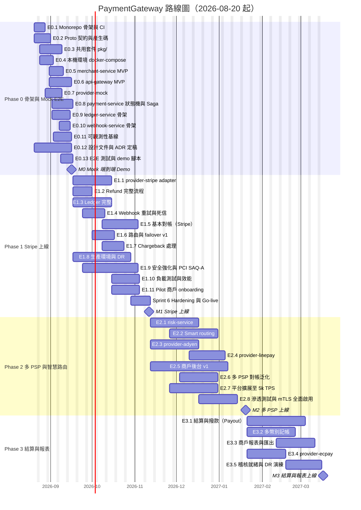

# PaymentGateway — 團隊組織、流程與路線圖

> 本文件描述**誰做、怎麼做、何時做**。技術決策以 `01-architecture.md` 為準；本文件只規範團隊結構、工作流程、交付時程與風險管理。
> 路線圖基準日：**2026-08-20**（Phase 0 Sprint 1 開始）。時程若需調整，在 sprint review 中更新本文件並附上變更原因。

---

## 1. 團隊組織

### 1.1 設計原則

- **以 bounded context 切 squad**：每個 squad 端到端擁有一組服務（程式碼、DB schema、migrations、dashboards、runbook、on-call）。
- **Conway 對齊**：squad 邊界 = `internal/<service>` 邊界 = Kafka topic / gRPC 契約邊界。跨 squad 的溝通必須走 proto / 事件契約，不走「借用對方 package」。
- **小而穩**：建議總人數 **13 FTE + 0.5 FTE 合規顧問**（範圍 10–14）。Phase 0–1 可先以 10 人起步（見 1.6 人力爬升）。
- **共用套件有明確 owner**：`pkg/` 下每個套件指定一個 owning squad，其他 squad 以 PR 貢獻。

### 1.2 Squad 配置（建議 13 + 0.5 人）

| Squad | 人數 | 角色組成 | 主要職責 |
|---|---|---|---|
| **Core Payments** | 3 | Tech Lead ×1、Backend Engineer ×2 | 商戶 REST API、付款/退款/爭議狀態機、路由與 failover、冪等、商戶與 API Key 管理 |
| **Ledger & Recon** | 3 | Tech Lead ×1、Backend Engineer ×2（至少一位具會計/金融背景） | 雙式記帳、餘額、對帳、差異報表、（Phase 3）結算撥款與報表 |
| **Platform / Infra** | 2 | SRE ×2（其中一位為 Platform Lead） | CI/CD、K8s/Helm、Kafka/Postgres/Redis/Vault 營運、可觀測性平台、DR、容量與效能 |
| **Integrations（PSP adapters）** | 2 | Tech Lead ×1、Backend Engineer ×1 | ProviderAdapter 契約、provider-mock / stripe / adyen / linepay / ecpay、PSP inbound webhook 驗簽、對商戶的 webhook 投遞 |
| **Security & Compliance** | 1 + 0.5 | Security Engineer ×1、Compliance 顧問 ×0.5（外部/兼任） | 威脅模型、簽章與金鑰管理、Vault 政策、PCI-DSS SAQ、滲透測試協調、稽核證據 |
| **跨 squad** | 2 | Product Owner ×1、QA/SDET ×1 | PO：backlog、商戶需求、驗收；SDET：E2E/契約/負載測試框架、測試資料、品質門檻 |

> 專案經理（PM）不計入上表 FTE，負責本文件所述流程的運作、跨 squad 依賴與風險追蹤。

**角色定義**

| 角色 | 職責摘要 |
|---|---|
| Tech Lead | squad 技術方向、ADR 主要作者、設計審查、code review 最終把關、on-call 輪值 |
| Backend Engineer | 功能開發、單元/整合測試、migrations、runbook 撰寫、on-call 輪值 |
| SRE | 平台可靠性、部署管線、告警與 SLO、容量規劃、事故指揮（Incident Commander） |
| QA/SDET | 測試策略落地、E2E 與契約測試、負載測試腳本、release 品質報告 |
| Security Engineer | 安全設計審查、祕密管理、依賴掃描、滲透測試追蹤、金鑰輪替執行 |
| Product Owner | 商戶需求與優先序、user story 驗收、商務 KPI、商戶 onboarding 內容 |
| Compliance 顧問 | PCI-DSS / 在地法規解讀、SAQ 填寫指導、稽核應對 |

### 1.3 服務與目錄 ownership（對應 01 文件第 7 節）

| Squad | 擁有的服務 | 擁有的目錄 | 共同擁有 / 主要貢獻 |
|---|---|---|---|
| Core Payments | `api-gateway`、`payment-service`、`merchant-service`、`risk-service`（Phase 2） | `cmd/api-gateway`、`cmd/payment-service`、`cmd/merchant-service`、`internal/apigateway`、`internal/payment`、`internal/merchant`、`internal/risk`、`pkg/idempotency`、`pkg/httpx`、`api/proto/pg/payment/v1`、`api/proto/pg/merchant/v1`、`api/openapi/`、`migrations/payment`、`migrations/merchant` | `pkg/money`（與 Ledger 共同擁有，變更需雙方 TL 核准） |
| Ledger & Recon | `ledger-service`、`reconciliation-service` | `cmd/ledger-service`、`cmd/reconciliation-service`、`internal/ledger`、`internal/reconciliation`、`api/proto/pg/ledger/v1`、`api/proto/pg/reconciliation/v1`、`migrations/ledger`、`migrations/recon` | `pkg/money`（共同擁有）、`pkg/outbox`（消費端語意） |
| Platform / Infra | （無業務服務）本機與生產環境、OTel 管線 | `deploy/`（docker、compose、helm、otel）、`.github/workflows/`、`Makefile`、`pkg/pgdb`、`pkg/grpcx`、`pkg/otel`、`pkg/config`、`pkg/eventbus`、`pkg/outbox`（relay worker） | 所有服務的 Helm values、Dashboard 模板 |
| Integrations | `provider-mock`、`provider-stripe`、`provider-adyen`、`provider-linepay`、`provider-ecpay`、`webhook-service` | `cmd/provider-*`、`cmd/webhook-service`、`internal/provider*`、`internal/webhook`、`api/proto/pg/provider/v1`、`api/proto/pg/webhook/v1`、`migrations/webhook` | `api-gateway` 的 `/psp/{provider}/webhook` 路由（與 Core 共同審查） |
| Security & Compliance | （無業務服務） | `pkg/sig`、`docs/06-security-compliance.md`、Vault policies（`deploy/helm/.../vault`）、`.github/workflows` 中的安全掃描 job、`SECURITY.md` | 所有涉及驗證、簽章、祕密的 PR 為必要 reviewer |
| QA/SDET | 測試基礎設施 | `test/e2e/`、`test/load/`、`test/contract/`、testcontainers 共用 fixtures | 各 squad 的整合測試規範 |

> `internal/<a>` 不得 import `internal/<b>`（01 文件 Import 規則、ADR-0001）。CI 以 `depguard` 強制；違反者 PR 直接失敗，不進入人工 review。

### 1.4 RACI

R = Responsible（執行）、A = Accountable（最終負責，僅一人）、C = Consulted、I = Informed

| 活動 | Core Payments TL | Ledger TL | Platform Lead | Integrations TL | Security Eng | Compliance 顧問 | PO | PM |
|---|---|---|---|---|---|---|---|---|
| **架構變更（ADR）** | R / **A**（涉及付款流程） | R（涉及帳本） | R（涉及基礎設施） | C | C | I | C | I |
| **上線（production release）** | R | C | R / **A** | R（若含 adapter） | C（安全 sign-off） | I | C（商務 go/no-go） | R（流程） |
| **PSP 新增** | C（路由整合） | C（對帳格式） | C（部署、祕密） | R / **A** | C（驗簽審查） | C（PSP 合約與合規） | R（商務需求） | I |
| **事故處理（Sev1/Sev2）** | R（付款面） | R（帳本面） | R / **A**（Incident Commander） | R（PSP 面） | C（若為安全事件則為 A） | I | I | R（對外溝通、事後檢討追蹤） |
| **合規稽核（PCI SAQ 等）** | C | C | R（基礎設施證據） | C | R / **A** | R（填寫與解讀） | I | R（時程） |
| **金鑰輪替** | C（API Key 機制） | I | R（Vault、憑證） | R（PSP 金鑰、webhook secret） | R / **A** | I | I | I |
| Sprint 範圍與優先序 | C | C | C | C | C | C | R / **A** | R |
| 帳本 schema 變更 | C | R / **A** | C | I | I | C | I | I |
| 對商戶 API 破壞性變更 | R / **A** | C | I | C | C | I | R（商戶溝通） | R |

### 1.5 On-call

- Phase 0：無正式 on-call（僅開發環境）。
- Phase 1 起（Stripe 上線前兩週開始演練）：**兩層 on-call**。
  - L1：Platform SRE（事故指揮、基礎設施）。
  - L2：依受影響服務 page 對應 squad（Core / Ledger / Integrations 各一條輪值表）。
- 每人連續值班不超過 1 週；值班週不安排 sprint 承諾工作超過 50%。
- 所有 page 必須對應一份 runbook（DoD 要求）；沒有 runbook 的告警不得設為 page 級別。

### 1.6 人力爬升計畫

| 時點 | 人數 | 說明 |
|---|---|---|
| Phase 0（2026-08-20） | 10 | Core 3、Ledger 2、Platform 2、Integrations 1、Security 1、PO 1；SDET 由 Platform 兼任 |
| Phase 1 開始前（2026-09-17） | 12 + 0.5 | 加入 Integrations 第 2 人（Stripe）、SDET；Compliance 顧問進場準備 SAQ |
| Phase 2 開始前（2026-11-12） | 13 + 0.5 | 加入 Ledger 第 3 人（多 PSP 對帳、Phase 3 結算）；商戶後台前端若無內部人力則外包（見風險 R11） |

---

## 2. 溝通與流程

### 2.1 Sprint 節奏

- **雙週 sprint**，週四開始、隔週三結束（與基準日 2026-08-20 星期四對齊）。
- Sprint 編號全專案連續（Sprint 1 = 2026-08-20 ～ 2026-09-02）。

| 儀式 | 時間 | 時長 | 參與者 | 產出 |
|---|---|---|---|---|
| Sprint Planning | Sprint 第 1 天（四）10:00 | 2h | 全員 | Sprint goal、承諾的 story 清單、容量表 |
| Daily Standup | 每日 09:45 | 15 min | 各 squad 分開站會；PM 輪流參加 | 阻礙清單更新 |
| Backlog Refinement | Sprint 第 2 週週二 14:00 | 1.5h | PO、各 TL、PM、SDET | 下個 sprint 候選 story 估算完成（T-shirt → story point） |
| Architecture Sync | 每週二 11:00 | 45 min | 各 TL、Security、Platform Lead | ADR 審查與決議、跨 squad 契約變更 |
| Sprint Review / Demo | Sprint 最後一天（三）14:00 | 1h | 全員 + 利害關係人 | 可運作的 demo（必須在 compose 或 staging 上跑，不看投影片） |
| Retrospective | Sprint 最後一天（三）15:30 | 1h | 全員 | 1–3 個行動項目，指定 owner，下次 retro 檢視 |
| 跨 squad 依賴同步 | 每週四 standup 後 | 15 min | 各 TL + PM | 依賴看板更新 |

**估算**：Refinement 時先以 T-shirt size（XS/S/M/L/XL）對 epic 粗估，拆成 story 後以 Fibonacci 點數估算。經驗換算：XS ≈ 1–2 點、S ≈ 3–5、M ≈ 8–13、L ≈ 20–30（一個 squad 一個 sprint 以上）、XL ≈ 40+（必須拆分）。

### 2.2 ADR（Architecture Decision Records）流程

01 文件明訂「變更決策請新增 ADR 而非直接改本文件」。流程如下：

1. **觸發條件**：任何變更 01 文件中「固定」事項（技術棧、服務邊界、通訊方式、資料庫策略、安全機制），或新增跨 squad 契約（新 topic、新 gRPC 服務、新 `pkg/` 套件）。
2. **撰寫**：複製 `docs/adr/0000-template.md`，檔名 `docs/adr/NNNN-<kebab-title>.md`，編號接續現有最大值（目前為 0012）遞增。採 MADR 格式：
   - Status（`proposed` → `accepted` / `rejected` / `superseded by NNNN`）
   - Context、Decision、Consequences、Alternatives considered、對 01 文件的影響段落
3. **審查**：開 PR，標籤 `adr`。在下一次 Architecture Sync 討論；至少需 **兩位 TL + Security Engineer**（若涉及安全）核准。提出後 **3 個工作日**內未有異議且達核准數即合併。
4. **生效**：合併後，同一 PR 內更新 01 文件相關段落並在段落末加上 `（見 ADR-NNNN）`。
5. **現有 ADR**（`docs/adr/`，狀態皆為 Accepted；新成員 onboarding 必讀，變更任一項需以新 ADR supersede）：

   | 編號 | 檔案 | 決策摘要 | 主要影響 squad |
   |---|---|---|---|
   | — | `0000-template.md` | ADR 範本 | 全員 |
   | 0001 | `0001-go-monorepo-single-module.md` | 單一 `go.mod` monorepo 與 `internal/` import 規則 | 全員（Platform 以 depguard 強制） |
   | 0002 | `0002-database-per-service-no-cross-db-join.md` | database-per-service，禁止跨 DB join | Core、Ledger、Platform |
   | 0003 | `0003-transactional-outbox-kafka-over-2pc.md` | 以 Transactional Outbox + Kafka 取代 2PC | Platform（relay）、所有擁有 DB 的 squad |
   | 0004 | `0004-money-int64-minor-units.md` | 金額以 int64 最小貨幣單位表示，`pkg/money` | Core、Ledger |
   | 0005 | `0005-saga-orchestration-payment-service.md` | payment-service 作為 Saga orchestrator | Core |
   | 0006 | `0006-provider-adapter-as-service.md` | 每個 PSP 一個 adapter service，實作同一 ProviderAdapter proto | Integrations |
   | 0007 | `0007-idempotency-key-two-layer.md` | 兩層冪等：api-gateway（Redis）+ payment-service（DB 唯一索引） | Core、Platform |
   | 0008 | `0008-state-table-plus-append-only-events.md` | 狀態表 + append-only 事件表（Event Sourcing-lite） | Core、Ledger |
   | 0009 | `0009-ledger-append-only-and-reversal.md` | 帳本只能 INSERT，錯帳以反向分錄沖銷 | Ledger |
   | 0010 | `0010-rest-external-grpc-internal-no-graphql.md` | 對外 REST、對內 gRPC，不採用 GraphQL | Core、Integrations |
   | 0011 | `0011-kafka-over-nats-jetstream.md` | 事件匯流排選 Kafka 而非 NATS JetStream | Platform |
   | 0012 | `0012-commit-generated-protobuf.md` | protoc 產物 commit 進 repo，CI 驗證未手改 | 全員（Platform 維護 CI 檢查） |

   > PCI 範圍策略（不接觸 PAN、使用 PSP tokenization）目前記錄於 `docs/06-security-compliance.md`，尚無獨立 ADR；若 Phase 2 商戶後台或 hosted fields 導致範圍重新評估，應以 ADR-0013 正式記錄（見風險 R2）。

### 2.3 Code Review 規範

- 所有變更經 PR 合併到 `main`，**禁止直接 push**。
- **一般變更**：至少 1 位 reviewer（同 squad 或 owning squad 成員）。
- **金流相關變更**（以下任一）：**至少 2 位 reviewer，且其中一位必須來自 Ledger & Recon squad**：
  - `internal/payment/domain`、`internal/ledger`、`internal/reconciliation` 任何變更
  - `pkg/money`、`pkg/outbox`、`pkg/idempotency`
  - 任何 `migrations/` 下的 `.up.sql`（含其他服務；Ledger reviewer 關注金額欄位型別、約束與 append-only）
  - 任何改變 Payment / Refund 狀態機轉移、金額計算、幣別處理的程式碼
  - Kafka 事件 schema（`api/proto/pg/*/v1/*event*.proto`）
- **安全相關變更**（`pkg/sig`、驗證 middleware、祕密讀取、webhook 驗簽、Vault 設定、CI secrets）：Security Engineer 為必要 reviewer。
- **契約變更**（`api/proto`、`api/openapi`）：owning squad TL + 所有消費方 squad 各一位 reviewer；CI 的 `buf breaking` 必須通過，破壞性變更需 ADR 或版本號遞增（`v2`）。
- `CODEOWNERS` 檔案依 1.3 表維護，GitHub 強制 required reviewers。
- Review SLA：一般 PR 1 個工作日內首次回覆；阻塞他人的 PR 4 小時內。
- PR 大小：目標 < 400 行 diff（不含產生碼與測試 fixtures）；超過需在描述中說明為何無法拆分。
- PR 描述必填：變更目的、測試方式、是否影響 migrations / 契約 / runbook / dashboards、rollback 方式。

### 2.4 Definition of Done

一個 story 只有在**全部**符合以下條件時才算完成：

**程式碼與測試**
- [ ] 程式碼已合併至 `main`，CI 全綠（lint、unit、integration、build、proto breaking check、depguard）。
- [ ] 單元測試覆蓋：`domain/` 與 `app/` 套件 **≥ 85%**；`pkg/money`、`pkg/idempotency`、`pkg/outbox`、`pkg/sig` **≥ 95%**；整體 repo ≥ 75%（CI 門檻）。
- [ ] 涉及 DB 的 repository 有 testcontainers 整合測試；涉及狀態機的有表格驅動的轉移測試（含非法轉移）。
- [ ] 涉及對外 API 的有 E2E 測試案例（`test/e2e/`）更新；涉及 gRPC 契約的有契約測試。
- [ ] 金額相關邏輯有 property-based 或邊界測試（0、負數、int64 上限、幣別最小單位不同）。

**可觀測性**
- [ ] 新的 use case 有 span，`payment_id` / `merchant_id` 放入 span attribute 與 log field。
- [ ] 新的失敗模式有對應 metric（沿用 01 文件 6.5 命名慣例 `pg_*`），並已加入 Grafana dashboard。
- [ ] 若新增 page 級告警，已有對應 runbook（見下）。

**營運與文件**
- [ ] Runbook：新服務或新失敗模式在 `docs/runbooks/<service>.md` 有條目（症狀、確認步驟、緩解、升級路徑）。
- [ ] Migration 可正向與反向執行（`.up.sql` / `.down.sql` 均經 CI 驗證），且與前一版程式相容（expand/contract）。
- [ ] 設定變更已更新 `deploy/compose/docker-compose.yaml` 與 Helm values 預設值，新增的 `PG_*` 環境變數已記錄於 `docs/07-deployment.md`。
- [ ] OpenAPI / proto 文件與實作同步。

**安全**
- [ ] 涉及驗證、簽章、祕密、輸入解析的變更已由 Security Engineer review。
- [ ] 無新的高風險依賴漏洞（`govulncheck`、依賴掃描通過）。
- [ ] 無祕密進入 repo（pre-commit `gitleaks` + CI 掃描）。
- [ ] 新增的 log 不含 PAN、CVV、完整 API Key、webhook secret（log 欄位白名單檢查）。

**驗收**
- [ ] PO 依 acceptance criteria 在 compose / staging 驗收並於 story 上簽核。
- [ ] 在 Sprint Review 中 demo 過（或明確標註為基礎建設類不需 demo）。

### 2.5 分支策略（Trunk-based Development）

- 單一長存分支 `main`，永遠可部署。
- 功能分支壽命 **< 2 個工作日**；超過即拆分或以 feature flag 提早合併。
  - 分支命名：`<type>/<ticket>-<short-desc>`，type ∈ `feat | fix | chore | adr | hotfix`。
- **Feature flags**：未完成功能以 `PG_FEATURE_<NAME>` 環境變數或 merchant-service 的 per-merchant 設定保護；flag 在功能 GA 後一個 sprint 內移除（建立清理 ticket）。
- **Commit 規範**：Conventional Commits（`feat(payment): ...`、`fix(ledger): ...`），scope 使用服務名或 pkg 名。commit 訊息不加任何 AI/工具署名 trailer。
- **Release**：
  - `main` 每次合併自動部署至 `dev` 環境（compose-in-k8s 或共用 namespace）。
  - 每個 sprint 結束或依需求打 tag `v0.<sprint>.<n>`（Phase 1 上線後改 `v1.x.y` semver），tag 觸發 staging 部署；production 以手動 promote 同一 image digest。
  - Hotfix：從 tag 切 `hotfix/*`，修正後同時合併回 `main` 並打 patch tag。
- **Migrations**：只能追加新檔，不得修改已合併的 migration；使用 expand/contract 確保 N-1 版相容以支援滾動更新與 rollback。
- **產生碼**（`api/gen/go`）commit 進 repo（ADR-0012）；CI 重新產生並 `git diff --exit-code` 驗證未手改。

### 2.6 溝通管道

| 管道 | 用途 |
|---|---|
| `#pg-dev` | 日常技術討論 |
| `#pg-<squad>` | 各 squad 頻道 |
| `#pg-incidents` | 事故宣告與即時處理（僅事故） |
| `#pg-releases` | 自動化部署通知、release notes |
| `#pg-adr` | ADR PR 通知與討論 |
| Weekly status（週五） | PM 發送：sprint 進度、燃盡、阻礙、風險變動、下週重點（格式見附錄 A） |
| 雙週 stakeholder demo | 即 Sprint Review |
| 月度 steering | PM + PO + 贊助人：里程碑、預算、人力、重大風險 |

---

## 3. 路線圖

### 3.1 里程碑總覽

| 里程碑 | 日期 | 定義 | 對應 01 文件 Phase |
|---|---|---|---|
| **M0 — Mock 端到端跑通** | 2026-09-16 | 可編譯 monorepo；`make up` 後以 provider-mock 完成 建立商戶 → 付款 → capture → 帳本入帳 → 商戶 webhook；設計文件 01–10 定稿，ADR 0001–0012 已 accepted 且實作與之一致 | Phase 0（4 週，Sprint 1–2） |
| **M1 — Stripe 上線（pilot 商戶）** | 2026-11-11 | Stripe adapter 於 production 處理真實交易；ledger 完整；webhook 重試；Stripe 結算對帳；99.95% SLO 監控到位；PCI SAQ-A 完成 | Phase 1（8 週，Sprint 3–6） |
| **M2 — 多 PSP 與智慧路由** | 2027-01-20 | risk-service、smart routing、Adyen 與 LINE Pay adapter 上線、商戶後台 v1 | Phase 2（10 週，Sprint 7–11） |
| **M3 — 結算撥款與報表** | 2027-03-17 | 結算/撥款、多幣別記帳、商戶報表、ECPay adapter | Phase 3（8 週，Sprint 12–15） |

Sprint 日曆：

| Sprint | 起迄 | Phase | 備註 |
|---|---|---|---|
| 1 | 2026-08-20 ～ 09-02 | 0 | |
| 2 | 2026-09-03 ～ 09-16 | 0 | M0 |
| 3 | 2026-09-17 ～ 09-30 | 1 | 9/28 教師節連假（台灣），容量 -1 天 |
| 4 | 2026-10-01 ～ 10-14 | 1 | 10/9–10/11 國慶連假，容量 -1 天 |
| 5 | 2026-10-15 ～ 10-28 | 1 | |
| 6 | 2026-10-29 ～ 11-11 | 1 | M1；Sprint 6 為 hardening，不接新功能 |
| 7 | 2026-11-12 ～ 11-25 | 2 | |
| 8 | 2026-11-26 ～ 12-09 | 2 | |
| 9 | 2026-12-10 ～ 12-23 | 2 | |
| 10 | 2026-12-24 ～ 2027-01-06 | 2 | 聖誕與元旦，容量約 -40%，只排低風險工作 |
| 11 | 2027-01-07 ～ 01-20 | 2 | M2 |
| 12 | 2027-01-21 ～ 02-03 | 3 | |
| 13 | 2027-02-04 ～ 02-17 | 3 | 農曆新年（2027-02-06 起），容量約 -50% |
| 14 | 2027-02-18 ～ 03-03 | 3 | |
| 15 | 2027-03-04 ～ 03-17 | 3 | M3 |

### 3.2 Gantt 圖



### 3.3 Phase 0 — 骨架與 provider-mock 端到端（2026-08-20 ～ 09-16，Sprint 1–2）

**Phase 目標**：依 01 文件完成可編譯、可在本機一鍵啟動的 monorepo，以 provider-mock 跑通完整付款流程，並讓設計文件與 ADR 定稿，使 Phase 1 的每個 squad 都能平行開工而不互相阻塞。

**Phase 0 的原則**
- 先契約、後實作：E0.2（proto）與 E0.3（pkg）在 Sprint 1 前半優先，其他 squad 對著契約寫 stub。
- 每個服務在 Sprint 1 結束前至少能 `go build` 並回應 `HealthCheck`。
- 不追求功能完整，但追求**架構正確**：outbox（ADR-0003）、冪等（ADR-0007）、append-only 帳本（ADR-0009）、trace 貫穿在 Phase 0 就要存在，不留到「之後補」。

#### E0.1 Monorepo 骨架與 CI — Sprint 1 — Size: M — Squad: Platform

- **目標**：建立 01 文件第 7 節的目錄結構、`go.mod`、`Makefile`、8 個 `cmd/*/main.go`（啟動即可回 health）、golangci-lint 設定、GitHub Actions CI。
- **涵蓋**：`go.mod`、`Makefile`、`cmd/*`、`.github/workflows/ci.yaml`、`.golangci.yaml`、`CODEOWNERS`、`deploy/docker/Dockerfile`。
- **User stories**：
  - As a developer, I want `make build` / `make test` / `make lint` 在乾淨機器上 5 分鐘內完成, so that 每個人的本機與 CI 行為一致。
  - As a Tech Lead, I want CI 在 `internal/<a>` import `internal/<b>` 時失敗, so that 服務邊界在第一天就被強制（ADR-0001）。
- **驗收條件**：
  - [ ] `make build` 產出 8 個 binary；多階段 Dockerfile 以 `--build-arg SERVICE=` 建出任一服務 image。
  - [ ] CI 包含 lint、unit test、build、`buf breaking`、depguard、gitleaks、`git diff --exit-code` 產生碼檢查（ADR-0012）。
  - [ ] `CODEOWNERS` 依 1.3 表設定且 branch protection 啟用。
- **依賴**：無。
- **交付物**：可合併的骨架 PR、CI badge。

#### E0.2 Proto 契約與程式碼產生 — Sprint 1 — Size: M — Squad: Core Payments（主）+ Integrations（provider）+ Ledger（ledger）

- **目標**：定義 `pg.merchant.v1`、`pg.payment.v1`、`pg.ledger.v1`、`pg.webhook.v1`、`pg.reconciliation.v1`、`pg.provider.v1`（ProviderAdapter 七個 RPC，ADR-0006）及事件 message（`PaymentEvent`、`RefundEvent`、`LedgerEvent`、`MerchantEvent`），以 `buf` 產生 Go 碼並 commit。
- **涵蓋**：`api/proto/pg/**`、`api/gen/go/**`、`buf.yaml`、`buf.gen.yaml`。
- **User stories**：
  - As an Integrations engineer, I want ProviderAdapter 介面在 Sprint 1 第 5 天前凍結, so that provider-mock 與 Phase 1 的 provider-stripe 對同一契約開發。
  - As a Ledger engineer, I want `PaymentEvent` 帶有 `event_id`、`payment_id`、`merchant_id`、`amount`（Money）、`provider`、`occurred_at`、`sequence`, so that 我能冪等且有序地記帳。
- **驗收條件**：
  - [ ] 所有 proto 通過 `buf lint`（`DEFAULT` 規則集）且有欄位註解。
  - [ ] Money message 定義為 `{int64 amount; string currency}`（ADR-0004），無任何 float/double 欄位（CI 以 `buf lint` 自訂規則或 grep 檢查）。
  - [ ] 每個事件 message 含 `event_id`（UUID）與 `schema_version`。
  - [ ] `api/openapi/payment-gateway.yaml` 初版涵蓋 `POST/GET /v1/payments`、`POST /v1/payments/{id}/capture`、`POST /v1/refunds`、`/v1/merchants/me/webhook-endpoints`，通過 spectral lint，與 `docs/03-api.md` 一致。
- **依賴**：E0.1。

#### E0.3 共用套件 `pkg/` — Sprint 1 ～ 2 前半 — Size: L — Squad: 依套件分工

| 套件 | Owner | 最小範圍 |
|---|---|---|
| `pkg/money` | Core + Ledger | `Money{Amount int64; Currency}`、`Add/Sub/Split/Allocate`、幣別最小單位表、禁止混幣別運算、JSON/proto 轉換、100% 測試（ADR-0004） |
| `pkg/config` | Platform | `PG_` 前綴載入、必填驗證、啟動時 dump（遮蔽祕密） |
| `pkg/pgdb` | Platform | pgx pool、`golang-migrate` helper、`WithTx` helper、健康檢查 |
| `pkg/grpcx` | Platform | server/client builder、otel、slog、recovery、deadline interceptors、健康檢查服務 |
| `pkg/httpx` | Core | 01 文件第 8 節錯誤格式、request id、recovery、JSON helper |
| `pkg/otel` | Platform | tracer/meter/logger 初始化、OTLP exporter、Kafka header 傳播 |
| `pkg/sig` | Security | HMAC-SHA256 `t=,v1=` 格式簽章/驗證、常數時間比較、時間窗、雙 secret 輪替 |
| `pkg/idempotency` | Core | Redis `SETNX` 鎖、`(request_hash, response)` 儲存、24h TTL、衝突偵測（ADR-0007 第一層） |
| `pkg/outbox` | Platform（relay）+ Ledger（消費端） | outbox 表 schema 與 `Write(tx, event)`、relay worker（polling + `FOR UPDATE SKIP LOCKED`）、`processed_events` 去重 helper（ADR-0003） |
| `pkg/eventbus` | Platform | Kafka producer/consumer 封裝（ADR-0011 選定 Kafka；Go client library 由後續 ADR 決定）、trace header、重試與 DLQ topic 慣例 |

- **User stories**：
  - As a backend engineer, I want `pkg/money` 在編譯期就阻止我把 `int64` 當金額相加, so that 浮點數與單位錯誤不可能進入帳本。
  - As a Ledger engineer, I want `pkg/outbox.Write` 與我的業務寫入在同一個 `pgx.Tx`, so that 事件與狀態不會不一致。
- **驗收條件**：
  - [ ] 上表每個套件有 README 與範例；覆蓋率達 DoD 門檻。
  - [ ] `pkg/outbox` 有 testcontainers 測試證明：交易 rollback 時事件不送出；relay 重啟後不漏不重（消費端去重）。
  - [ ] `pkg/sig` 對 01 文件 6.4 的兩種簽章（商戶請求 `X-Signature`、對商戶 webhook `X-PG-Signature`）都有測試向量。
- **依賴**：E0.1、E0.2（Money proto）。

#### E0.4 本機環境 docker-compose — Sprint 1 — Size: M — Squad: Platform

- **目標**：`make up` 啟動 Postgres（5 個 DB）、Redis、Kafka（KRaft 單節點）、OTel Collector、Prometheus、Grafana、Jaeger、Loki 與全部 8 個服務；`make down`、`make reset-db`、`make migrate`。
- **涵蓋**：`deploy/compose/`、`deploy/otel/`、`Makefile`、`docs/07-deployment.md` 本機章節。
- **User stories**：
  - As a new team member, I want 在 clone 後 15 分鐘內看到一筆付款的 trace 出現在 Jaeger, so that 我能立刻理解系統如何串接。
- **驗收條件**：
  - [ ] 冷啟動（含 image pull 後）< 90 秒全部 healthy。
  - [ ] 每個服務用獨立 DB 使用者，只能存取自己的 DB（ADR-0002）。
  - [ ] Kafka topics 由 init container 建立（`payment.events`、`refund.events`、`ledger.events`、`merchant.events`、`reconciliation.events` 及對應 `.dlq`）。
  - [ ] Grafana 預載 dashboard：服務概覽、outbox lag、provider latency。
- **依賴**：E0.1。

#### E0.5 merchant-service MVP — Sprint 1 後半 ～ 2 — Size: M — Squad: Core Payments

- **目標**：建立商戶、發行/撤銷 API Key（Argon2id hash、回傳一次明文、顯示前綴）、Webhook 端點 CRUD（含 signing secret 產生）、供 api-gateway 驗證用的 `VerifyAPIKey` RPC（含快取）。
- **涵蓋**：`internal/merchant`、`migrations/merchant`、`pg.merchant.v1`。
- **User stories**：
  - As an operator, I want 用 CLI/gRPC 建立商戶並取得 `pk_test_…` key, so that 我能在 demo 中以真實驗證流程呼叫 API。
  - As a merchant, I want 註冊一個 webhook URL 並取得 signing secret, so that 我能驗證通知的來源。
- **驗收條件**：
  - [ ] API Key 明文只出現在建立回應中；DB 只存 Argon2id hash 與前綴。
  - [ ] 撤銷 key 後 60 秒內（快取 TTL）api-gateway 拒絕該 key。
  - [ ] 狀態變更寫 `merchant.events` outbox。
- **依賴**：E0.2、E0.3（pgdb、outbox、grpcx）。

#### E0.6 api-gateway MVP — Sprint 1 後半 ～ 2 — Size: L — Squad: Core Payments

- **目標**：chi router、Bearer + HMAC 驗證（5 分鐘時間窗）、`Idempotency-Key` middleware（Redis）、簡單限流（per merchant token bucket）、REST↔gRPC 轉譯（ADR-0010）、01 文件第 8 節錯誤格式、`/psp/{provider}/webhook` 入口（轉交對應 adapter 的 `ParseWebhook`）。
- **涵蓋**：`internal/apigateway`、`pkg/httpx`、`pkg/idempotency`、`api/openapi`。
- **User stories**：
  - As a merchant, I want 重送帶同一 `Idempotency-Key` 的請求得到同一個回應, so that 網路重試不會造成重複付款。
  - As a merchant, I want 同一 key 但不同 payload 得到 `409 idempotency_error`, so that 我能發現自己的 bug。
  - As an operator, I want 每個回應都有 `request_id` 且能在 Jaeger 查到, so that 支援問題可以被追蹤。
- **驗收條件**：
  - [ ] 缺少 / 錯誤 / 過期簽章分別回 `401 authentication_error`，錯誤 code 可區分。
  - [ ] 冪等：並發 50 個同 key 請求只有 1 個到達 payment-service（整合測試）。
  - [ ] 限流超過回 `429 rate_limit_error` 並帶 `Retry-After`。
  - [ ] OpenAPI 與實際回應以契約測試比對。
- **依賴**：E0.2、E0.3、E0.5（驗證 key）。

#### E0.7 provider-mock — Sprint 1 後半 — Size: M — Squad: Integrations

- **目標**：實作 ProviderAdapter 全部 RPC；行為可由請求控制：金額尾數 / metadata 決定成功、拒絕（各類 decline code）、逾時、`requires_action`（3DS）、延遲；可模擬 PSP inbound webhook（例如 3DS 完成、async capture）。
- **涵蓋**：`internal/providermock`、`cmd/provider-mock`。
- **User stories**：
  - As a Core Payments engineer, I want 用 `amount` 結尾 `…01` 觸發 decline、`…02` 觸發逾時、`…03` 觸發 3DS, so that 我能在 E2E 測試覆蓋所有狀態轉移。
  - As an SDET, I want mock 能以設定檔注入固定延遲分佈, so that 負載測試不依賴真實 PSP。
- **驗收條件**：
  - [ ] 行為矩陣文件化於 `internal/providermock/README.md`。
  - [ ] `ParseWebhook` 能驗一把共享 secret 的簽章並輸出標準事件。
  - [ ] `HealthCheck` 可被切成 unhealthy（供 Phase 1 failover 測試）。
- **依賴**：E0.2。

#### E0.8 payment-service 狀態機與 Saga — Sprint 2 — Size: L — Squad: Core Payments（主）+ Integrations（adapter 呼叫）

- **目標**：Payment 聚合根與 01 文件 5.2 狀態機、`payment_events` append-only（ADR-0008）、`(merchant_id, idempotency_key)` 唯一索引（ADR-0007 第二層）、Saga 步驟 1–4（ADR-0005；路由在 Phase 0 只選單一 provider）、`Authorize`/`Capture`/`Void`、`automatic`/`manual` capture、outbox 發佈 `PaymentEvent`。
- **涵蓋**：`internal/payment`、`migrations/payment`、`pg.payment.v1`；流程對應 `docs/05-flows-and-sequences.md`。
- **User stories**：
  - As a merchant, I want `POST /v1/payments` with `capture_method=automatic` 回傳 `captured` 狀態, so that 一般電商結帳只需一次呼叫。
  - As a merchant, I want 以 `manual` 建立後再呼叫 capture（可小於授權金額）, so that 我能在出貨時才請款。
  - As an operator, I want 每一次狀態轉移都能在 `payment_events` 看到 who/when/why, so that 稽核與客訴可追溯。
- **驗收條件**：
  - [ ] 狀態機以表格驅動測試覆蓋所有合法與非法轉移（非法轉移回領域錯誤，不寫 DB）。
  - [ ] 狀態更新與 `payment_events`、`outbox` 在同一交易。
  - [ ] 併發對同一 payment capture 兩次只成功一次（樂觀鎖 `version` 欄位）。
  - [ ] `requires_action` → mock webhook → `authorized` 的非同步路徑跑通。
- **依賴**：E0.2、E0.3、E0.7。

#### E0.9 ledger-service 骨架 — Sprint 2 — Size: M — Squad: Ledger & Recon

- **目標**：帳戶、journal、entries schema（借貸相等的 DB constraint 或 deferred trigger）、5 種帳戶類型、消費 `payment.captured` 產生一筆 journal（借 `psp_receivable` / 貸 `merchant_payable`，手續費暫以 0 或固定比例）、`processed_events` 去重、`pg_ledger_imbalance_total` 指標、`GetBalance` RPC。schema 對應 `docs/04-data-model.md`。
- **涵蓋**：`internal/ledger`、`migrations/ledger`、`pg.ledger.v1`。
- **User stories**：
  - As a finance operator, I want 任何讓借貸不平衡的寫入在 DB 層就被拒絕, so that 帳本正確性不依賴應用程式碼沒有 bug。
  - As a Ledger engineer, I want 同一 `event_id` 被重放時不產生第二筆 journal, so that Kafka at-least-once 不會造成重複入帳。
- **驗收條件**：
  - [ ] journal/entries 表只有 INSERT 權限（DB role 層拒絕 UPDATE/DELETE，ADR-0009）。
  - [ ] 整合測試：重放同一事件 100 次只產生 1 筆 journal。
  - [ ] `pg_ledger_imbalance_total` 在 compose 環境的 Grafana 顯示為 0 並設告警規則。
- **依賴**：E0.2、E0.3（money、outbox、eventbus）、E0.8（事件來源）。

#### E0.10 webhook-service 骨架 — Sprint 2 — Size: S — Squad: Integrations

- **目標**：消費 `payment.events`，查商戶 webhook 端點（gRPC 到 merchant-service），以 `pkg/sig` 簽 `X-PG-Signature`，投遞一次並記錄結果（重試與死信留到 E1.4）。
- **涵蓋**：`internal/webhook`、`migrations/webhook`。
- **User stories**：
  - As a merchant, I want 在付款 captured 後數秒內收到帶簽章的 `payment.captured` 通知, so that 我能更新訂單狀態。
- **驗收條件**：
  - [ ] 通知 payload 含 `event_id`、`type`、`created`、`data`，商戶可用文件中的驗簽範例驗證。
  - [ ] 投遞結果（status code、耗時）寫 `deliveries` 表並產生 `pg_webhook_delivery_total{result}`。
- **依賴**：E0.3（sig、eventbus）、E0.5、E0.8。

#### E0.11 可觀測性基線 — Sprint 2 — Size: M — Squad: Platform

- **目標**：trace 從 HTTP → gRPC → outbox → Kafka → consumer 貫穿（Kafka header 傳播 `traceparent`）；01 文件 6.5 的五個關鍵指標全部有資料；結構化 log 帶 `trace_id`、`payment_id`；Loki 可用 `payment_id` 檢索。
- **驗收條件**：
  - [ ] 一筆付款在 Jaeger 是單一 trace，含 api-gateway、payment-service、provider-mock、ledger-service、webhook-service 的 span。
  - [ ] Grafana「Payment Overview」dashboard 含成功率、P50/P99、provider latency、outbox lag、webhook 成功率、ledger imbalance。
  - [ ] 告警規則檔（Prometheus rules）存於 `deploy/otel/`，即使 Phase 0 不 page。
- **依賴**：E0.3（otel、grpcx、eventbus）、E0.8、E0.9、E0.10。

#### E0.12 設計文件與 ADR 定稿 — Sprint 1 ～ 2 — Size: S — Squad: 各 TL + Security + PM

- **目標**：`docs/01`～`10` 完成並互相一致（`10-codebase-guide.md` 隨骨架程式碼同步更新）；ADR-0001～0012 已 accepted，Phase 0 實作若偏離任一 ADR 必須以新 ADR supersede 而非默默偏離；`docs/06-security-compliance.md` 含威脅模型初版與 PCI 範圍聲明；`docs/runbooks/` 骨架。
- **驗收條件**：
  - [ ] 每份文件有 owner 與最後審閱日期。
  - [ ] 01 文件中所有「細節見 `0X`」的交叉引用都指向存在的章節。
  - [ ] 各 TL 逐條確認自己 squad 的程式碼符合相關 ADR（對照 §2.2 表的「主要影響 squad」欄）。
  - [ ] Security Engineer 簽核 PCI 範圍聲明（SAQ-A 目標、不接觸 PAN 的技術控制清單）。
- **依賴**：無（與開發平行）。

#### E0.13 E2E 測試與 demo 腳本 — Sprint 2 — Size: M — Squad: SDET（Platform 兼任）+ 各 squad

- **目標**：`make e2e` 在 compose 上執行：建立商戶 → 發 key → 建 webhook 端點（測試接收器）→ 建付款（automatic）→ 驗證 `captured` → 驗證 ledger journal → 驗證 webhook 收到且簽章正確；另含 manual capture、decline、3DS、冪等重送四個情境。測試層級依 `docs/09-testing-strategy.md`。
- **User stories**：
  - As a PO, I want 在 Sprint 2 review 用一條指令展示完整流程, so that 利害關係人對架構有信心。
- **驗收條件**：
  - [ ] E2E 在 CI 以 testcontainers 或 compose service 執行，< 5 分鐘。
  - [ ] 五個情境全部綠燈且失敗時輸出 trace id。
- **依賴**：E0.4～E0.11。

**M0 退出條件**：E0.1～E0.13 全部達 DoD；Sprint 2 review 現場 demo 成功；Phase 1 backlog 已 refinement 完成（至少 Sprint 3、4 的 story 已估算）。

### 3.4 Phase 1 — Stripe 上線（2026-09-17 ～ 11-11，Sprint 3–6）

**Phase 目標**：第一個真實 PSP（Stripe）在 production 為 pilot 商戶處理交易；帳本與對帳可供財務信任；具備 99.95% SLO 所需的營運能力。Sprint 6 為 hardening sprint，不接新功能。

| Epic | Sprint | Size | Squad | 目標 | 涵蓋服務 | 主要 user stories | 驗收條件 | 依賴 |
|---|---|---|---|---|---|---|---|---|
| **E1.1 provider-stripe adapter** | 3–4 | L | Integrations | 以 Stripe PaymentIntents 實作全部 ProviderAdapter RPC；`ParseWebhook` 驗 Stripe 簽章並正規化 `payment_intent.*`、`charge.refunded`、`charge.dispute.*` | provider-stripe、api-gateway（webhook 路由） | As a merchant, I want 用同一套 API 在 Stripe 上完成付款, so that 我不需要理解 Stripe；As an Integrations engineer, I want adapter 在 Stripe 逾時時回傳可區分「未知結果」的錯誤, so that payment-service 能查詢而非盲目重試 | Stripe sandbox 上 E2E 五情境全過；3DS 以 Stripe test card 跑通；webhook 重放攻擊被拒；Stripe API key 來自 Vault；錯誤映射表文件化 | E0.7 契約、E1.8（Vault） |
| **E1.2 Refund 完整流程** | 3 | M | Core（主）+ Ledger | 部分/多次退款、`captured - refunded` 約束、`refund.events`、ledger `refund_clearing` 分錄、對商戶 `refund.succeeded/failed` webhook | payment-service、ledger-service、webhook-service | As a merchant, I want 對一筆付款做多次部分退款直到金額用盡, so that 我能處理部分退貨 | 超額退款回 `invalid_request_error/amount_exceeds_refundable`；併發退款不超額（唯一索引 + 樂觀鎖）；每筆退款在 ledger 有平衡 journal | E0.8、E0.9 |
| **E1.3 Ledger 完整** | 3–4 | L | Ledger | 5 種帳戶類型全部啟用；手續費（PSP fee 與平台 fee）分錄；反向分錄沖銷 API（需雙人核准欄位，ADR-0009）；每日餘額快照；`ListJournals` 查詢；帳本與 `payment_events` 的一致性檢查 job | ledger-service | As a finance operator, I want 查任一商戶任一時點的應付餘額, so that 我能回答商戶詢問；As a Ledger engineer, I want 每晚 job 證明 Σ(captured − refunded − fees) = merchant_payable 變動, so that 帳本缺陷在 24 小時內被發現 | 一致性 job 在 compose 與 staging 連續 7 天為 0 差異；沖銷只能以新 journal 進行；快照可重建 | E0.9、E1.2 |
| **E1.4 Webhook 重試與死信** | 4 | M | Integrations | 指數退避（1m、5m、30m、2h、12h、24h）、最多 N 次後進死信；商戶可查投遞紀錄與手動重送 API；secret 輪替（同時接受兩把，01 文件 6.4）；端點連續失敗自動停用與通知 | webhook-service、api-gateway、merchant-service | As a merchant, I want 我的伺服器停機 1 小時後仍能收到所有通知, so that 不會漏單；As a merchant, I want 輪替 webhook secret 時有重疊期, so that 零停機 | 測試接收器回 500 時依排程重試且順序保留（per endpoint）；死信可由 API 重放；輪替期間新舊 secret 都驗得過 | E0.10 |
| **E1.5 基本對帳（Stripe）** | 4–5 | L | Ledger | 匯入 Stripe Balance Transactions / payout 報表（API 拉取 + CSV 上傳）、三方比對（PSP 報表 ↔ ledger ↔ payment-service）、差異分類（金額不符、缺漏、時間差、手續費差）、差異報表與 `reconciliation.events` | reconciliation-service | As a finance operator, I want 每日自動對帳並只看到差異項, so that 我不必逐筆核對；As an operator, I want 差異超過門檻時收到告警, so that 系統性問題早期發現 | Stripe sandbox 一週資料對帳差異率 < 0.1% 且每項差異有分類；差異報表可匯出 CSV；對帳 job 冪等可重跑 | E1.1、E1.3 |
| **E1.6 路由與 failover v1** | 4 | M | Core | 路由規則：商戶偏好 + 幣別 + provider 健康度（HealthCheck + 滑動視窗錯誤率）；可重試錯誤時 failover 到下一 provider；circuit breaker；路由決策寫入 `payment_events` | payment-service、merchant-service | As an operator, I want 當 Stripe 錯誤率超過 20% 時新付款自動改走備援, so that 單一 PSP 故障不影響整體（01 文件 NFR） | staging 用 mock 模擬 Stripe 故障時 failover 在 30 秒內生效；不可重試錯誤（decline）不 failover；決策可追溯 | E0.8、E1.1 |
| **E1.7 Chargeback 處理** | 4–5 | M | Core（主）+ Ledger | Stripe dispute webhook → `disputed`；`chargeback_won/lost`；ledger `chargeback_reserve` 提列與釋放；對商戶通知與證據提交 API（透傳 Stripe） | payment-service、ledger-service、webhook-service、provider-stripe | As a merchant, I want 收到爭議通知並能上傳證據, so that 我能爭取勝訴；As a finance operator, I want 爭議金額在帳本中被保留, so that 餘額反映風險 | Stripe 測試卡 `4000000000000259` 流程跑通；won/lost 分錄平衡；超過 PSP 期限的證據提交被拒並提示 | E1.1、E1.3 |
| **E1.8 生產環境與 DR** | 3–5 | L | Platform | Helm chart、K8s（staging + production）、Vault（動態 DB 憑證、PSP key）、mTLS（cert-manager）、managed Kafka 與 Postgres、備份與 PITR、DR 演練（RPO 5 分鐘 / RTO 1 小時）、SLO 與 page 級告警、on-call 工具；更新 `docs/07-deployment.md` | 全部 | As an SRE, I want 一鍵從備份在另一區域還原並跑通 E2E, so that DR 不只是文件；As a Security Engineer, I want 服務只能以 Vault 短期憑證連 DB, so that 憑證外洩影響受限 | staging 與 production 以同一 chart 不同 values 部署；DR 演練紀錄（時間、RPO/RTO 實測）；所有 page 告警有 runbook；滾動更新零失敗請求（負載測試期間驗證） | E0.4、E0.11 |
| **E1.9 安全強化與 PCI SAQ-A** | 4–5 | M | Security + Compliance | 威脅模型定稿；依賴與容器掃描進 CI；金鑰輪替 runbook 與演練（API key、webhook secret、PSP key、mTLS cert）；稽核日誌（誰改了商戶設定）；PCI SAQ-A 填寫與證據；外部滲透測試排程（執行於 Phase 2） | api-gateway、merchant-service、全部 | As a Compliance 顧問, I want 技術控制清單對應 SAQ-A 每一題, so that 稽核可一次通過；As a Security Engineer, I want 每季輪替所有金鑰且有演練紀錄, so that 輪替不會在緊急時才第一次做 | SAQ-A 簽署完成；輪替演練在 staging 完成且零停機；CI 阻擋 high/critical 漏洞；稽核日誌不可竄改（append-only + 外送） | E1.8 |
| **E1.10 負載測試與效能** | 5 | M | SDET + Platform | k6 腳本（建立付款、查詢、退款混合）；目標 500 TPS 持續 30 分鐘、建立付款 P99 < 300ms（不含 PSP）；找出瓶頸（Redis 冪等、outbox relay、DB index）並修正；容量模型文件 | 全部 | As an SRE, I want 知道每個服務在 500 TPS 下的 CPU/記憶體/連線數, so that Helm 的 requests/limits 與 HPA 有依據 | 報告含 P50/P95/P99、錯誤率 0、outbox lag < 2 秒、ledger imbalance 0；HPA 設定依結果調整 | E1.8、provider-mock 延遲注入 |
| **E1.11 Pilot 商戶 onboarding** | 5–6 | S | PO + Core | 商戶整合文件（快速開始、驗簽範例 Node/Go/PHP、錯誤碼表、測試卡）、sandbox 環境與測試 key、支援流程（工單、SLA 回覆時間）、商戶協議草案（SLA 99.95%） | api-gateway、docs | As a pilot merchant, I want 在一天內從拿到 key 到完成第一筆 sandbox 付款, so that 整合成本低 | 一家 pilot 商戶在 staging 完成整合且通過驗收清單；文件由非團隊成員試讀通過 | E1.1、E1.4 |
| **Sprint 6 Hardening 與 Go-live** | 6 | M | 全員 | 凍結功能；bug 修復；Go-live checklist（第 5 節）逐項完成；production 首筆真實交易（小額）；監控 72 小時 | 全部 | — | 第 5 節 checklist 全部勾選；Go/No-go 會議紀錄；首週無 Sev1 | 所有 Phase 1 epic |

**M1 退出條件**：pilot 商戶在 production 完成真實交易並對帳成功；第 5 節 Go-live checklist 全部完成；SLO dashboard 運作且 on-call 輪值啟動。

### 3.5 Phase 2 — 多 PSP 與智慧路由（2026-11-12 ～ 2027-01-20，Sprint 7–11）

**Phase 目標**：從「單一 PSP 可用」進化到「多 PSP、可依成本與成功率自動路由、具風險控管」，並提供商戶自助後台。

| Epic | Sprint | Size | Squad | 目標 | 涵蓋服務 | 主要 user stories | 驗收條件 | 依賴 |
|---|---|---|---|---|---|---|---|---|
| **E2.1 risk-service** | 7–8 | L | Core Payments | 新服務（:9006、`pg_risk`）：規則引擎（DSL 或表格規則）、velocity check（同卡指紋/同 IP/同商戶在時間窗內次數與金額）、黑名單、決策 `allow/review/block`；payment-service 在 Authorize 前同步呼叫（逾時 fail-open 可設定）；決策寫 `payment_events` | risk-service、payment-service | As an operator, I want 設定「同一卡指紋 10 分鐘內超過 5 筆就阻擋」, so that 卡測攻擊成本上升；As a merchant, I want 被風控擋下的付款有明確錯誤碼, so that 我能告知客戶 | 規則變更不需部署；決策 P99 < 20ms；fail-open/closed 行為可設定且有測試；規則命中率 dashboard | E0.8 |
| **E2.2 Smart routing** | 8–9 | L | Core Payments | 路由引擎 v2：以 provider 成本（手續費表）、近期授權成功率（per 幣別/卡種）、延遲、商戶偏好加權；A/B 分流；路由設定 API 與模擬器（dry-run）；決策理由可查 | payment-service、merchant-service | As an operator, I want 把 30% 的 TWD 交易導到 LINE Pay 觀察成功率, so that 切換有依據；As a merchant, I want 指定某幣別只走特定 PSP, so that 符合我的合約 | 模擬器輸出與實際決策一致；成本節省與成功率變化可在 dashboard 比較；路由變更有稽核紀錄 | E1.6、E2.3 |
| **E2.3 provider-adyen** | 7–8 | L | Integrations | Adyen Checkout API adapter；HMAC webhook 驗簽；Adyen 結算報表格式供對帳 | provider-adyen、api-gateway | As a merchant, I want 用同一 API 走 Adyen, so that 我可取得更好的歐洲授權率 | Adyen test 環境 E2E 五情境全過；failover Stripe↔Adyen 在 staging 驗證；錯誤映射表 | E1.1 經驗、E1.6 |
| **E2.4 provider-linepay** | 9–10 | M | Integrations | LINE Pay v3 API（redirect 型付款：Request → Confirm）；`requires_action` 流程對應；退款 | provider-linepay、api-gateway | As a merchant in Taiwan, I want 提供 LINE Pay 付款, so that 符合在地消費習慣 | sandbox 跑通 request/confirm/refund；redirect 回跳與 webhook 兩條路徑都能完成狀態轉移 | E0.8 `requires_action` 路徑 |
| **E2.5 商戶後台 v1** | 7–10 | L | Core + PO（前端可能外包） | 商戶登入（SSO 或 email+TOTP）、付款/退款/爭議查詢與操作、webhook 投遞紀錄與重送、API key 管理、路由偏好設定、基本報表 | 新 BFF（`api-gateway` 的 `/dashboard` 路由或獨立 `dashboard-bff`）、merchant-service、前端 repo | As a merchant operator, I want 不寫程式就能查一筆付款並退款, so that 客服能自助；As a merchant admin, I want 管理團隊成員權限, so that 符合內控 | 角色權限（admin/ops/viewer）；所有操作有稽核日誌；pilot 商戶可用性測試通過 | E1.4、E1.11 |
| **E2.6 多 PSP 對帳泛化** | 8–9 | M | Ledger | 對帳引擎抽象 PSP 報表格式（parser plugin）；Adyen / LINE Pay 報表；跨 PSP 差異儀表板；差異處理工作流（指派、備註、結案） | reconciliation-service | As a finance operator, I want 所有 PSP 在同一個差異清單中處理, so that 流程一致 | 三個 PSP 報表皆可匯入；差異可指派與結案；月結報表 | E1.5、E2.3、E2.4 |
| **E2.7 平台擴展至 5k TPS** | 8–10 | M | Platform | Kafka partition 與 consumer 併發策略（以 `payment_id` 為 key 保序）；Postgres 連線池與讀寫分離評估；HPA/VPA；多 AZ；負載測試 5k TPS | 全部 | As an SRE, I want 5k TPS 時 outbox lag 仍 < 5 秒, so that 商戶通知不延遲 | 5k TPS 30 分鐘錯誤率 0、P99 達標；容量模型更新；成本估算 | E1.10 |
| **E2.8 滲透測試與 mTLS 全面啟用** | 9–11 | M | Security + Platform | 外部滲透測試執行與修復；服務間 mTLS 在 production 強制；網路政策（NetworkPolicy）最小化；祕密掃描與 SBOM；SAQ-A-EP 評估（若商戶後台或 hosted fields 導致範圍變化，以 ADR 記錄） | 全部 | As a Security Engineer, I want 滲透測試無 high 以上未修復項, so that 可向商戶提供報告 | 滲透報告與修復證據；mTLS 強制後 E2E 通過；NetworkPolicy 拒絕非預期流量測試 | E1.9 |

**M2 退出條件**：至少一家商戶在 production 使用兩個以上 PSP 且 smart routing 啟用；risk-service 至少一條規則生效；商戶後台供 pilot 商戶使用；滲透測試無 high 以上未修復項。

### 3.6 Phase 3 — 結算、多幣別與報表（2027-01-21 ～ 03-17，Sprint 12–15）

**Phase 目標**：補齊資金面閉環（從 PSP 收到錢到撥付給商戶）與財務報表能力。注意 Sprint 13 有農曆新年，容量減半。

| Epic | Sprint | Size | Squad | 目標 | 涵蓋服務 | 主要 user stories | 驗收條件 | 依賴 |
|---|---|---|---|---|---|---|---|---|
| **E3.1 結算與撥款（Payout）** | 12–14 | L | Ledger | 結算週期（T+N、每週）、結算批次（以 PSP 實際入帳為基礎）、`merchant_payable` → 撥款分錄、撥款指令檔（銀行格式或 PSP payout API）、保留金（reserve）與最低撥款額、撥款狀態追蹤與失敗處理 | ledger-service、reconciliation-service、新 `settlement` 模組（在 ledger 內或獨立服務，由 ADR 決定） | As a merchant, I want 每週收到撥款並看到明細（扣除手續費、退款、爭議）, so that 對帳輕鬆；As a finance operator, I want 撥款前必須對帳無差異, so that 不會多付 | 撥款批次需雙人核准；批次總額 = 明細總和 = 帳本分錄（三方相等）；對帳有差異時阻擋撥款；撥款檔格式測試 | E1.3、E1.5、E2.6 |
| **E3.2 多幣別記帳** | 12–13 | L | Core + Ledger | 每幣別獨立帳戶（`merchant_payable:TWD`、`:USD`…）；PSP 結算幣別與交易幣別不同時記錄 PSP 匯率與換匯損益（不自行換匯，01 文件非目標）；多幣別餘額查詢與報表 | payment-service、ledger-service、reconciliation-service | As a merchant selling globally, I want 看到每個幣別的餘額與 PSP 換匯後的結算金額, so that 財務能入帳 | 不同幣別永不混算（`pkg/money` 保證）；換匯損益帳戶平衡；對帳支援結算幣別 ≠ 交易幣別 | E1.3、E2.6 |
| **E3.3 商戶報表與匯出** | 13–14 | M | Ledger + PO | 月結帳單、交易明細匯出（CSV/Excel）、排程寄送、財務報表（收入、手續費、退款率、爭議率）、後台整合 | reconciliation-service 或獨立 reporting 模組、商戶後台 | As a merchant accountant, I want 每月 1 日收到上月帳單與明細, so that 結帳流程不需人工請求 | 報表數字與帳本一致（自動比對）；大商戶（100 萬筆/月）匯出 < 5 分鐘；排程可靠 | E2.5、E3.1 |
| **E3.4 provider-ecpay** | 12–13 | M | Integrations | 綠界 ECPay adapter（信用卡、ATM 虛擬帳號等非同步付款方式）；ECPay 對帳檔 | provider-ecpay | As a merchant in Taiwan, I want 提供 ATM 轉帳, so that 無卡客群可付款 | 非同步付款方式的 `requires_action` → 逾期失效流程；對帳檔匯入 | E2.4 經驗、E2.6 |
| **E3.5 稽核就緒與 DR 演練** | 14–15 | M | Security + Platform + Compliance | 年度 PCI SAQ 更新；DR 全面演練（含 Kafka 與 Redis）；稽核證據自動蒐集；事故演練（game day：雙重扣款、PSP 全掛、ledger 不平衡） | 全部 | As a Compliance 顧問, I want 所有稽核證據在一個地方且自動更新, so that 稽核準備從週變成天 | DR 演練達 RPO/RTO；三場 game day 紀錄與改進項目；SAQ 更新簽署 | E1.8、E1.9、E2.8 |

**M3 退出條件**：至少一家商戶完成一次真實撥款且三方金額相等；多幣別商戶報表經財務驗證；ECPay 上線。

### 3.7 跨 Phase 的持續工作（每 sprint 保留約 20% 容量）

- 技術債與 retro 行動項目
- 依賴升級（Go、pgx、grpc、Kafka client）
- Dashboard 與 runbook 維護
- on-call 產生的修復
- 商戶支援與文件更新

---

## 4. 風險登錄表

評分：機率與影響各 1–5；風險值 = 機率 × 影響。≥ 12 為高風險，每週 status 必須更新；6–11 每月檢視；< 6 每季檢視。

| # | 風險 | 機率 | 影響 | 風險值 | 緩解措施 | 應變計畫 | 負責人角色 | 狀態 |
|---|---|---|---|---|---|---|---|---|
| R1 | **PSP sandbox 不穩定或行為與 production 不一致**，造成 E2E 測試不可靠、Phase 1 時程延誤 | 4 | 3 | 12 | 所有 E2E 預設跑 provider-mock；針對 Stripe 另設 nightly job 而非 PR gate；記錄 sandbox 與 production 差異清單；adapter 設計為錄製/回放（record/replay）測試 | 若 sandbox 連續 2 天不可用，改用錄製的回應繼續開發，並向 PSP 開 ticket | Integrations TL | 開放 |
| R2 | **PCI 範圍擴大**（例如商戶後台、hosted fields 實作方式或日誌意外含卡號）導致從 SAQ-A 變 SAQ-A-EP 甚至 SAQ-D | 3 | 5 | 15 | `docs/06-security-compliance.md` 明訂不接觸 PAN（建議補 ADR 正式化）；api-gateway 入口做 PAN pattern 偵測並拒絕（Luhn 檢查）；log 欄位白名單；Security review 為所有前端/輸入相關 PR 必要 reviewer；Phase 2 開始前重新評估範圍 | 若範圍擴大，立即凍結相關功能並找 QSA 諮詢，調整 Phase 2 時程 | Security Engineer | 開放 |
| R3 | **帳本一致性缺陷**（借貸不平衡、事件漏記/重記、沖銷錯誤）造成商戶餘額錯誤 | 3 | 5 | 15 | DB constraint + append-only role（ADR-0009）；`processed_events` 去重；每日一致性 job（E1.3）；`pg_ledger_imbalance_total` page 級告警；金流變更需 Ledger reviewer；property-based 測試 | 發現時凍結撥款（Phase 3）與對外餘額顯示，以反向分錄修正並出具事故報告 | Ledger TL | 開放 |
| R4 | **Kafka 營運複雜度**（partition 重平衡、consumer lag、順序保證、DLQ 處理）超出 2 人 SRE 能力 | 4 | 3 | 12 | 使用 managed Kafka；Phase 0 即以 `payment_id` 為 key 保序；consumer 統一用 `pkg/eventbus` 封裝；lag 告警；DLQ 處理 runbook；Phase 1 安排 Kafka 訓練 | 若 lag 長期無法控制，評估退回「outbox + 直接 gRPC 通知」的過渡方案（需新 ADR supersede ADR-0011） | Platform Lead | 開放 |
| R5 | **雙重扣款事故**（冪等失效、failover 時第一個 PSP 實際已成功、重試風暴） | 2 | 5 | 10 | 三層冪等（Redis、DB 唯一索引、PSP idempotency key 透傳；前兩層見 ADR-0007）；failover 前先 `GetPaymentStatus` 確認未知結果；每筆 Authorize 帶 PSP 端 idempotency key；對帳偵測「PSP 有、我方無」的交易；混沌測試注入逾時 | 啟動 Sev1；以對帳找出受影響交易，24 小時內自動退款並通知商戶；事後檢討 | Core Payments TL | 開放 |
| R6 | **人員缺口 / 關鍵人員離職**（特別是 Ledger 與 Integrations 各僅 2–3 人） | 3 | 4 | 12 | 每個服務至少兩人熟悉（pairing、輪流 on-call）；runbook 與 ADR 文件化；Phase 1 前補齊 Integrations 第 2 人；避免單人長期負責同一服務 | 重新排定 sprint 優先序，必要時外包非核心（商戶後台前端、adapter）；PM 維護替補名單 | PM | 開放 |
| R7 | **法規變動**（台灣電子支付機構管理條例、個資法、PSD2/SCA 要求、PSP 合約條款）影響功能或上市資格 | 2 | 4 | 8 | Compliance 顧問每季法規掃描；3DS/SCA 流程在 Phase 0 即設計為一等公民；不持有資金（直接由 PSP 結算到商戶）以避開電支牌照，Phase 3 撥款設計前再確認 | 若需牌照，Phase 3 撥款改為「指令 PSP payout」而非自行持有資金 | Compliance 顧問 | 開放 |
| R8 | **Phase 1 時程過度樂觀**（8 週內完成 Stripe、ledger、對帳、生產環境、SAQ） | 4 | 3 | 12 | Sprint 6 保留為 hardening；E1.5 對帳與 E1.7 chargeback 標記為可降級（M1 可接受手動對帳一週）；每 sprint 燃盡追蹤；Sprint 4 結束做 M1 可行性檢查點 | 若 Sprint 4 檢查點落後 > 20%，M1 範圍縮減為「Stripe + ledger + webhook 重試」，對帳延至 Sprint 7 | PM | 開放 |
| R9 | **Webhook 投遞壓垮商戶或被濫用**（商戶端點緩慢導致 worker 阻塞、SSRF 風險） | 3 | 3 | 9 | per endpoint 併發上限與逾時；端點 URL 驗證（禁止內網 IP、需 HTTPS）；連續失敗自動停用；投遞 worker 與消費 worker 分離 | 停用問題端點並通知商戶；必要時全域降速 | Integrations TL | 開放 |
| R10 | **Redis 故障導致冪等層失效**（api-gateway 的 SETNX 不可用） | 2 | 4 | 8 | Redis 為 fail-closed（不可用時寫入 API 回 503 而非略過冪等）；managed Redis 高可用；DB 唯一索引為最後防線 | 切換到 standby；事後用對帳確認無重複 | Platform Lead | 開放 |
| R11 | **商戶後台需要前端能力，團隊無前端工程師** | 4 | 2 | 8 | Phase 2 開始前決定：外包前端或採用低程式碼管理後台框架；BFF API 先行由 Core 開發，前端可平行 | 若外包延誤，M2 以「API + 基本 CLI 工具」替代後台，後台延至 Phase 3 | PO | 開放 |
| R12 | **PSP 合約或費率談判延遲**（Adyen、LINE Pay 申請流程數週至數月） | 3 | 3 | 9 | Phase 1 即啟動 Adyen 與 LINE Pay 的商務申請；sandbox 帳號先行；adapter 以契約測試開發不等正式帳號 | 調整 Phase 2 順序：先 LINE Pay（申請較快）後 Adyen | PO | 開放 |
| R13 | **跨 DB 沒有分散式交易，Saga 補償邏輯出錯**（例如 capture 成功但 outbox relay 長時間停擺，商戶久未收到通知） | 3 | 3 | 9 | outbox lag 告警（> 30 秒 warning，> 5 分鐘 page）；relay 多副本 + `SKIP LOCKED`；商戶可用 `GET /v1/payments/{id}` 主動查詢（文件強調不可只依賴 webhook） | 重啟 relay；重放 outbox；通知受影響商戶 | Platform Lead | 開放 |
| R14 | **祕密外洩**（PSP API key、webhook secret 進入 log/repo/CI 輸出） | 2 | 5 | 10 | gitleaks pre-commit 與 CI；Vault 動態憑證；log 白名單；CI secrets 遮蔽；季度輪替演練（E1.9） | 立即輪替受影響金鑰（runbook）；評估影響範圍；通知商戶（若為 webhook secret） | Security Engineer | 開放 |
| R15 | **節慶期間容量不足**（Sprint 10 聖誕元旦、Sprint 13 農曆新年）同時是電商高峰 | 5 | 2 | 10 | 該兩個 sprint 只排低風險工作；Phase 1 上線前凍結期避開；節前一週 change freeze | 延長 sprint 或調整 M2/M3 日期 | PM | 開放 |

---

## 5. 上線準備檢查表（Go-live Checklist）

適用於 M1（Stripe 首次上線）。後續每個新 PSP 或重大功能上線以本表為基礎刪減。Go/No-go 會議在上線前 3 個工作日召開，由 Platform Lead 主持，PO、各 TL、Security Engineer、PM 出席；任何一項未完成需有書面例外核准（A 角色簽字）。

### 5.1 技術

- [ ] **負載測試**：500 TPS 持續 30 分鐘，建立付款 P99 < 300ms（不含 PSP），錯誤率 0，outbox lag < 2 秒，`pg_ledger_imbalance_total` = 0（E1.10 報告附上）。
- [ ] **滾動更新驗證**：負載期間執行部署，零失敗請求。
- [ ] **DR 演練**：已於上線前 2 週內完成一次完整演練（Postgres PITR 還原、Kafka 重建、Redis 切換），實測 RPO ≤ 5 分鐘、RTO ≤ 1 小時，紀錄存檔。
- [ ] **備份**：所有 5 個 DB 每日全備 + WAL 歸檔；還原測試通過；備份加密且跨區域。
- [ ] **告警到位**：SLO（可用性 99.95%、P99）burn-rate 告警；`pg_ledger_imbalance_total > 0`、outbox lag、webhook 失敗率、provider 錯誤率、DB 連線數、Kafka lag、憑證到期均有告警；每個 page 級告警有 runbook 連結且經 on-call 演練。
- [ ] **Runbook**：每個服務有 `docs/runbooks/<service>.md`，至少涵蓋：服務無回應、DB 連線耗盡、outbox 停擺、PSP 全面失敗、ledger 不平衡、webhook 死信處理、金鑰輪替、回滾。
- [ ] **On-call**：輪值表已排定至少 4 週；PagerDuty（或同等）路由測試通過；升級路徑文件化。
- [ ] **可觀測性**：production trace 取樣策略設定；dashboard 與 staging 一致；log 保留期符合稽核需求（至少 1 年，含不可竄改稽核日誌）。
- [ ] **回滾**：上線前一版 image 與 migration down 路徑經 staging 驗證；feature flag 可在不部署下關閉 Stripe 路由。
- [ ] **設定與祕密**：production 所有 `PG_*` 變數已依 `docs/07-deployment.md` 審閱；Stripe live key 存於 Vault 且僅 provider-stripe 可讀；webhook signing secret 已在 Stripe dashboard 設定且驗簽測試通過。
- [ ] **資料**：production DB 已跑完 migrations；seed 資料僅限必要（無測試商戶）。
- [ ] **E2E 在 production**：以內部測試商戶與真實小額交易（例如 TWD 10）完成付款、退款，並確認 ledger、webhook、對帳。
- [ ] **相依服務**：Stripe 帳號為 live 模式且 KYC 完成；managed Kafka / Postgres / Redis 的 SLA 與支援合約生效。

### 5.2 合規與安全

- [ ] **PCI-DSS SAQ-A**：已填寫並由 Compliance 顧問審閱、管理層簽署；技術控制對照表存檔。
- [ ] **PAN 不落地驗證**：程式碼掃描與 log 抽樣確認無 PAN/CVV；api-gateway 的 PAN pattern 拒絕機制啟用。
- [ ] **滲透測試**：外部滲透測試已排程（Phase 2 執行）；上線前至少完成內部安全審查與自動化掃描（DAST 對 staging）且無 high 以上未修復項。
- [ ] **依賴與映像掃描**：無 critical/high 漏洞；SBOM 產生。
- [ ] **威脅模型**：`docs/06-security-compliance.md` 威脅模型已審閱，每個高風險威脅有對應控制。
- [ ] **金鑰管理**：所有金鑰輪替 runbook 已在 staging 演練；Vault 政策最小權限審閱；mTLS 憑證自動更新驗證。
- [ ] **存取控制**：production 存取僅限 on-call 與 SRE，透過 SSO + MFA；稽核日誌外送到不可竄改儲存。
- [ ] **個資**：資料保留與刪除政策文件化；商戶與持卡人個資欄位清單；隱私影響評估完成。
- [ ] **事故應變**：安全事故流程（含通知商戶與主管機關的時限）文件化並演練一次。

### 5.3 商務與營運

- [ ] **商戶 onboarding 文件**：快速開始、API 參考（OpenAPI 與 `docs/03-api.md`）、驗簽範例（至少 3 種語言）、錯誤碼表、測試卡與 sandbox 指南、webhook 最佳實務（冪等處理、主動查詢）— 經非團隊成員試讀。
- [ ] **SLA**：商戶協議含可用性 99.95%、支援回應時間、排除條款（PSP 故障）、賠償方式；法務審閱完成。
- [ ] **支援流程**：工單系統與 `#pg-support` 路由；L1（PO/支援）→ L2（on-call）升級規則；常見問題與回覆模板；支援時段公告。
- [ ] **狀態頁**：公開 status page 與事故溝通模板。
- [ ] **Pilot 商戶**：已簽署 pilot 協議；完成 staging 整合驗收；指定雙方聯絡窗口；上線後每日同步一週。
- [ ] **費率與帳務**：pilot 商戶費率在 ledger 手續費表設定並驗證；結算方式（Phase 1 由 Stripe 直接撥款給商戶或平台代收）已與財務確認。
- [ ] **變更凍結**：上線前 3 個工作日至上線後 3 個工作日僅允許 hotfix。
- [ ] **Go/No-go 紀錄**：會議紀錄含出席者、決議、例外項目與到期日。

---

## 6. KPI / 成功指標

### 6.1 技術指標

| 指標 | 定義 / 來源 | M1 目標 | M2 目標 | M3 目標 | 負責 |
|---|---|---|---|---|---|
| 可用性（API） | `api-gateway` 成功回應（非 5xx）/ 總請求，月度，SLO | 99.95% | 99.95% | 99.97% | Platform |
| 建立付款 P99 延遲 | `POST /v1/payments` 扣除 provider span 時間 | < 300ms | < 250ms | < 250ms | Core |
| 端到端 P99（含 PSP） | 同上含 provider 往返 | < 2.5s | < 2.0s | < 2.0s | Core + Integrations |
| 授權成功率 | `authorized+captured` / (`authorized+captured+failed`)，排除風控阻擋，per provider | 基準線建立（Stripe） | 相較 M1 基準 +1.5pp（smart routing 效益） | 維持 | Core |
| Failover 生效時間 | 從 provider 不健康到新付款改路由 | < 30s | < 15s | < 15s | Core |
| Webhook 投遞成功率 | 最終成功（含重試）/ 總事件，24h 內 | ≥ 99.9% | ≥ 99.95% | ≥ 99.95% | Integrations |
| Webhook 首次投遞延遲 P95 | 事件產生到首次 HTTP 送出 | < 5s | < 3s | < 3s | Integrations |
| 對帳差異率 | 未自動匹配筆數 / PSP 報表筆數，每日 | < 0.1% | < 0.05% | < 0.02% | Ledger |
| 對帳完成時間 | PSP 報表可用到差異報表產生 | < 4h | < 1h | < 1h | Ledger |
| 帳本不平衡事件 | `pg_ledger_imbalance_total` | 0 | 0 | 0 | Ledger |
| Outbox lag P99 | 寫入到送達 Kafka | < 2s | < 5s（5k TPS 下） | < 5s | Platform |
| 吞吐能力 | 負載測試驗證的 TPS | 500 | 5,000 | 5,000 | Platform |
| 部署頻率 / 變更失敗率 | DORA | 每日部署 dev、每 sprint production；失敗率 < 15% | 每週 production；< 10% | 每週；< 10% | Platform |
| MTTR（Sev1/2） | 事故宣告到緩解 | < 1h | < 45min | < 30min | Platform |
| 測試覆蓋率 | 依 DoD | domain/app ≥ 85%、核心 pkg ≥ 95% | 維持 | 維持 | SDET |
| 雙重扣款事件 | 經對帳或客訴確認 | 0 | 0 | 0 | Core |

### 6.2 商務指標

| 指標 | 定義 | M1 目標 | M2 目標 | M3 目標 | 負責 |
|---|---|---|---|---|---|
| 接入商戶數（production） | 完成 KYC 並有真實交易 | 1（pilot） | 5 | 15 | PO |
| 月交易量 | captured 筆數 / 月 | 1 萬 | 20 萬 | 100 萬 | PO |
| 月交易金額（TPV） | captured 金額合計（以 TWD 計） | 基準線 | 10× M1 | 50× M1 | PO |
| 每筆交易基礎設施成本 | 月度雲端 + managed 服務成本 / captured 筆數 | 建立基準線 | 較 M1 降 40% | 較 M1 降 60% | Platform + PM |
| PSP 手續費節省 | smart routing 後實際費用 vs. 全走預設 PSP 的模擬費用 | — | ≥ 3% | ≥ 5% | Core + PO |
| 商戶整合時間 | 取得 sandbox key 到首筆 production 交易 | < 10 個工作日 | < 5 | < 3 | PO |
| 支援工單量 / 千筆交易 | 商戶開的工單數 | 基準線 | 較 M1 降 30% | 較 M2 降 30% | PO |
| 商戶 NPS | 季度調查 | 建立基準線 | ≥ 30 | ≥ 40 | PO |
| 爭議率 | disputed / captured | < 0.5% | < 0.3% | < 0.3% | Core + Risk |
| 撥款準時率（Phase 3） | 依排程完成的撥款批次比例 | — | — | 100% | Ledger |

### 6.3 團隊健康指標

| 指標 | 目標 |
|---|---|
| Sprint 完成率（承諾點數完成比例） | ≥ 80% |
| 速度穩定性（相鄰 sprint 速度變異） | < 20% |
| PR 平均合併時間 | < 1 個工作日 |
| Retro 行動項目完成率 | ≥ 70% |
| On-call 每週 page 數 | < 5（超過即排入可靠性工作） |
| 團隊滿意度（每季匿名 1–5） | ≥ 4 |

---

## 7. Onboarding 指南

### 7.1 第一週閱讀順序

| 天 | 閱讀 | 目的 | 完成標準 |
|---|---|---|---|
| Day 1 上午 | `docs/01-architecture.md`（全文） | 理解目標、NFR、服務切分、技術棧、目錄與 import 規則 | 能不看文件畫出 4.1 服務圖並說出每個服務的 DB |
| Day 1 下午 | `docs/02-domain-and-ledger.md` | Money、Payment/Refund 狀態機、雙式記帳 | 能解釋為何帳本只能 INSERT，以及一筆 captured 付款會產生哪些分錄 |
| Day 2 上午 | `docs/03-api.md` + `api/openapi/payment-gateway.yaml` | 商戶視角的 API、冪等、錯誤格式 | 能用 curl 帶正確簽章建立一筆付款 |
| Day 2 下午 | `docs/04-data-model.md` + `migrations/` | 每個服務的資料表、outbox、processed_events、帳本 schema | 能說出 `payment_events`、`outbox`、`journal/entries` 各自的用途與約束 |
| Day 3 上午 | `docs/05-flows-and-sequences.md` + `api/proto/` | 付款 Saga、failover、webhook、對帳的時序與服務間契約 | 能說出一筆付款從 HTTP 到 webhook 經過哪些 RPC 與 topic |
| Day 3 下午 | `docs/06-security-compliance.md` | 簽章、金鑰、PCI 範圍、禁止事項 | 能說出三件「絕對不能做」的事（log 卡號、浮點金額、直接改帳本） |
| Day 4 上午 | `docs/07-deployment.md` + `deploy/` | 本機與生產環境、設定、可觀測性 | 能在 Grafana 與 Jaeger 找到自己剛建立的付款 |
| Day 4 下午 | 本文件（`08-team-and-roadmap.md`）+ `docs/adr/0001`～`0012` | 團隊如何運作、為何這樣決策 | 知道自己的 squad、CODEOWNERS、DoD、如何開 ADR；能說出 ADR-0003、0007、0009 各解決什麼問題 |
| Day 5 上午 | `docs/09-testing-strategy.md` + `test/` | 測試層級、testcontainers、E2E | 能跑通 `make test` 與 `make e2e` 並讀懂一個失敗輸出 |
| Day 5 下午 | `docs/10-codebase-guide.md` + 所屬 squad 的 `internal/<service>/` 與 `docs/runbooks/<service>.md` | 程式碼導覽、深入自己的服務 | 與 buddy 完成第一個 good-first-issue 的 PR |

### 7.2 第一週要跑起來的東西

1. **環境**：Go 1.26、Docker、`buf`、`golangci-lint`、`golang-migrate`、`k6`（選用）。執行 `make tools` 安裝（步驟見 `docs/07-deployment.md`）。
2. **本機啟動**：`make up` → 確認 `http://localhost:8080/healthz`、Grafana（3000）、Jaeger（16686）全部可用。
3. **第一筆付款**：依 `docs/03-api.md` 以 `make seed-merchant` 取得測試 key，用 `scripts/pay.sh`（或 curl）建立一筆 automatic capture 付款；在 Jaeger 找到 trace，在 Postgres `pg_ledger` 查到 journal，在測試 webhook 接收器（`make webhook-sink`）看到通知。
4. **觸發失敗路徑**：用 provider-mock 的金額規則觸發 decline、逾時、3DS，各觀察一次狀態機與事件，對照 `docs/05-flows-and-sequences.md` 的時序圖。
5. **冪等**：同一 `Idempotency-Key` 重送兩次，觀察回應一致；改 payload 重送，觀察 `409`。
6. **測試**：`make test`（單元）、`make test-integration`（testcontainers）、`make e2e`。
7. **CI**：開一個只改 README 的 PR，看完整 CI 流程與 required checks。
8. **可觀測性**：在 Grafana「Payment Overview」找到自己觸發的 decline 計數；在 Loki 用 `payment_id` 查 log。

### 7.3 Good-first-issue 類型（標籤 `good-first-issue`）

依 squad 提供，每個 issue 附上：相關文件段落、預期改動檔案、驗證方式、預估 ≤ 1 天。

| 類型 | 範例 | 學到什麼 |
|---|---|---|
| provider-mock 新行為 | 新增一個 decline code（如 `insufficient_funds`）及對應金額尾數 | ProviderAdapter 契約、錯誤映射 |
| 狀態機測試補強 | 為某個非法轉移補表格驅動測試 | Payment 狀態機、領域錯誤 |
| `pkg/money` 邊界案例 | 為某幣別（如 JPY、KWD）補最小單位與 `Allocate` 測試 | Money 模型、為何不用浮點（ADR-0004） |
| 錯誤碼與 OpenAPI 同步 | 新增一個 `invalid_request_error` code 並更新 OpenAPI 與 `docs/03-api.md` | 01 文件第 8 節錯誤格式、契約測試 |
| Dashboard 面板 | 在 Grafana 加一個 per-currency 成功率面板 | 指標命名、PromQL |
| Runbook 條目 | 為某個既有告警補 runbook 的「確認步驟」 | 營運視角、on-call 準備 |
| Webhook 測試接收器功能 | 讓 `webhook-sink` 支援模擬 500 / 延遲回應 | webhook 重試機制 |
| Migration 小改 | 為查詢熱點補索引（含 `.down.sql`）並附 `EXPLAIN` 前後比較，同步更新 `docs/04-data-model.md` | expand/contract、pgdb helper |
| 文件修正 | 修正交叉引用、補範例 | 熟悉文件體系 |

### 7.4 第一週的人際安排

- 指定 **buddy**（同 squad 資深成員），每日 15 分鐘 check-in。
- Day 1 與 PM 與 PO 各 30 分鐘：專案背景、商戶是誰、目前 sprint 目標。
- Day 3 與 Security Engineer 30 分鐘：安全基線與禁止事項。
- Day 5 在 standup 簡短分享「onboarding 中最困惑的一點」，作為文件改進輸入。
- 第 2 週起加入 on-call shadow（Phase 1 之後）。

---

## 附錄 A：週報格式

```markdown
## PaymentGateway 週報 — Sprint N（YYYY-MM-DD）

### 本週完成
- E0.6 api-gateway 冪等 middleware（8 點）— Core
- E0.7 provider-mock 3DS 模擬（5 點）— Integrations

### 進行中
- E0.8 payment-service Saga（13 點）— 60%，預計週三完成

### 阻礙
- Stripe sandbox webhook 延遲 > 10 分鐘（R1）— Integrations TL 已開 ticket

### 風險變動
- R8 Phase 1 時程：機率 4 → 3（E1.8 提前開始）

### 下週重點
- 完成 E0.8、E0.9，準備 M0 demo

### 指標
- 速度：34 點（目標 36）
- Sprint 完成率：85%
- CI 綠燈率：92%
```

## 附錄 B：文件維護

| 項目 | 負責 | 頻率 |
|---|---|---|
| 路線圖與 sprint 日曆 | PM | 每 sprint review 後 |
| 風險登錄表 | PM（各風險 owner 提供更新） | 每週 status |
| RACI 與 squad 配置 | PM + 各 TL | 人員異動時 |
| KPI 實際值 | 各負責 squad | 每月 steering |
| Go-live checklist | Platform Lead | 每次上線前複製一份至 `docs/releases/<version>-checklist.md` |
| §2.2 ADR 清單 | 新 ADR 的作者 | 每次 ADR 合併時同 PR 更新 |
