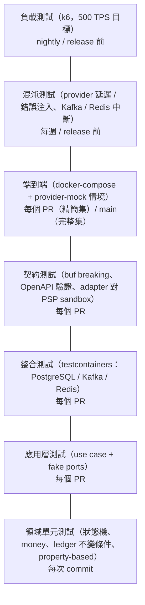
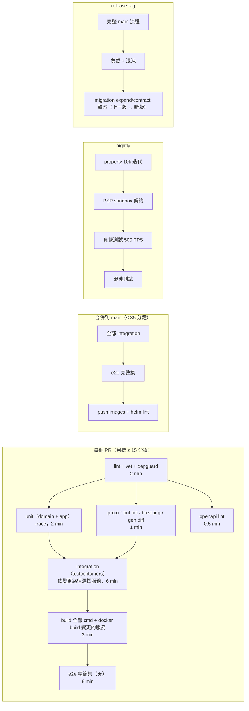

# PaymentGateway — 測試策略（Testing Strategy）

> 依據 `01-architecture.md` §3（`testing` + `testcontainers-go` + `testify`）、§7 的分層（domain / app / adapter）與 CI 要求（lint、test、build、proto breaking check）。流程細節見 `05-flows-and-sequences.md`，決策背景見 `docs/adr/`。

## 1. 測試金字塔與責任



| 層 | 目錄 / 命名 | 外部依賴 | 目標覆蓋 | 單次執行時間預算 |
|---|---|---|---|---|
| 1. Domain 單元 | `internal/<svc>/domain/*_test.go`、`pkg/money/*_test.go` | 無 | domain 套件 ≥ 95% 行覆蓋、狀態機轉移表 100% | < 30s（全部） |
| 2. App 層 | `internal/<svc>/app/*_test.go`，以 `app/porttest` 的 fake | 無（in-memory fake） | 每個 use case 的成功路徑 + 每個失敗分支 | < 60s |
| 3. Adapter 整合 | `internal/<svc>/adapter/**/*_test.go`，build tag `integration` | testcontainers | 每個 repository 方法、outbox relay、consumer 去重、gateway middleware | < 6 分鐘 |
| 4. 契約 | `api/`、`test/contract/` | buf、OpenAPI validator、PSP sandbox（選擇性） | 所有 proto、所有 REST 端點 | < 2 分鐘（不含 sandbox） |
| 5. 端到端 | `test/e2e/`，build tag `e2e` | docker-compose 全系統 | `09` §3 的情境表 | 精簡集 < 8 分鐘；完整集 < 20 分鐘 |
| 6. 混沌 | `test/chaos/` | compose + toxiproxy + provider-mock 控制 | 韌性假設 | < 30 分鐘 |
| 7. 負載 | `test/load/*.js`（k6） | 預備環境 | 500 TPS、P99 目標 | 15 分鐘 |

原則：

- **越下層越多、越快、越確定**；上層只驗證下層無法驗證的整合與非功能面。
- **沒有 mock 框架**：domain 無依賴；app 層用手寫 fake（`porttest`）實作 port 介面，行為可設定（回傳值、延遲、錯誤序列）；adapter 用真的基礎設施（testcontainers）。禁止 mock PostgreSQL / Kafka。
- 每個 bug 修復必須附帶「會在修復前失敗」的測試，層級以能重現該 bug 的最低層為準。

---

## 2. 各層細節

### 2.1 Domain 單元測試（狀態機 table-driven）

`internal/payment-service/domain/payment_test.go`：

```go
func TestPayment_Transition(t *testing.T) {
    cases := []struct {
        name     string
        from     Status
        cmd      Command
        want     Status
        wantErr  error
    }{
        {"created→authorized", StatusCreated, Authorize{Result: Approved}, StatusAuthorized, nil},
        {"created→requires_action", StatusCreated, Authorize{Result: RequiresAction}, StatusRequiresAction, nil},
        {"created→failed(hard decline)", StatusCreated, Authorize{Result: DeclinedHard}, StatusFailed, nil},
        {"requires_action→authorized", StatusRequiresAction, MarkAuthenticated{}, StatusAuthorized, nil},
        {"authorized→captured", StatusAuthorized, Capture{Amount: full}, StatusCaptured, nil},
        {"authorized→voided", StatusAuthorized, Void{Reason: "requested"}, StatusVoided, nil},
        {"captured→void 不合法", StatusCaptured, Void{}, StatusCaptured, ErrInvalidTransition},
        {"captured→disputed", StatusCaptured, OpenDispute{Amount: partial}, StatusDisputed, nil},
        {"failed→任何命令皆不合法", StatusFailed, Capture{}, StatusFailed, ErrInvalidTransition},
        // ... 完整轉移矩陣：每個 (status, command) 組合都要有一列
    }
    // ...
}
```

必須涵蓋：

- **完整轉移矩陣**：以「所有狀態 × 所有命令」產生組合，合法的列出目標狀態，不合法的斷言 `ErrInvalidTransition`；以 `TestPayment_TransitionMatrixIsExhaustive` 檢查測試表覆蓋所有組合（反射列舉列舉值），避免新增狀態時漏測。
- **金額不變條件**：capture 金額 > amount、退款超過可退餘額、部分 capture 後 `amount_capturable` 歸零、全額退款後狀態為 `refunded` 而非 `partially_refunded`。
- **事件產出**：每個合法轉移回傳正確的 `PaymentEvent{type, from, to}`，且 `seq` 遞增。
- **version** 遞增。
- **Refund 狀態機**、**Chargeback** 子流程同樣 table-driven。
- **routing 規則**（純函式）：給定 merchant 偏好、幣別、provider 健康度，斷言排序結果；circuit breaker 的狀態轉移（closed / open / half-open）以假時鐘測試。

`pkg/money`：每個方法的邊界測試（§5）、`Allocate` 總和不變、`Cmp` 幣別不同回錯、溢位。

### 2.2 App 層（use case + fake ports）

`internal/<svc>/app/porttest/` 提供所有 port 的 fake：

- `FakePaymentRepo`：in-memory map，支援 version 衝突模擬（`FailNextUpdateWithVersionConflict()`）。
- `FakeProviderClient`：以腳本設定每次呼叫的回應序列（`Script([]Resp{Unavailable, Approved})`），並記錄呼叫（斷言 failover 時第二次呼叫用了新的 `psp_idempotency_key`、hard decline 時沒有第二次呼叫）。
- `FakeOutbox`：記錄寫入的事件，斷言「狀態轉移一定伴隨事件」。
- `FakeClock`：控制 `auth_expires_at`、退避計算。
- `FakeTx`：驗證 use case 在同一個 tx 內完成寫入（fake repo 記錄 tx id）。

測試重點（對應 `05` 的失敗情境表，每列至少一個測試）：

- CreatePayment：成功、hard decline、unavailable → failover 成功、unavailable × 2 → failed、timeout → `GetPaymentStatus` 三種結果、unknown 逾 1h → `needs_reconciliation` + `failed(provider_timeout)`、冪等衝突 hash 相同 / 不同。CapturePayment：PSP 明確失敗 → payment 維持 `authorized`、`pending_operation` 清除、不 void。
- ConfirmPayment 與 HandleProviderEvent 競態：兩者對同一 payment 先後執行，第二個為 no-op。
- CreateRefund：部分、全額、超額、並發 version 衝突重試 3 次後放棄、PSP 失敗釋放預留額度。
- 排程工作：sweeper 的 `authorized → voided(authorization_expired)` 只處理 `auth_expires_at - 1h < now`，`created` / `requires_action` 逾時 → `expired`；attempt-resolver 的退避與 1h 上限。
- webhook-service：10 次退避表、`dead_letter` 閾值、端點停用 → `canceled`、`in_flight` 回收、secret 輪替簽兩把、SSRF 檢查。
- ledger-service：事件 → 分錄映射；不平衡時拒絕；重複 `event_id` no-op。
- reconciliation：匹配規則、grace period、重複匯入。

### 2.3 Adapter 整合測試（testcontainers）

build tag `//go:build integration`；`make test-integration`。

共用 helper `pkg/testinfra`：

- `testinfra.Postgres(t)`：啟動 `postgres:16`，執行該服務的 migrations（`golang-migrate`），回傳 pool；每個測試以 `BEGIN ... ROLLBACK` 或獨立 schema 隔離；容器以 `testcontainers` 的 reuse 模式在同一 package 共享。
- `testinfra.Kafka(t)`：`redpanda` 容器（啟動快），自動建 topic。
- `testinfra.Redis(t)`：`redis:7`。

必測：

- **Repository**：每個方法的 CRUD、唯一索引衝突回傳的錯誤型別、CHECK 約束（超退必須被 DB 擋下，即使繞過 domain）、樂觀鎖（兩個 tx 並發更新同列，其一 0 rows）。
- **Outbox relay**：寫 N 筆 → relay 送到 Kafka → 全部 `published_at` 非空；模擬 Kafka 不可用（停止容器）→ relay 退避、恢復後補送；relay 在 produce 後、UPDATE 前被 kill → 重送 → 消費端去重。
- **Consumer**：重複訊息只處理一次；handler 失敗 3 次後進 DLQ 且 offset 前進；poison message 直接 DLQ；處理中崩潰（不 commit offset）→ 重送 → 去重。
- **Ledger DB 約束**：不平衡 journal 在 commit 時被 deferred trigger 拒絕；UPDATE / DELETE entries 被拒絕。
- **api-gateway middleware**：冪等 10 種情況（`05` §10.2）逐一用真 Redis 測；HMAC 驗簽（正確、錯誤、時間窗外、重放）；限流。
- **gRPC server**：以 `bufconn` 起 server，驗證錯誤碼映射、deadline 傳遞（server 收到的 `ctx.Deadline()` 與 client 設定一致）、interceptor 的 trace 傳遞。
- **Migration**：`up` 後 `down` 再 `up` 不報錯；`up` 在已有資料的 schema 上可執行（expand/contract 檢查，對比上一版 tag）。

### 2.4 契約測試

| 檢查 | 工具 | 何時 | 失敗即 |
|---|---|---|---|
| Proto 破壞性變更 | `buf breaking --against .git#branch=main` | 每個 PR | block |
| Proto lint | `buf lint` | 每個 PR | block |
| 產物一致 | `make proto && git diff --exit-code api/gen` | 每個 PR | block |
| OpenAPI 檔有效 | `redocly lint` / `openapi-spec-validator` | 每個 PR | block |
| REST 回應符合 OpenAPI | gateway 的 HTTP 測試以 `kin-openapi` 的 `openapi3filter` 驗證每個回應（status、headers、body schema） | 每個 PR（整合測試內） | block |
| REST 請求範例有效 | OpenAPI 中的 `examples` 全部送進 gateway（fake 上游）驗證 `400` 不會出現 | 每個 PR | block |
| 錯誤碼對照表 | `errors_test.go` 列舉所有 gRPC code × ErrorInfo.reason → 期望的 HTTP status 與 `error.type` | 每個 PR | block |
| Adapter 對 PSP sandbox | `internal/provider-stripe` 的 `//go:build sandbox` 測試：Authorize / Capture / Void / Refund / ParseWebhook 打 Stripe test mode；以 record/replay（`go-vcr`）存錄製檔供 PR 使用，nightly 打真 sandbox 更新 | PR 用錄製；nightly 用 sandbox | PR block；nightly 告警 |
| 事件 schema 消費相容 | 以上一版 tag 產生的事件 payload（golden files `test/golden/events/*.pb`）餵給新版消費者，必須能處理 | 每個 PR | block |

### 2.5 端到端（docker-compose + provider-mock）

`make e2e`：起 `deploy/compose/docker-compose.yaml`（全部服務 + Redpanda + PostgreSQL + Redis + provider-mock），以 Go 測試（`test/e2e`，build tag `e2e`）透過 REST 操作並以 **商戶 webhook 接收器**（測試內啟動的 HTTP server，註冊為商戶端點）與 **REST 查詢** 斷言結果。

情境表（每列一個測試；「精簡集」標 ★ 在每個 PR 跑，其餘在 main / nightly）：

| # | 情境 | 觸發方式（§3） | 斷言 |
|---|---|---|---|
| ★1 | automatic capture 成功 | `tok_ok` | 201 captured；webhook `payment.captured`；`GET /balance` 在 5s 內反映；ledger journal 平衡 |
| ★2 | hard decline | `tok_decline_hard` | 201 failed（`decline_code`）；只呼叫一次 provider；webhook `payment.failed` |
| 3 | soft decline | `tok_decline_soft` | 同上，不 failover |
| ★4 | 3DS：webhook 路徑 | `tok_3ds` + 模擬完成（mock 控制 API） | 201 requires_action → mock 發 PSP webhook → 最終 captured；webhook 順序 requires_action → captured |
| 5 | 3DS：confirm 路徑 | `tok_3ds` + `POST /confirm` | 200 captured；隨後 mock 的 webhook 為 no-op |
| 6 | 3DS 逾時 | `tok_3ds` + 調快 `expires_at`（sweeper T9）（mock / 測試設定） | `expired`（02 T9） |
| ★7 | failover 成功 | `tok_unavailable_once`（第一個 provider 回 unavailable，第二個成功；compose 起兩個 provider-mock 實例：`mock-a`、`mock-b`） | captured，`provider = mock-b`，`payment_attempts` 2 列，事件 `attempt_failed` + `authorized` |
| 8 | 全部 provider 不可用 | `tok_unavailable` | `failed(provider_unavailable)`；circuit breaker 在連續失敗後 open（metrics 斷言） |
| ★9 | Authorize 逾時 → 狀態查詢為已授權 | `tok_timeout_then_authorized` | 回 201 created + `last_attempt.status=unknown` → resolver 在 60s 內推進到 captured |
| 10 | Authorize 逾時 → 狀態查詢為 not found → failover | `tok_timeout_then_notfound` | 第二個 provider 成功 |
| ★11 | manual capture 部分 + void | `capture_method=manual`、`POST /capture {7000}`；另一筆 `POST /cancel` | amount_captured 7000；voided |
| 12 | 授權過期自動 void | manual + `tok_short_auth`（mock 回 `auth_valid_until = now + 90m`，測試設定 job 間隔 5s） | 在 job 執行後 `voided`（`reason=authorization_expired`）、webhook `payment.voided`；提前收到 `authorization_expiring` |
| ★13 | 部分退款 × 2 + 超額退款 | 兩次 `POST /refunds` | `partially_refunded` → `refunded`；第三次 400 `refund_amount_exceeds_available` |
| 14 | 並發退款搶餘額 | 10 個 goroutine 同時退 60% | 恰好一個成功，其餘 400；`amount_refunded ≤ amount_captured` |
| 15 | 非同步退款 | `tok_refund_async` | refund pending → mock 發 webhook → succeeded |
| ★16 | chargeback opened → lost | mock 控制 API 觸發 PSP webhook | `disputed` → `chargeback_lost`；ledger 的 `chargeback_reserve` 分錄；商戶 webhook 兩則 |
| 17 | PSP webhook 重送 | 同一 `provider_event_id` 送兩次 | 第二次 200 且無新事件 |
| 18 | PSP webhook 簽章錯 | 竄改 body | 400；無狀態變更 |
| ★19 | 冪等 10 種情況 | 同 `05` §10.2 | 各自的 status code 與 header |
| 20 | 商戶 webhook 重試與死信 | 接收器先回 500 × N（測試設定退避為秒級） | 重試次數、`dead_letter`、`POST /retry` 後成功 |
| 21 | webhook secret 輪替 | 更新 endpoint secret | 投遞帶兩個 `v1=`，新舊 secret 都能驗 |
| 22 | 對帳 | 上傳含 匹配 / 金額不符 / PSP 多一筆 的結算檔 | case 數量與類型正確；`post_adjustment` 後 ledger 有反向 / 調整分錄 |
| 23 | graceful shutdown | 在 in-flight 付款期間 `docker stop`（SIGTERM）payment-service | in-flight 完成且狀態一致；outbox 無遺失；重啟後 resolver 收斂 |
| 24 | Kafka 短暫中斷 | `docker pause redpanda` 30s | 付款 API 仍成功；恢復後 ledger / webhook 補上；`pg_outbox_lag_seconds` 曾升高後歸零 |
| 25 | Redis 中斷 | `docker pause redis` | 寫入 API 回 503（fail-closed）；GET 正常；恢復後正常 |

### 2.6 混沌測試

工具：`toxiproxy`（在 compose 中置於 payment-service ↔ provider-mock、gateway ↔ Redis、服務 ↔ Kafka 之間）+ provider-mock 的控制介面（§3）。

| 實驗 | 注入 | 預期 |
|---|---|---|
| provider 延遲 8–12s 隨機 | toxiproxy latency | 逾時路徑正確（unknown → resolver）；無重複授權；P99 受控於 deadline |
| provider 50% 5xx | mock 控制 `failure_rate=0.5` | circuit breaker open；failover 到另一個 mock；恢復後 half-open → closed |
| provider 回應截斷 / 連線重置 | toxiproxy `reset_peer` | 視為 unavailable，可 failover |
| Kafka 分區 leader 切換 | 重啟 Redpanda 節點（3 節點 compose profile） | relay 重試；無遺失、無亂序（同 key） |
| DB failover（主從切換） | 以 Patroni compose profile 或 `docker kill` 主庫 | in-flight tx 失敗 → API 回 503 → 商戶重試同 key 成功；無重複付款 |
| 時鐘偏移 | 調整 gateway 容器時間 ±6 分鐘 | 商戶簽章時間窗拒絕；webhook `t=` 驗證 |
| 記憶體壓力（adapter OOM） | 限制 adapter 容器 memory | adapter 重啟期間 payment-service 以 circuit breaker 處理；其他 provider 不受影響 |

每個實驗以 Go 測試包裝，斷言 **不變條件**（§4 的帳本不變條件、`payment_attempts` 中 `approved` 數 ≤ 1、`amount_refunded ≤ amount_captured`、事件與狀態一致）而非具體路徑。

### 2.7 負載測試（k6）

`test/load/create_payment.js`：

- 場景：70% automatic capture 成功、10% decline、10% manual（含後續 capture）、5% 退款、5% 3DS（mock 立即完成）。
- 目標：**500 TPS 持續 10 分鐘**；`POST /v1/payments` P99 < 300ms（provider-mock 延遲設為 0，以量測系統自身延遲）；另一輪 mock 延遲 200ms 驗證 P99 < 500ms 且吞吐不降。
- 斷言（k6 thresholds）：`http_req_failed < 0.1%`、`http_req_duration{p(99)} < 300`、無 5xx。
- 測後檢查：`pg_ledger_imbalance_total == 0`、outbox 積壓歸零時間 < 60s、consumer lag 歸零、`processed_events` 數 = 事件數（無重複處理）、DB 連線池無耗盡、goroutine 無洩漏（pprof 快照比對）。
- 擴展測試（每季）：5 個 payment-service 副本 → 2k TPS，確認水平擴展線性。
- 冪等壓測：同一 key 每秒重送 50 次 × 100 個 key，斷言只建立 100 筆 payment。

---

## 3. provider-mock 的控制介面設計

provider-mock 是與真實 adapter 地位相同的 gRPC 服務（ADR-0006），額外提供**情境控制**，讓測試無需改設定即可觸發各種 PSP 行為。兩種控制方式並存：

### 3.1 以 card token 觸發（主要方式，無狀態、可並行）

測試在 `payment_method.token` 放特定值：

| token | Authorize 行為 | 後續行為 |
|---|---|---|
| `tok_ok` | APPROVED | Capture / Void / Refund 皆成功 |
| `tok_decline_hard` | DECLINED_HARD，`decline_code=stolen_card` | — |
| `tok_decline_soft` | DECLINED_SOFT，`decline_code=insufficient_funds` | — |
| `tok_invalid` | INVALID_REQUEST，`code=currency_not_supported` | — |
| `tok_unavailable` | PROVIDER_UNAVAILABLE（每次） | — |
| `tok_unavailable_once` | **第一次**收到此 token 的 mock 實例回 UNAVAILABLE，其他實例正常（以 `PG_MOCK_INSTANCE_NAME` 判斷：名稱字典序最小的實例失敗） | 用於 failover 測試 |
| `tok_rate_limited` | RATE_LIMITED | — |
| `tok_timeout` | 不回應（睡到 ctx deadline） | `GetPaymentStatus` 回 NOT_FOUND |
| `tok_timeout_then_authorized` | 不回應，但**內部已建立**授權 | `GetPaymentStatus` 回 AUTHORIZED |
| `tok_timeout_then_notfound` | 不回應、未建立 | `GetPaymentStatus` 回 NOT_FOUND |
| `tok_3ds` | REQUIRES_ACTION，`redirect_url = http://provider-mock:9101/3ds/{ref}` | 訪問該 URL（或控制 API）完成後，mock 發 `AUTHENTICATION_SUCCEEDED` webhook 到 gateway |
| `tok_3ds_fail` | REQUIRES_ACTION | 完成後發 `AUTHENTICATION_FAILED` |
| `tok_capture_fail` | APPROVED | Capture 回 PROVIDER_UNAVAILABLE |
| `tok_capture_timeout` | APPROVED | Capture 不回應；`GetPaymentStatus` 回 CAPTURED |
| `tok_refund_fail` | APPROVED | Refund 回 REFUND_FAILED |
| `tok_refund_async` | APPROVED | Refund 回 REFUND_PENDING，3s 後發 `REFUND_SUCCEEDED` webhook |
| `tok_short_auth` | APPROVED，`auth_valid_until = now + 90m` | 用於過期 void 測試 |
| `tok_slow_<ms>` | APPROVED，但延遲 `<ms>` 毫秒（例如 `tok_slow_2500`） | 延遲測試、P99 測試 |
| `tok_chargeback` | APPROVED | Capture 後 5s 發 `DISPUTE_OPENED` webhook；控制 API 可觸發 won / lost |

規則：token 前綴 `tok_` 後的行為是**確定性的**，同一 token 在任何測試都相同；未列出的 token 視同 `tok_ok`。

### 3.2 以 metadata 微調（與 token 疊加）

`Authorize` 請求的 `metadata` map（payment-service 原樣透傳商戶的 `metadata`）中以 `x-mock-` 前綴的鍵控制細節，mock **只在 `PG_MOCK_ALLOW_METADATA_CONTROL=true` 時**解讀（生產部署的 mock 關閉）：

| metadata key | 作用 |
|---|---|
| `x-mock-latency-ms` | 此次呼叫延遲 |
| `x-mock-auth-valid-minutes` | 覆寫授權有效期 |
| `x-mock-webhook-delay-ms` | 3DS / async refund / chargeback 的 webhook 延遲 |
| `x-mock-webhook-duplicate` | 同一 webhook 送兩次（測去重） |
| `x-mock-fee-bps` | 回傳的手續費 basis points（預設 290 + 固定 30） |
| `x-mock-partial-capture` | `deny` → Capture 金額 < amount 時回 INVALID_REQUEST（模擬不支援部分 capture 的 PSP） |

### 3.3 控制 API（gRPC `pg.providermock.v1.Control` + HTTP `/control/*`，僅 mock 提供）

用於需要「之後再觸發」的情境與全域行為：

- `Complete3DS(provider_ref, outcome)`：模擬持卡人完成 / 失敗 3DS，觸發 webhook。
- `EmitWebhook(provider_ref, type, overrides)`：任意時間點發任意 PSP 事件（chargeback opened / won / lost、refund succeeded、payment expired），可指定 `provider_event_id` 以測重送。
- `SetGlobalBehavior{failure_rate, latency_ms, latency_jitter_ms, unavailable_until}`：混沌測試用的全域注入；`Reset()` 清除。
- `ListCalls(provider_ref)`：回傳 mock 收到的所有呼叫（方法、時間、psp_idempotency_key），供測試斷言「只呼叫一次」「第二次 attempt 用了新 key」。
- `GetState(provider_ref)`：mock 內部的交易狀態。

Webhook 發送：mock 用 `PG_MOCK_WEBHOOK_URL`（預設 `http://api-gateway:8080/psp/mock/webhook`）與 `PG_MOCK_WEBHOOK_SECRET` 以 HMAC 簽章（`Mock-Signature: t=..,v1=..`），provider-mock 自己的 `ParseWebhook` 負責驗證——與真實 adapter 走同一條路。

### 3.4 mock 的內部一致性

mock 在記憶體維護 `provider_ref → {status, amount, captured, refunded}`，且**對 `psp_idempotency_key` 實作真正的冪等**（同 key 重送回同結果、不重複扣款）。這讓端到端測試能驗證「我們的重送是安全的」而不只是「我們有送 key」。

---

## 4. 帳本不變條件的屬性測試（property-based）

使用 `pgregory.net/rapid`（或 `testing/quick`），對 ledger 的 domain 與 repository 做屬性測試。

### 4.1 生成器

- `genMoney(currency)`：依幣別 exponent 生成 `[1, 10^12]` 範圍內的金額，含邊界（1、最大值、`10^exponent` 的倍數與非倍數）。
- `genPaymentLifecycle()`：生成一串合法的業務事件序列（captured → 0..n 個 partial refund → 可選的 dispute → won/lost），金額受約束（退款總和 ≤ captured）。
- `genJournal()`：生成任意 2–8 條 entry 的 journal，平衡與不平衡各半。
- `genReversalChain()`：生成 journal + 沖銷 + 重記。

### 4.2 必須恆成立的性質

| # | 性質 | 測試層 |
|---|---|---|
| P1 | 任何被接受的 journal，`SUM(debit) == SUM(credit)`；任何不平衡的 journal 都被拒絕（domain 與 DB trigger 各測一次） | domain + integration |
| P2 | 任意事件序列記帳後，**所有帳戶餘額總和為 0**（整個系統的借貸總和相等） | domain |
| P3 | 任意付款生命週期：`merchant_payable` 餘額 == `captured_net − Σrefund − Σchargeback_lost_amount`（以 money 精確相等） | domain |
| P4 | `fee_revenue` 餘額 == Σ fee，且每筆 `net + fee == gross`（`Allocate` / `MulRatio` 不遺失分） | domain |
| P5 | 沖銷一筆 journal 後，所有帳戶餘額回到沖銷前的值；沖銷再重記等價於直接記正確值 | domain |
| P6 | 同一 `event_id` 記帳 N 次與記 1 次結果相同（冪等） | integration |
| P7 | 任意順序重播同一批事件（同一 payment 內保序、跨 payment 任意交錯），最終餘額相同（交錯無關性） | domain |
| P8 | 任意時點的 `balance_snapshot + Σ(entries after last_entry_id)` == 即時重算餘額 | integration |
| P9 | 對 `entries` / `journals` 的任何 UPDATE / DELETE 都失敗 | integration |
| P10 | `Allocate(total, ratios)` 的結果總和 == total、每份與理想比例差 < 1 最小單位、結果順序穩定 | `pkg/money` |
| P11 | 幣別不同的 money 任何二元運算都回錯，不會產生值 | `pkg/money` |
| P12 | `ParseDecimal(FormatDecimal(m)) == m` 對所有支援幣別 | `pkg/money` |

每個性質至少 1000 次迭代（CI）、10000 次（nightly）；失敗時 `rapid` 會自動縮小反例，把反例加入固定的 regression 測試表。

---

## 5. 金額 / 幣別邊界測試清單

`pkg/money` 與所有接收金額的 API 必須覆蓋：

### 5.1 幣別 exponent

| 幣別 | exponent | 測試 |
|---|---|---|
| `TWD`、`JPY`、`KRW` | 0 | `ParseDecimal("100")` → 100；`ParseDecimal("100.5")` → 錯誤；`FormatDecimal(100)` → `"100"`；API 接受 `amount: 100`（表示 100 元）；手續費 2.9% of 101 → 捨入到整數元且 `net + fee == gross` |
| `USD`、`EUR`、`GBP` | 2 | `"1.00"` → 100；`"1.005"` → 錯誤（不靜默捨入）；`"0.01"` → 1 |
| `KWD`、`BHD`、`JOD`、`OMR` | 3 | `"1.000"` → 1000；`"1.0005"` → 錯誤；`Allocate(1000, [1,1,1])` → `[334, 333, 333]` |
| 不支援 / 不存在（`XXX`、`BTC`、小寫 `usd`、兩碼 `US`） | — | `New` 回 `ErrUnsupportedCurrency`；API 回 `400 invalid_request_error / currency_not_supported` |
| 空字串 / 空白 | — | 400 |

### 5.2 金額邊界

| 案例 | 期望 |
|---|---|
| `amount = 0` | `400 amount_too_small`（付款、退款皆不允許 0） |
| `amount < 0` | 400 |
| `amount = 1`（每幣別最小單位） | 接受（若 PSP 有最低金額，adapter 回 `INVALID_REQUEST / amount_below_provider_minimum`） |
| 每幣別的最低金額設定（例如 USD 50、TWD 1、JPY 50） | 低於 → `400 amount_too_small`，錯誤含 `param=amount` 與 `minimum` |
| `amount = 2^53 − 1` | 接受 |
| `amount = 2^53` | `400 amount_too_large` |
| `amount = 2^63 − 1` | 400（gRPC int64 可表示，但 API 層拒絕） |
| `amount = 2^63`（JSON 溢位） | `400 invalid_request_error / invalid_json` |
| JSON 傳 `"100"`（字串） | 400（嚴格 integer） |
| JSON 傳 `100.0` / `1e2` | 400 |
| 部分 capture `amount == payment.amount` | 等同全額 |
| 部分 capture `amount = amount_authorized + 1` | `400 capture_amount_exceeds_authorized` |
| 退款 `amount == 可退餘額` | 全額退款，狀態 `refunded` |
| 退款 `amount == 可退餘額 + 1` | `400 refund_amount_exceeds_available` |
| 多筆退款累計剛好等於 captured | 最後一筆後狀態 `refunded` |
| 手續費計算 `MulRatio(1, 290, 10000)` | 0（HalfEven）；`MulRatio(1, 5000, 10000)` → 0（half to even）；`MulRatio(3, 5000, 10000)` → 2 |
| `Add` 溢位 `MaxInt64 + 1` | 錯誤 |
| `Allocate(1, [1,1,1])` | `[1, 0, 0]`（總和不變） |
| `Allocate(0, ...)` / `Allocate(x, [])` | 錯誤或全零（定義並測試） |
| 幣別不一致（payment USD、退款 TWD） | `400 currency_mismatch` |
| 大小寫（`usd`） | 400（不自動轉大寫，避免兩種寫法被視為不同幣別） |

### 5.3 跨層一致

- OpenAPI、proto、DB CHECK 對 `amount` 的約束一致（`minimum: 1`、`int64`、`CHECK (amount > 0)`）；以測試讀取三處定義比對。
- 事件 payload 的 `amount` 與 DB 列一致（整合測試斷言）。

---

## 6. 測試資料與環境慣例

- **Fixtures**：`test/fixtures/` 的 Go builder（`NewPayment().Captured(10000, "TWD").Build()`），不使用 SQL dump。
- **時間**：所有 domain / app 程式透過 `clock.Clock` 介面取得時間；測試用 `FakeClock`。整合測試以 `PG_TEST_JOB_INTERVAL=1s` 等環境變數縮短排程間隔。
- **隨機**：property 測試以固定 seed 重現，CI log 印出 seed。
- **隔離**：整合測試每個 package 共用一個容器、每個測試用獨立 schema（`CREATE SCHEMA test_<rand>`）或 tx rollback；e2e 以獨立 `merchant_id` 隔離。
- **祕密**：測試用 API key / HMAC secret 寫死在 `test/fixtures/secrets.go`，明確標示 `TEST ONLY`；PSP sandbox key 由 CI secret 注入。
- **Flaky 政策**：連續 3 次 flaky 的測試標 `t.Skip` + issue，一週內修復或刪除；禁止無條件 retry 通過。

---

## 7. CI 中各層的執行時機與時間預算

### 7.1 流程



### 7.2 預算表

| 階段 | 觸發 | 內容 | 時間預算 | 超時處理 |
|---|---|---|---|---|
| pre-commit（本機，可選） | `git commit` | `gofmt`、`go vet`、變更套件的 unit | < 30s | — |
| PR：lint | 每個 PR | `golangci-lint`（含 depguard、forbidigo 金額規則）、`go vet` | 2 min | block |
| PR：unit | 每個 PR | `go test -race -short ./internal/.../domain/... ./internal/.../app/... ./pkg/...`；property 1k 迭代 | 2 min | block |
| PR：contract | 每個 PR | buf lint / breaking / gen diff；OpenAPI lint；錯誤碼對照 | 1.5 min | block |
| PR：integration | 每個 PR | `-tags integration`，以 `git diff --name-only origin/main` 決定受影響的服務（改 `pkg/` 或 `api/` → 全部）；testcontainers 容器 reuse；平行 4 個 job | 6 min | block |
| PR：build | 每個 PR | `go build ./cmd/...`；docker build 受影響服務（buildx cache） | 3 min | block |
| PR：e2e 精簡集 | 每個 PR | compose up（預建 image）+ ★ 情境（約 8 個） | 8 min | block |
| main：integration 全部 | push main | 全部服務 | 10 min | block 部署 |
| main：e2e 完整集 | push main | 25 個情境 | 20 min | block 部署 |
| nightly：property | 每日 02:00 | 10k 迭代、不同 seed | 10 min | 告警 + issue |
| nightly：sandbox 契約 | 每日 | provider-stripe 對 Stripe test mode，更新 go-vcr 錄製 | 5 min | 告警 |
| nightly：負載 | 每日 | k6 500 TPS × 10 min 於 staging | 15 min | 告警；P99 回歸 > 20% 開 issue |
| weekly / release：混沌 | 每週日 / tag | §2.6 全部 | 30 min | release block |
| release：migration 驗證 | tag | 上一版 image 跑在新 migration 上的 e2e 精簡集（expand/contract） | 10 min | release block |

### 7.3 加速手段

- Go build / test cache 以 `actions/cache` 依 `go.sum` + 原始碼 hash 快取；testcontainers 映像預拉到 runner cache。
- 整合測試依路徑選擇：`internal/payment-service/**` 變更只跑 payment-service 的整合測試 + e2e 精簡集；`pkg/**`、`api/**`、`migrations/**` 變更跑全部。
- e2e 使用 PR build 階段產出的 image（`docker save` → artifact），不重複建置。
- 整合測試以 `t.Parallel()` + 獨立 schema 平行；Redpanda 取代 Kafka 容器（啟動 < 3s）。
- 測試總時間每週於 CI dashboard 追蹤；任何階段超過預算 20% 需開 issue 處理（拆分、平行化或降級到 nightly）。

### 7.4 覆蓋率門檻

| 範圍 | 行覆蓋率門檻 | 備註 |
|---|---|---|
| `internal/*/domain` | 95% | 狀態機矩陣 100% |
| `pkg/money`、`pkg/idempotency`、`pkg/outbox`、`pkg/sig` | 95% | — |
| `internal/*/app` | 85% | — |
| `internal/*/adapter` | 70%（僅整合測試計入） | — |
| 整體 | 80% | `codecov` patch coverage 門檻 80%，低於則 PR 標註但不 block；domain / pkg 門檻 block |
